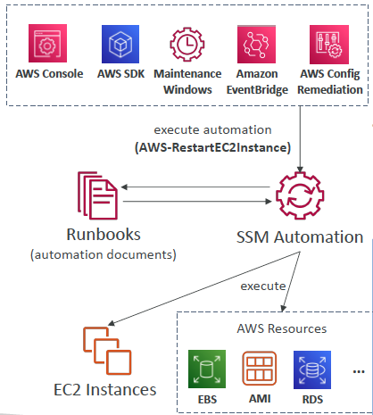

# Map

## 특징

* Key-Value 쌍의 집합을 저장하는 데이터 구조
* 하나의 Key는 하나의 Value와 매핑된다.
* 맵의 구현 방식으로 여러 종류가 있다.

<figure><figcaption></figcaption></figure>

## HashMap

* Key 값을 해싱하여 나온 인덱스에 Value를 저장한다.
* 삽입, 검색, 제거 작업이 O(1) 소요되지만, 두 Key가 동일 인덱스에 매핑되는 해시 충돌이 발생한다면 성능이 저하될 수 있다.

## TreeMap

* key를 기준으로 정렬되며, NavigableMap 인터페이스를 구현하여 특정 키 구간만 조회하거나, 주어진 키를 기준으로 크거나 작은 Entry를 조회하는 등의 기능도 제공한다.
* 내부적으로 레드블랙트리를 사용하기 때문에 HashMap에 비해 성능이 떨어지지만, 정렬된 데이터를 갖고 있어야 하는 경우 사용하기 좋다.
* key 값을 사용해 value를 조회하는 get 메서드의 경우 시간이 많이 소모되므로 많은 양의 데이터를 가져올 경우 entrySet 메서드를 사용하는 것이 좋다.

## LinkedHashMap

* HashMap과 동일한 방식으로 저장하지만 원소의 삽입 순서를 유지하는 특징을 가진다.

