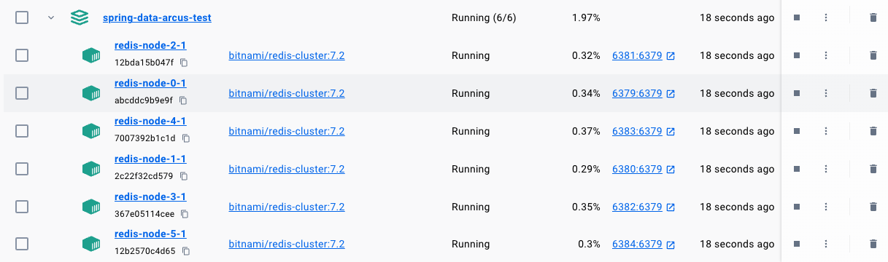

# Cluster

## 개념

* Replication, Failover, Sharding 기능을 제공하여 Redis 운영 시 고가용성을 보장해주는 방식이다.
* 클러스터의 모든 노드는 서로 연결된 Full Mesh 구조를 이룬다.
* 클러스터를 구성하기 위해 최소 세 개의 마스터 노드가 필요하다.

## 주요 특징

### Gossip Protocol

* 클러스터를 관리하거나 클러스터 상태를 확인하는 노드는 따로 존재하지 않는다.
* 대신 각 노드끼리 TCP 연결을 맺고 Gossip Protocol으로 통신한다.
* 주변에 있는 일부 node에만 데이터를 송신하면 node간의 데이터 정합성이 시간이 지나면서 확률적으로 맞추어지는 protocol 방식이다.

### Cluster Bus

* 구성 노드들 외에 추가로 채널을 사용한다.
* 구성 노드의 장애 감지, 구성 업데이트, 페일오버 권한 부여 등에 사용된다.
* 노드 간 데이터 교환에 있어 바이너리 프로토콜을 사용하는데, 이는 대역폭과 처리시간을 거의 사용하지 않고 노드간 정보를 교환하는 데에 적합하다.
* 모든 레디스 클러스터 노드에는 두 개의 TCP 연결이 열려있어야 한다.
  * 클라이언트와 통신하는 서비스 포트
  * 노드 간 통신을 위한 클러스터 버스 포트 (서비스 포트 + 10000번)
    * 모든 클러스터 노드와 통신이 가능해야 하며 노드의 장애 감지, 구성 업데이트, failover 권한 부여 등에 사용된다. 바이너리 프로토콜을 사용해 대역폭과 처리 시간을 거의 사용하지 않고 노드 간 정보를 교환한다.
  * 예를 들어 6379, 6380, 6381 포트로 클러스터를 구성한다면, 16379, 16380, 16381 포트도 방화벽에서 열어주어야 한다.

### Sharding

* 최대 1000개 노드까지 Scale Out할 수 있다.

> **Client-side 샤딩**
>
> * Redis Cluster를 사용하지 않고 Arcus Java Client처럼 Client쪽에서 Sharding 기능을 사용할 수 있다. Jedis의 경우 Sharded Jedis를 통해 hash function과 consistent hashing을 통해 여러 master 노드에 키를 분배할 수 있다. (하지만 현재 [Jedis에서 Deprecated된 상태](https://github.com/redis/jedis/blob/77d52ab04fa333a3c2c50d0150c09300b1c92161/src/main/java/redis/clients/jedis/JedisSharding.java)로, Sharding 기능을 다음 major release에서 제거한다고 한다.)
> * Sharded Jedis는 사용중에 노드를 추가/삭제할 수 없어 노드가 고정된 경우에만 사용이 가능하므로 Redis Cluster를 사용하는 것이 좋다.

### Hash Slot

* 클러스터 사용 시 데이터를 여러 노드에 자동으로 분산시키기 위한 방식이다.
* consistent hashing을 사용하지 않는 대신 모든 노드에 분산될 수 있는 16384개의 해시 슬롯을 두고, key 값에 대해 `CRC16(key) mod 16384` 연산을 사용한다.
* 리샤딩 또는 리밸런싱 작업을 통해 노드 간 slot을 이동시킬 수 있다.
* 노드 간 해시 슬롯을 이동할 때는 다운 타임이 필요하지 않다.
* 다중 키 작업(`MULTI` , `RPOPLPUSH` …) 요청 시 키들이 같은 노드에 존재해야만 정상적으로 수행할 수 있다. 같은 노드에 키를 위치시키기 위해 Hash Tag를 사용하기도 한다.
*   만약 서로 다른 노드에 존재하는 키들에 대해 작업 요청을 보내면 아래와 같은 에러가 발생한다.

    `ERR CROSSSLOT Keys in request don't hash to the same slot`
* cluster-require-full-coverage
  * 여러 노드에 분산되어 있는 상황에서 한 노드에 장애가 발생해 모든 hash slot을 커버할 수 없는 상황이 발생했을 때 클러스터에 접근할 수 없게 만들 지에 대한 여부
  * 기본값은 true이므로, 모든 hash slot을 커버할 수 없는 상황이면 클러스터를 사용할 수 없게 된다.

### Hash Tag

* 여러 키가 동일한 해시 슬롯에 할당되게 하기 위해 괄호로 `{` `}` 해싱될 문자열을 한정하는 방식이다.
* 키가 `user-profile:1234`, `user-session:1234` 인 캐시 아이템이 존재할 경우 두 아이템은 다른 해시 슬롯에 할당된다.
* 두 키를 `user-profile:{1234}`, `user-session:{1234}` 로 저장하면 동일 해시 슬롯에 할당되어 `MULTI` 명령을 수행할 수 있게 된다.
*   Redis Enterprise 사용 시 정규식으로 해싱 함수에서 사용될 문자열을 지정할 수 있다.

    ex) `/user-.*:(?<tag>.+)/`

### Failover

* Sentinel 구조에서는 Sentinel 프로세스가 노드들을 감시했지만, Cluster 구조에서는 **모든 노드가 서로서로 감시**한다. 즉, 클러스터의 노드들은 매 초 임의의 일부 노드에게 heartbeat(ping, pong) 패킷을 교환한다.
* 과반수의 master 노드에서 heartbeat 패킷이 교환되지 않아 FAIL 플래그가 세워진 노드의 경우 장애가 있다고 간주하여, replica 노드가 master 노드로 승격된다. 자세한 사항은 [링크](https://redis.io/docs/reference/cluster-spec/#failure-detection) 참조한다.
* node timeout
  * 클러스터 노드 중 `node timeout` 시간의 절반 이상동안 heartbeat 패킷을 교환하지 않은 노드에게 패킷을 보낸다.
  * 따라서 `node timeout`이 짧고 노드 수가 매우 큰 경우, 교환되는 패킷 양이 상당히 커질 수 있다.
  * ms 단위로 설정한 `node timeout` 시간 내에 master 노드와 연결할 수 없으면 failover가 발생하여 replica 노드가 master 노드로 승격된다.
  * 지정된 시간 동안 과반수의 master 노드에 접근할 수 없는 노드는 요청을 받지 못하도록 한다.
  * 기본값은 15000ms이다.
* repl ping replica period
  * master 노드에서 replica 노드로 핑을 보내는 주기를 초단위로 지정할 수 있다.
  * 기본값은 10초이다.
* cluster replica validity factor
  * master 노드와 replica 노드의 마지막 통신으로부터 `(node timeout) * (cluster replica validity factor) + (repl ping replica period)` 초 이상 경과했다면, 해당 replica 노드는 master 노드로의 승격 대상에서 제외된다.
  * 예를 들어 node timeout이 30초, cluster replica validity factor가 10, repl ping replica period가 10초라면, 310초 이상 master 노드와 연결되지 않은 replica 노드는 failover를 시도하지 않을 것이다.
  * 이렇게 제한하는 이유는 연결이 오래 끊길수록 데이터 최신화가 불가능하여 데이터 손실이 발생할 수도 있다.
  * 만약 더 이상 master 노드로 승격할 replica 노드가 없을 경우, 기존 master 노드가 다시 클러스터에 합류할 때 까지 클러스터는 사용할 수 없게 된다.
  * 기본값은 10이다.

### Replica Migration

* master 노드와 replica 노드 간의 연결이 고정되어있을 경우, 단일 노드에 여러 오류가 발생하면 시간이 지나면서 가용성이 제한된다.
* 이를 해결하기 위해 replica 노드는 여러 master 노드를 유동적으로 복제하도록 하는 기능을 제공한다.
* migration barrier
  * master 노드가 가져야 할 최소한의 replica 노드 개수를 지정할 수 있다.
  * master 노드 A, B, C 가 있고 각각 A1, B1, C1, C2 라는 replica 노드를 가지며 `migration barrier` 값이 1인 상황을 가정한다. A 노드에 장애가 발생해 A1이 master로 승격된다. 이를 그대로 두면 나중에 A1에 장애가 발생하면 A노드의 데이터가 모두 손실된다. 이를 방지하기 위해 C의 replica 노드 중 하나를 A1 노드의 replica 노드로 마이그레이션 시킨다.

### resharding

* cluster가 동작하는 동안 노드가 추가되거나 삭제될 수 있다. 이 과정에서 노드 간 해시 슬롯이 이동(resharding)되어야 한다.
* resharding 도중에 들어오는 요청을 어떻게 처리할 지 지정하기 위해 redis는 `CLUSTER SETSLOT <slot> MIGRATING | IMPORTING <node>` 명령을 제공한다.
* 노드의 특정 슬롯이 `MIGRATING`으로 설정되었을 때 노드는 해당 슬롯으로 요청이 들어왔을 때 키가 존재할 때만 응답을 줄 수 있다. 키가 존재하지 않으면 `ASK` 리다이렉션을 이용해서 마이그레이션 대상 노드로 전달된다.
* 노드의 특정 슬롯이 `IMPORTING`으로 설정되었을 때 요청 앞에 `ASKING` 커맨드가 주어지지 않는다면, 쿼리는 보통 발생하는 것처럼 `MOVED` 에러를 통해서 실제 해시 슬롯의 주인으로 리다이렉트된다.

## 관련 명령어

* `cluster info`
  * 클러스터 상태, 클러스터에 할당된 slot들의 상태 등을 확인할 수 있다.
* `cluster nodes`
  * 현 노드가 속한 cluster의 노드 정보(address, role, connect 여부)를 조회할 수 있다.

## Docker로 Cluster 구동하기

### Docker Compose로 여러 컨테이너 구동

* 아래는 Master 3대, Slave 3대로 구성된 Redis Cluster를 구동하기 위한 docker-compose.yml 파일이다.
* `redis-cluster-entry` 컨테이너를 구동함으로써 여러 redis 노드들을 클러스터로 구성할 수 있다.
  * `--cluster-replicas 1`을 통해 6개의 노드 중 3개는 master, 3개는 slave로 수행되도록 한다.

```yaml
services:
  redis-cluster:
    platform: linux/x86_64
    image: redis
    container_name: redis-test
    volumes:
      - ./redis.conf:/usr/local/etc/redis/redis.conf
    command: redis-server /usr/local/etc/redis/redis.conf
    ports:
      - 6379:6379
      - 6380:6380
      - 6381:6381
      - 6382:6382
      - 6383:6383
      - 6384:6384

  redis-node-1:
    network_mode: "service:redis-cluster"
    platform: linux/x86_64
    image: redis
    container_name: redis-test1
    volumes:
      - ./redis1.conf:/usr/local/etc/redis/redis.conf
    command: redis-server /usr/local/etc/redis/redis.conf

  redis-node-2:
    network_mode: "service:redis-cluster"
    platform: linux/x86_64
    image: redis
    container_name: redis-test2
    volumes:
      - ./redis2.conf:/usr/local/etc/redis/redis.conf
    command: redis-server /usr/local/etc/redis/redis.conf

  redis-node-3:
    network_mode: "service:redis-cluster"
    platform: linux/x86_64
    image: redis
    container_name: redis-test3
    volumes:
      - ./redis3.conf:/usr/local/etc/redis/redis.conf
    command: redis-server /usr/local/etc/redis/redis.conf

  redis-node-4:
    network_mode: "service:redis-cluster"
    platform: linux/x86_64
    image: redis
    container_name: redis-test4
    volumes:
      - ./redis4.conf:/usr/local/etc/redis/redis.conf
    command: redis-server /usr/local/etc/redis/redis.conf

  redis-node-5:
    network_mode: "service:redis-cluster"
    platform: linux/x86_64
    image: redis
    container_name: redis-test5
    volumes:
      - ./redis5.conf:/usr/local/etc/redis/redis.conf
    command: redis-server /usr/local/etc/redis/redis.conf

  redis-cluster-entry:
    network_mode: "service:redis-cluster"
    platform: linux/x86_64
    image: redis
    container_name: redis-cluster-entry
    command: redis-cli --cluster create 127.0.0.1:6379 127.0.0.1:6380 127.0.0.1:6381 127.0.0.1:6382 127.0.0.1:6383 127.0.0.1:6384 --cluster-replicas 1 --cluster-yes
    depends_on:
      - redis-cluster
      - redis-node-1
      - redis-node-2
      - redis-node-3
      - redis-node-4
      - redis-node-5
```

* docker compose up 하기 전 아래와 같이 redis.conf 파일을 같은 경로에 생성해준다.  redis.conf\~redis5.conf 까지 총 6개의 파일을 생성해주어야 하며, 포트만 서로 다르게 설정하면 된다.

```yaml
port 6379 
cluster-enabled yes
cluster-config-file node.conf
cluster-node-timeout 5000
```

* `docker compose up -d` 명령으로 구동 시 아래와 같이 컨테이너가 동작한다. (클러스터링이 잘 안될 경우 redis-cluster-entry 컨테이너를 재구동한다.)

<figure><figcaption></figcaption></figure>

### Failover 테스트

* 모두 정상적으로 띄워진 클러스터에서 master 노드 하나를 중지시키면, 해당 master 노드의 replica 노드는 election과정을 거친 후 master 노드로 승격된다.
* 아래는 승격 과정이 담긴 로그이다. master 노드에 연결이 되지 않기 시작하면 election 과정을 거쳐 replica 노드가 새로운 master가 되는 것을 확인할 수 있다.

```java
* FAIL message received from d0359ab5d77da5f01ae7b61560d2640db49eb3ce () about 09e5829cf2c0a5653759b2d56871ffc3452caed5 ()
# Cluster state changed: fail
* Start of election delayed for 591 milliseconds (rank #0, offset 98).
* Starting a failover election for epoch 7.
* Failover election won: I'm the new master.
* configEpoch set to 7 after successful failover
* Discarding previously cached master state.
* Setting secondary replication ID to ff13ae4f90b76853c6255ad30ac2bc0ddeaae7a0, valid up to offset: 99. New replication ID is 2aec83beaa9528a9ded84fd7f78d058d1c3c6b88
* Cluster state changed: ok
* Replication backlog freed after 3600 seconds without connected replicas.
* Clear FAIL state for node 09e5829cf2c0a5653759b2d56871ffc3452caed5 ():master without slots is reachable again.
* Replica 192.168.144.4:6379 asks for synchronization
* Partial resynchronization not accepted: Replication ID mismatch (Replica asked for 'b236364cc74c50c3e73170c88fdde45c8e1e6654', my replication IDs are '56d4c427e3bdb251e977ad3d4286d04b61d8e362' and '0000000000000000000000000000000000000000')
* Replication backlog created, my new replication IDs are 'ec6ca0a3584f388ec62616e14e9f466edf0800ff' and '0000000000000000000000000000000000000000'
```

### 노드 추가/삭제 및 리샤딩 테스트

*   기본적으로 3대의 마스터 노드를 띄우면 아래와 같이 해시 슬롯이 분배된다. 각 라인의 끝부분을 보면 3개의 노드에 고르게 해시슬롯이 분배되어있는 것을 확인할 수 있다.

    ```
    5cb45d9aff563254626375e3a7f1189378214cdb 127.0.0.1:6379@16379 myself,master - 0 1705652580000 1 connected 0-5460
    bfa9f985a3882bee909d155985834b2405be68a7 127.0.0.1:6380@16380 master - 0 1705652581562 2 connected 5461-10922
    9cef3427669857f4164143921b22faa60b1d00c2 127.0.0.1:6381@16381 master - 0 1705652581562 3 connected 10923-16383
    ```

#### 노드 추가

*   이 상황에서 6382번 마스터를 추가해 총 4대의 마스터가 되도록 구성한다.

    ```
    redis-cli --cluster add-node <new host:port> <existing host:port>
    redis-cli --cluster add-node 127.0.0.1:6390 127.0.0.1:6379
    ```

#### 리밸런싱

*   새로 추가된 노드를 포함해 리밸런싱 명령을 수행하면 아래와 같이 기존 노드의 일부 해시 슬롯이 자동으로 새로 추가된 노드에 옮겨진다.

    ```
    redis-cli --cluster rebalance 127.0.0.1:6379 --cluster-use-empty-masters
    ```

    ```
    fb946c7f99f326d86e7324a01eb4c16d5207516d 127.0.0.1:6390@16390 master - 0 1705654987000 7 connected 0-1364 5461-6826 10923-12287
    11f59794ab8ef9bd6d0365fc76a85384675d3b14 127.0.0.1:6379@16379 myself,master - 0 1705654985000 1 connected 1365-5460
    1c1476bad0f4c4bfece0d611573c4af511aa724c 127.0.0.1:6380@16380 master - 0 1705654987778 2 connected 6827-10922
    a5729357678563491c132b2178763fa1b6d76752 127.0.0.1:6381@16381 master - 0 1705654986752 3 connected 12288-16383
    ```

#### 리샤드

*   6381번 마스터의 해시 슬롯들을 리샤드 명령을 수행해 제거한다.

    ```
    redis-cli --cluster reshard <host:port> --cluster-from <node_id> --cluster-to <node_id> --cluster-slots <number of slots> --cluster-yes

    redis-cli --cluster reshard 127.0.0.1:6379 --cluster-from a5729357678563491c132b2178763fa1b6d76752 --cluster-to fb946c7f99f326d86e7324a01eb4c16d5207516d --cluster-slots 1000 --cluster-yes
    redis-cli --cluster reshard 127.0.0.1:6379 --cluster-from a5729357678563491c132b2178763fa1b6d76752 --cluster-to 11f59794ab8ef9bd6d0365fc76a85384675d3b14 --cluster-slots 1000 --cluster-yes
    redis-cli --cluster reshard 127.0.0.1:6379 --cluster-from a5729357678563491c132b2178763fa1b6d76752 --cluster-to 1c1476bad0f4c4bfece0d611573c4af511aa724c --cluster-slots 2500 --cluster-yes
    ```
*   아무 데이터도 저장하지 않게 된 6381번 노드는 6380번 노드의 slave 노드로 변경되었음을 아래 로그로 확인할 수 있다.

    ```
    2024-01-22 11:32:06 1:M 22 Jan 2024 02:32:06.256 * Configuration change detected. Reconfiguring myself as a replica of 1c1476bad0f4c4bfece0d611573c4af511aa724c ()
    2024-01-22 11:32:06 1:S 22 Jan 2024 02:32:06.259 * Before turning into a replica, using my own master parameters to synthesize a cached master: I may be able to synchronize with the new master with just a partial transfer.
    2024-01-22 11:32:06 1:S 22 Jan 2024 02:32:06.260 * Connecting to MASTER 127.0.0.1:6380
    ```

#### 노드 제거

*   노드를 제거하려면 아래 명령을 수행하면 된다.

    ```
    redis-cli --cluster del-node <host:port> <node_id>
    redis-cli --cluster del-node 127.0.0.1:6379 a5729357678563491c132b2178763fa1b6d76752
    ```

## Spring Data Redis에 Cluster 연결하기

### 노드에 요청 보내기

* 클러스터를 구성하는 노드를 입력해 `RedisClusterConfiguration` 객체를 생성하고 이를 기반으로 LettuceConnectionFactory 객체를 생성해 Redis 서버와 연결할 수 있도록 한다.
* 초기 노드 정보는 전부 입력하지 않아도 된다.

```java
LettuceConnectionFactory lettuceConnectionFactory = new LettuceConnectionFactory(new RedisClusterConfiguration()
	.clusterNode("localhost", 6379)
        .clusterNode("localhost", 6380)
        .clusterNode("localhost", 6381)
        .clusterNode("localhost", 6382)
        .clusterNode("localhost", 6383)
        .clusterNode("localhost", 6384),
	LettuceClientConfiguration.builder()
	    .commandTimeout(Duration.ofSeconds(10))
	    .shutdownTimeout(Duration.ofSeconds(30))
            .readFrom(ReadFrom.REPLICA_PREFERRED)
	    .build());
lettuceConnectionFactory.afterPropertiesSet();

RedisTemplate<String, Object> redisTemplate = new RedisTemplate<>();
...
redisTemplate.setConnectionFactory(lettuceConnectionFactory);
redisTemplate.afterPropertiesSet();
```

* 사용자가 RedisTemplate을 사용해 요청을 보내는 시점에 Redis 서버와 연결을 맺고 요청을 보내게 된다.

```java
redisTemplate.opsForValue().get("key", "value");
```

### 요청 리다이렉션

* 특정 키에 대한 요청이 들어왔을 경우 ClusterDistributionChannelWriter를 사용해 단일 Key에 대한 hash slot 번호를 연산하고, 해당 해시 슬롯을 가지는 캐시 노드에 명령어를 보낸다.

1. SlotHash 클래스에서 getSlot() 메서드를 통해 `CRC16(key) % 16384` 로 hash slot을 찾는다.
2. PooledClusterConnectionProvider 클래스에서 getConnectionAsync() 메서드를 통해 명령어가 READ인지 WRITE인지 여부와 hash slot 번호를 통해 명령을 보낼 캐시 노드와 연결을 맺고 정보를 반환한다.
3. ClusterNodeEndPoint 클래스에서 write() 메서드를 통해 데이터를 전송한다. 내부적으로는 네티의 AbstractChannel#writeAndFlush 메서드가 사용된다.

### multi key 연산

* `multiGet(List.of(”k1”, “k2”, “k3”))` 같은 multi key 연산을 기본 Redis 명령어로 수행하려면 반드시 동일한 해시 슬롯 안에 존재해야만 수행 가능하다.
* 하지만 lettuce를 사용하면, 입력된 각 key마다 요청을 나누어 보내기 때문에 여러 해시 슬롯에서 multi key 연산을 수행할 수 있다.
* 어떤 API에 multi key 연산을 제공하는지 확인하려면 [문서](https://lettuce.io/core/release/reference/#redis-cluster.cross-slot-command-routing)를 참고하면 된다.

### topologyRefreshOptions

* topology란 클러스터 구성을 의미하며, 각 노드들의 IP 정보 등이 포함된다.
* Spring Data Redis에서는 `topologyRefreshOptions` 을 통해 클러스터 topology가 변경되었을 때를 감지하고 변경된 노드에 접속할 수 있도록 설정할 수 있다.
* Redis Cluster에서 failover 등으로 토폴로지에 변화가 생겼을 때 이를 어떻게 Refresh할 지 옵션을 주어 설정할 수 있다.

```java
@Bean
public RedisConnectionFactory redisConnectionFactory() {
    return new LettuceConnectionFactory(new RedisClusterConfiguration()
        .clusterNode("localhost", 6379),
        LettuceClientConfiguration.builder()
            .clientOptions(getClientOptions())
            .build());
}

@Bean
public ClientOptions getClientOptions() {
    return ClusterClientOptions.builder()
        .autoReconnect(true)
        .topologyRefreshOptions(ClusterTopologyRefreshOptions
            .builder()
            .dynamicRefreshSources(true)
            .enablePeriodicRefresh(Duration.ofSeconds(60)) 
            .enableAllAdaptiveRefreshTriggers() 
            .adaptiveRefreshTriggersTimeout(Duration.ofSeconds(30))
            .build())
        .build();
}
```

* dynamicRefreshSources
  * 클러스터 토폴로지 정보를 얻기 위해 `CLUSTER NODES` 명령으로 얻은 노드들을 사용할 지, 아니면 사용자로부터 입력받은 노드들만 사용할지에 대해 설정할 수 있다.
* periodicRefresh
  * 입력된 주기마다 토폴로지 정보가 변경되었는지 감지한다.
* adaptiveRefreshTrigger
  * 특정 응답이 왔을 때 topology 갱신을 실행한다. (MOVED\_REDIRECT, ASK\_REDIRECT, PERSISTENT\_RECONNECTS, UNCOVERED\_SLOT, UNKNOWN\_NODE)
  * Redis cluster에서 refresh trigger 이벤트가 많이 발생하는 경우 계속 topology를 갱신하려 해 성능 이슈가 발생할 수가 있다.
* adaptiveRefreshTriggersTimeout
  * adaptive refresh trigger를 실행할 때 timeout을 설정한다. timeout이 발생하면 topology 갱신을 중단한다.
