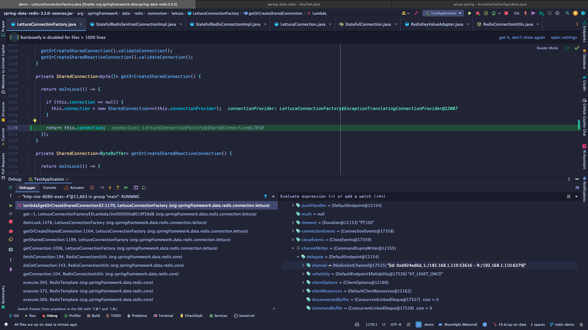
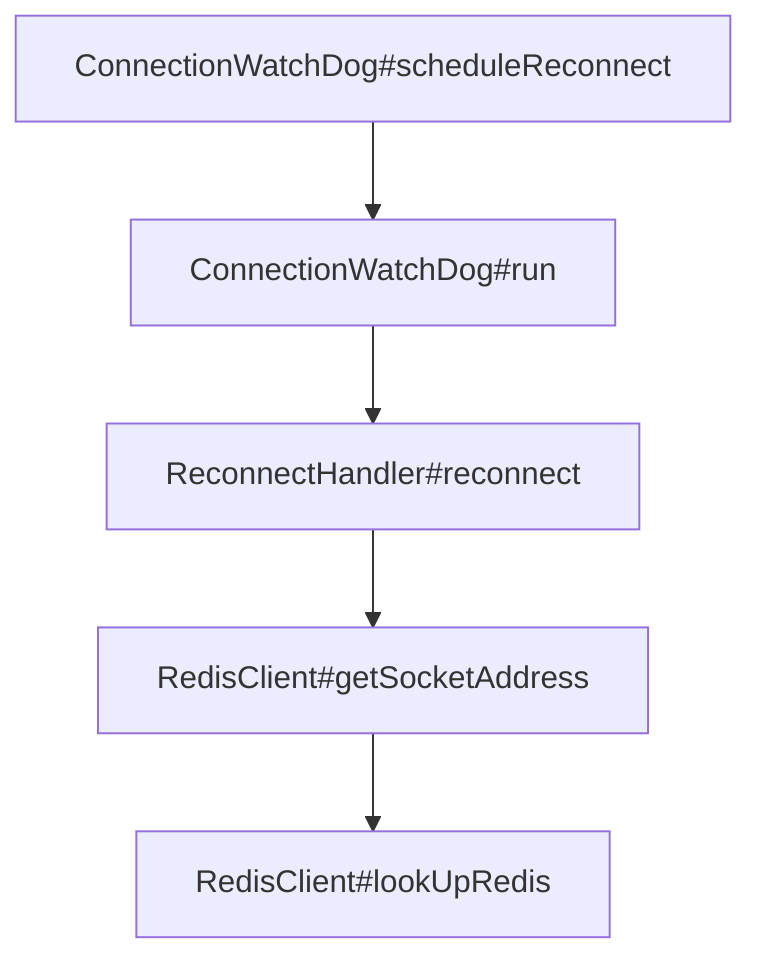

# Sentinel

## 개념

* sentinel이란 보초병, 감시병이라는 뜻으로, Redis 노드들을 감시하여 안정적인 운영을 돕는 역할을 하는 프로세스이다.
*   일반적으로 sentinel 프로세스를 3대 이상(Quorum 형성을 위함) 구동하여 sentinel 그룹을 형성해 사용되며, 이 sentinel 그룹은 각 master 노드를 감시하고 있다가 문제가 발생하면 failover 시켜준다.

    > 당연하게도 각 sentinel 프로세스들은 availability zone이 다른 장비에서 구동되어야 한다.
* 클라이언트는 실제 redis 노드에 연결하는 대신 **sentinel 노드와 연결**하여 정상적인 master 노드에만 요청을 보내도록 한다.
* 한 sentinel 그룹에는 여러 복제 그룹(Master-Replica sets)을 등록할 수 있다.

## 주요 특징

### Monitoring

* Sentinel 그룹은 가용성, 성능, 복제 지연을 포함하여 master 노드와 replica 노드들의 상태를 지속적으로 모니터링한다.

### Automatic Failover

* Sentinel 프로세스는 master, replica, 다른 sentinel 노드들에 1초에 한 번씩 PING을 보내서 특정 시간동안 응답이 없으면 해당 서버가 다운된 것으로 판단하여 sentinel 리더를 선출하고 replica 노드 중 하나를 master 노드로 승격한다.
* `Quorum`
  * master 노드가 다운되었다고 판단한 sentinel 노드의 개수가 Quorum 이상일 경우 failover가 시작된다. 실패를 감지하는 데에만 사용되고 실제 failover를 수행하려면 sentinel 중 하나가 장애 조치에 대한 리더로 선출되고 계속 진행할 수 있는 권한을 부여받아야 한다. 이는 Sentinel 프로세스 투표로 진행된다.
* `SDOWN`
  * Subjectively Down, 즉 주관적 다운이라는 의미로, 특정 sentinel 노드에서 다운되었다고 판단하는 상황이다. ODOWN인지 확인하기 위해 다른 sentinel 노드들에 다운되었는지 확인하는 요청을 보낸다.
* `ODOWN`
  * Objectively Down, 즉 객관적 다운이라는 의미로, 쿼럼 개수 이상의 sentinel 노드에서 다운되었다고 판단하는 상황이다. 이 상황이 되면 replica 노드를 master 노드로 승격시킨다.

### Client Redirection

* 클라이언트가 sentinel 노드를 거쳐 master 노드로 요청을 보내는데 failover가 진행되었다면, sentinel은 클라이언트에게 새로 승격된 master 노드로 리다이렉트해준다.
* 이를 통해 클라이언트는 새로운 master 노드에 원활하게 다시 연결되어 사용자에게 미치는 영향을 최소화하면서 안정적으로 동작할 수 있다.

### Alert

* master 노드 장애가 발생하거나 Replica 동기화 지연 등 특정 상황이 발생하면 알림을 보낼 수 있다.

## Docker로 Sentinel 그룹 구동하기

### Docker Compose로 여러 컨테이너 구동

* 아래는 Master 1대 (6379), Slave 2대 (6380, 6381), Sentinel 3대 (26379\~26381)로 구성된 Sentinel 그룹과 복제 그룹을 Docker로 구동시킬 수 있도록 만든 docker-compose.yml 파일이다.
* redis 서버는 redis에서 지원하는 공식 Docker 이미지를 사용했고, sentinel 서버는 bitnami에서 지원하는 이미지를 사용했다.
  * bitnami에서 제공하는 redis-sentinel 이미지에 대한 자세한 설명은 [링크](https://hub.docker.com/r/bitnami/redis-sentinel)를 참고하면 된다.
* `redis-slave1` 컨테이너에 포트를 몰아둔 이유는 `redis-master` 컨테이너를 종료시켜 failover 테스트를 해보기 위함이다. 대표 네트워크로 설정된 `redis-slave1` 컨테이너가 다운된다면 모든 redis 서버에 연결이 불가능해지는데, 만약 `redis-master` 를 대표 네트워크로 지정해두고 컨테이너를 종료시켜버리면 모든 redis 서버에 연결이 되지 않아 failover가 제대로 수행되었는지 알 수 없다.

```yaml
services:
  redis-master:
    network_mode: "service:redis-slave1"
    image: redis:latest
    container_name: redis-master
    platform: linux/x86_64
  redis-slave1:
    platform: linux/x86_64
    image: redis:latest
    container_name: redis-slave
    command: redis-server --slaveof 127.0.0.1 6379 --port 6380
    ports:
      - 6379:6379
      - 6380:6380
      - 6381:6381
      - 26379:26379
      - 26380:26380
      - 26381:26381
  redis-slave2:
    network_mode: "service:redis-slave1"
    platform: linux/x86_64
    image: redis:latest
    container_name: redis-slave2
    command: redis-server --slaveof 127.0.0.1 6379 --port 6381
  redis-sentinel:
    network_mode: "service:redis-slave1"
    image: 'bitnami/redis-sentinel:latest'
    environment:
      - REDIS_SENTINEL_DOWN_AFTER_MILLISECONDS=3000
      - REDIS_SENTINEL_PORT_NUMBER=26379
      - REDIS_MASTER_HOST=127.0.0.1 # local device en0 IP
      - REDIS_MASTER_PORT_NUMBER=6379
      - REDIS_MASTER_SET=mymaster
      - REDIS_SENTINEL_QUORUM=2
      - REDIS_SENTINEL_RESOLVE_HOSTNAMES=yes
    depends_on:
      - redis-master
      - redis-slave1
      - redis-slave2
  redis-sentinel2:
    network_mode: "service:redis-slave1"
    image: 'bitnami/redis-sentinel:latest'
    environment:
      - REDIS_SENTINEL_DOWN_AFTER_MILLISECONDS=3000
      - REDIS_SENTINEL_PORT_NUMBER=26380
      - REDIS_MASTER_HOST=127.0.0.1 # local device en0 IP
      - REDIS_MASTER_PORT_NUMBER=6379
      - REDIS_MASTER_SET=mymaster
      - REDIS_SENTINEL_QUORUM=2
      - REDIS_SENTINEL_RESOLVE_HOSTNAMES=yes
    depends_on:
      - redis-master
      - redis-slave1
      - redis-slave2
  redis-sentinel3:
    network_mode: "service:redis-slave1"
    image: 'bitnami/redis-sentinel:latest'
    environment:
      - REDIS_SENTINEL_DOWN_AFTER_MILLISECONDS=3000
      - REDIS_SENTINEL_PORT_NUMBER=26381
      - REDIS_MASTER_HOST=127.0.0.1 # local device en0 IP
      - REDIS_MASTER_PORT_NUMBER=6379
      - REDIS_MASTER_SET=mymaster
      - REDIS_SENTINEL_QUORUM=2
      - REDIS_SENTINEL_RESOLVE_HOSTNAMES=yes
    depends_on:
      - redis-master
      - redis-slave1
      - redis-slave2
```

* `docker compose up -d` 명령으로 구동 시 모든 컨테이너가 구동된다.

<figure><figcaption></figcaption></figure>

### Failover 테스트

* Master 1대, Slave 2대, Sentinel 3대로 구성되어 있음을 확인 후, Master 1대를 구동중인 컨테이너를 잠시 중지킨다.

<figure><figcaption></figcaption></figure>

* Sentinel 컨테이너의 로그를 확인해보면, 하나의 Sentinel 서버에서 연결이 불가능해 sdown 상태가 되었음이 보고되면 failover 처리를 위한 리더를 선출하고 모든 sentinel 서버에서 연결이 불가능하여 odown 상태가 되면 내부적으로 `switch-master` 명령어를 사용해 새로운 마스터를 선출한다.

## Spring Data Redis에 Sentinel 그룹 연결하기

* sentinel 그룹에 속한 서버들의 주소와 master 이름을 넣어 `RedisSentinelConfiguration` 객체를 생성한다.
* 이 객체를 기반으로 `LettuceConnectionFactory` 객체를 생성하면 Redis 서버와 통신할 수 있다.

```java
LettuceConnectionFactory lettuceConnectionFactory = new LettuceConnectionFactory(new RedisSentinelConfiguration()
				.sentinel("localhost", 26379)
				.sentinel("localhost", 26380)
				.sentinel("localhost", 26381)
				.master("mymaster"),
				LettuceClientConfiguration.builder()
						.commandTimeout(Duration.ofSeconds(10))
						.shutdownTimeout(Duration.ofSeconds(30))
						.build());
lettuceConnectionFactory.afterPropertiesSet();

RedisTemplate<String, Object> redisTemplate = new RedisTemplate<>();
...
redisTemplate.setConnectionFactory(lettuceConnectionFactory);
redisTemplate.afterPropertiesSet();
```

* `LettuceConnectionFactory` 객체를 생성할 때 바로 Redis 서버와 TCP 연결을 맺는 것은 아니고, 사용자가 RedisTemplate을 사용해 특정 요청을 보내는 시점에 Redis 서버와 연결을 맺고 요청을 보내기 시작한다.

### master 노드에 요청 보내기

다음은 lettuce에서 sentinel 그룹으로부터 master 서버 주소를 얻어 요청을 보내는 과정이다.

1. 사용자가 입력한 정보를 토대로 `redis-sentinel://localhost,localhost:26380,localhost:26381?sentinelMasterId=mymaster&timeout=10s` 형식의 주소(RedisURI)를 생성한다.
2. 앞서 생성된 주소에서 하나의 sentinel 주소로 연결하기 위해 `redis://localhost:26379?timeout=10s` 과 같이 파싱 작업을 거친다.
3. 하나의 sentinel 서버에 연결해 `SENTINEL GET-MASTER-ADDR-BY-NAME <master name>` \*\*\*\*명령을 보내 master 주소를 가져온다.
4. 얻어온 master 서버와 연결한 후 캐시 저장/조회 등의 요청을 보낸다.

### failover 처리하기

다음은 lettuce에서 master나 sentinel 노드에 장애가 발생했을 때 master 서버 연결 정보를 갱신하는 과정이다.

1. master 노드에 장애가 발생해 연결이 끊기면 곧바로 `ConnectionWatchDog` 이라는 클래스에서 `sentinel` 주소로 연결을 시도한다.
2. `sentinel` 에서는 앞서 설명한 방식과 동일하게 masterId에 해당하는 복제 그룹의 master 주소를 반환한다.
3. 이렇게 얻어온 master 서버와 연결해두어 다음에 캐시 저장/조회 요청이 들어왔을 때 요청이 실패하지 않도록 한다.

### 기타 특이 사항

*   기본적으로는 필드에 저장된 master connection 정보를 이용해 요청을 보낸다.

    * sentinel 노드가 모두 죽어버리더라도 이 정보로 요청을 보내기 때문에 failover가 발생하지 않는 이상 요청은 보내진다.

    ```java
    public class LettuceConnectionFactory implements RedisConnectionFactory, ReactiveRedisConnectionFactory, InitializingBean, DisposableBean, SmartLifecycle {
        // ...
        private @Nullable SharedConnection<byte[]> connection;
        // ...
    }
    ```

    *   실제 어떻게 연결 정보가 저장되어 있는지는 디버깅으로 찾아볼 수 있다.

        * 중요한 부분은 ChannelWriter에 master 노드의 주소로 채널이 열려있다는 점이다.

        <figure><figcaption></figcaption></figure>
* failover로 인해 승격된 master 노드의 정보를 sentinel 그룹으로부터 조회했지만 네트워크 파티션 등으로 인해 응용(lettuce)에서 연결할 수 없다면, 기본적으로 10초에 한번씩 sentinel에서 master 주소를 가져와 재연결을 시도한다.
* Lettuce를 통해 재연결을 시도하는 플로우는 아래와 같다.



* slave 노드는 프로세스가 종료되어 연결할 수 없더라도 아무런 영향이 없다.
