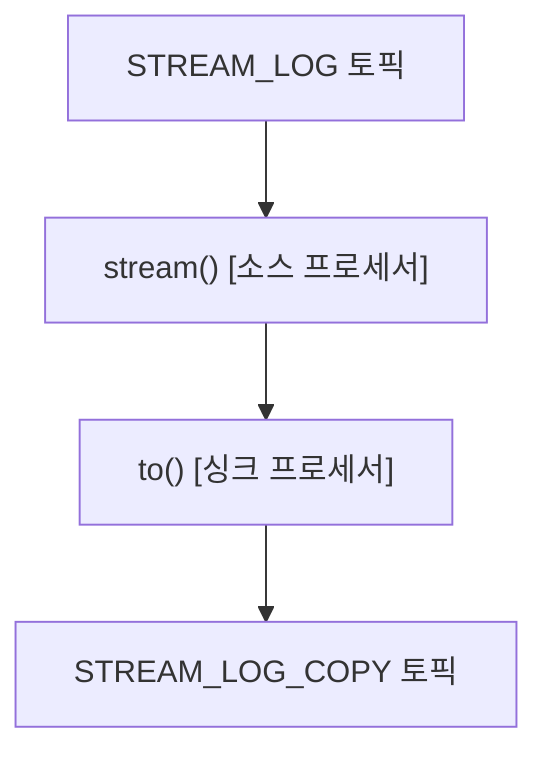
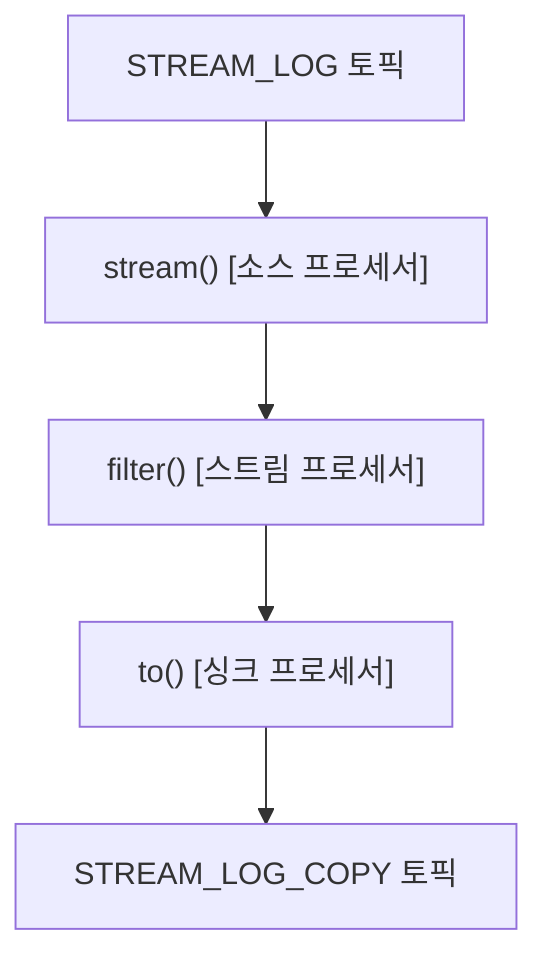

# Kafka Streams

## 개념

* 토픽에 적재된 데이터를 실시간으로 변환하여 다른 토픽에 적재하는 라이브러리이다.
* 소스 토픽과 싱크 토픽의 카프카 클러스터가 서로 다르다면 스트림즈를 사용할 수 없으므로 컨슈머와 프로듀서 조합으로 처리해야 한다.
* 내부적으로 스레드를 1개 이상 생성 가능하고, 스레드는 1개 이상의 태스크를 가진다.
* 태스크는 데이터 처리 최소 단위로, 하나의 파티션과 매핑된다.
* 병렬 처리를 위해 파티션과 스트림즈 스레드 혹은 프로세스 개수를 늘려 처리량을 늘릴 수 있다.
* 보통 장애가 나도 안정적으로 운영할 수 있도록 스트림즈 프로세스를 여러 개 둔다.

### 토폴로지

* 프로세서
  * 토폴로지를 이루는 노드 하나를 의미하며, 소스 프로세서, 스트림 프로세서, 싱크 프로세서 세 종류가 존재한다.
  * 소스 프로세서는 데이터를 처리하기 위해 최초로 선언해야 하며 하나 이상의 토픽에서 데이터를 가져온다.
  * 스트림 프로세서는 다른 프로세서가 반환한 데이터를 처리한다.
  * 싱크 프로세서는 데이터를 특정 카프카 토픽으로 저장한다.

<figure><figcaption></figcaption></figure>

* 스트림
  * 노드와 노드를 이은 선을 지칭하며, 토픽의 데이터인 레코드를 의미한다.

## 스트림즈 DSL

* 스트림즈DSL은 스트림 프로세싱에 쓰일 만한 다양한 기능들을 API로 만들어 제공한다.
* 예를 들어 메시지 값을 기반으로 토픽 분기 처리, 지난 n분간 들어온 데이터 개수 집계 등의 작업을 처리할 수 있다.

### 내부 개념

* 스트림즈 DSL에서는 레코드의 흐름을 추상화한 KStream, KTable, GlobalKTable 개념이 존재한다.

#### KStream

* 레코드의 흐름을 표현하며, 메시지 키와 값으로 구성된다.
* KStream은 컨슈머로 토픽을 구독하는 것과 동일한 선상에서 사용된다.
* 토픽 혹은 KStream의 모든 레코드를 조회할 수 있다.
* 각 파티션은 1개 태스크에 할당되어 사용된다.

#### KTable

* KStream과 달리 메시지 키를 기준으로 묶어 사용한다.
* 유니크한 메시지 키를 기준으로 가장 최신 레코드를 조회할 수 있다.
* 동일한 메시지 키를 가진 레코드가 추가되면 최신 레코드로 덮어쓰여진다.
* 각 파티션은 1개 태스크에 할당되어 사용된다.

#### GlobalKTable

* KTable과 동일하게 메시지 키를 기준으로 묶어 사용하지만, 모든 파티션이 각 태스크에 할당되어 사용된다.
* 따라서 어떤 태스크이더라도 파티션에 관계 없이 전역적으로 데이터에 접근 가능하므로, 코파티셔닝 되지 않은 KStream과 조인이 가능하다.

> **코파티셔닝**
>
> * 토픽 A의 데이터와 토픽 B의 데이터를 조인하고 싶을 때 **두 토픽의 파티션 개수와 파티셔닝 전략이 같아야(코파티셔닝) 동일한 메시지 키를 가진 데이터가 동일한 태스크에 들어간다.**
> * 만약 코파티셔닝 되어있지 않다면 한쪽 토픽을 리파티셔닝하여 새로운 토픽에 새로운 메시지 키를 갖도록 재배열해주어 코파티셔닝되도록 할 수 있다.

* 각 태스크가 GlobalKTable의 모든 데이터를 저장하고 사용하기 때문에 프로세스의 메모리 사용량이 증가하고 네트워크, 브로커에 부하가 생긴다. 따라서 작은 용량의 데이터일 경우에만 사용하는 것이 좋다.

## 주요 옵션

### 필수 옵션

* bootstrap.server
  * 카프카 브로커 클러스터 주소
* application.id
  * 스트림즈 애플리케이션 구분을 위한 고유한 아이디를 설정한다.
  * 이 값을 기준으로 병렬 처리를 한다.

### 선택 옵션

* default.key.serde
  * 레코드의 메시지 키를 직렬화/역직렬화하는 클래스 이름을 지정한다.
  * 기본값은 바이트 직렬화/역직렬화 클래스인 Serdes.ByteArray().getClass().getName()이다.
* default.value.serde
  * 레코드의 메시지 값을 직렬화/역직렬화하는 클래스 이름을 지정한다.
  * 기본값은 바이트 직렬화/역직렬화 클래스인 Serdes.ByteArray().getClass().getName()이다.
* num.stream.threads
  * 스트림 프로세싱 실행 시 사용될 스레드 개수를 지정한다.
  * 기본값은 1이다.
* state.dir
  * 상태 기반 데이터 처리를 할 때 데이터 저장할 디렉토리를 지정한다.
  * 기본값은 /tmp/kafka-streams이다.

## 제공하는 기능

### stream() / to()

* 특정 토픽을 KStream 형태로 가져오는 stream 메서드와 KStream 데이터를 특정 토픽에 저장하는 to 메서드를 제공한다.



* 아래와 같이 기존에 존재하는 토픽의 데이터를 실시간으로 다른 토픽으로 복제하는 애플리케이션을 작성할 수 있다.

```java
Properties props = new Properties();
props.put(StreamsConfig.APPLICATION_ID_CONFIG, APPLICATION_NAME);
props.put(StreamsConfig.BOOTSTRAP_SERVERS_CONFIG, BOOTSTRAP_SERVERS);
props.put(StreamsConfig.DEFAULT_KEY_SERDE_CLASS_CONFIG, Serdes.String().getClass());
props.put(StreamsConfig.DEFAULT_VALUE_SERDE_CLASS_CONFIG, Serdes.String().getClass());

StreamsBuilder builder = new StreamsBuilder();
KStream<String, String> stream = builder.stream("STREAM_LOG");

stream.to("STREAM_LOG_COPY");

KafkaStreams streams = new KafkaStreams(builder.build(), props);
streams.start();
```

### filter()

* 메시지 키 또는 값을 필터링해 특정 조건에 맞는 데이터만 골라낼 수 있다.



```java
StreamsBuilder builder = new StreamsBuilder();
KStream<String, String> stream = builder.stream("STREAM_LOG");
KStream<String, String> stream = stream.filter((key, value) -> value.length() > 5);
stream.to("STREAM_LOG_FILTER");

KafkaStreams streams = new KafkaStreams(builder.build(), props);
streams.start();
```

### join()

* 데이터를 DB에 저장하지 않고도 메시지 키를 기준으로 조인하여 스트리밍 처리할 수 있다.
* 예를 들어 이름을 메시지 키, 주소를 메시지 값으로 갖는 KTable이 있고, 이름을 메시지 키, 주문 내역을 메시지 값으로 갖는 KStream이 있다면 이를 조인하여 물품과 주소가 결합된 데이터를 만들어낼 수 있다.
* 조인 시에는 반드시 코파티셔닝이 되어 있어야 하며 만약 되어있지 않은 상태라면 TopologyException이 발생한다.

```java
StreamsBuilder builder = new StreamsBuilder();
KTable<String, String> table = builder.table("address");
KStream<String, String> stream = builder.stream("order");
// 동일한 메시지 키를 가진 데이터를 찾았다면 주문 내역과 주소를 합쳐 새로운 토픽에 저장한다.
KStream<String, String> stream = stream
    .join(table, (order, address) -> order + "send to " + address)
    .to("order_with_address");

KafkaStreams streams = new KafkaStreams(builder.build(), props);
streams.start();
```

* 코파티셔닝되어 있지 않은 토픽을 조인하려면 리파티셔닝하거나 GlobalKTable과 KStream 형태로 조인해야 한다.
* GlobalKTable은 KTable의 조인과 달리 레코드 매칭 시 KStream의 메시지 키와 메시지 값 둘 다 사용할 수 있으므로 join 메서드의 두번째 인자에 어떤 값을 사용해 매칭할 지 전달해주어야 한다.&#x20;

```java
StreamsBuilder builder = new StreamsBuilder();
GlobalKTable<String, String> table = builder.globalTable("address");
KStream<String, String> stream = builder.stream("order");

KStream<String, String> stream = stream
    .join(table, (orderKey, orderValue) -> orderKey, (order, address) -> order + "send to " + address)
    .to("order_with_address");

KafkaStreams streams = new KafkaStreams(builder.build(), props);
streams.start();
```

## 프로세서 API

* 스트림즈DSL보다 투박하지만 토폴로지를 기준으로 데이터를 처리하는 같은 목적을 가진다.
* 스트림즈DSL에서 사용하는 KStream, KTable, GlobalKTable 개념이 존재하지 않는다.
* Processor 인터페이스를 상속받는 스트림 프로세서 클래스를 만들고 토폴로지 객체를 생성해 프로세서를 사용하도록 코드를 구현해야 한다.
* ProcessorContext 클래스를 통해 현재 스트림 처리 중인 토폴로지의 토픽 정보, 애플리케이션 아이디를 조회하거나 프로세싱 처리에 필요한 다양한 메서드를 사용할 수 있다.

```java
public class FilterProcessor implements Processor<String, String> {
    private ProcessorContext context;
    
    @Override
    public void init(ProcessorContext context) {
        this.context = context;
    }
    
    @Override
    public void process(String key, String value) {
        if (value.length() > 5) {
            context.forward(key, value);
        }
        context.commit();
    }
    
    @Override
    public void close() {}
}
```

* `addSource` 메서드의 첫 번째 인자로는 소스 프로세서 이름을 입력하고, 두 번째 인자로는 토픽 이름을 입력해야 한다.
* `addProcessor` 메서드에는 스트림 프로세서 이름, 프로세서 객체, 부모 노드 이름을 입력한다.
* `addSink` 메서드에는 싱크 프로세서의 이름, 저장할 토픽 이름, 부모 노드 이름을 입력한다.
* 생성 완료된 토폴로지 객체를 KafkaStreams 객체에 넣고 start 메서드를 통해 스트림즈 애플리케이션을 실행시킬 수 있다.

```java
Topology topology = new Topology();
topology.addSource("Source", STREAM_LOG)
        .addProcessor("Process", () -> new FilterProcessor(), "Source")
        .addSink("Sink", STREAM_LOG_FILTER, "Process");

KafkaStreams streaming = new KafkaStreams(topology, props);
streaming.start();
```
