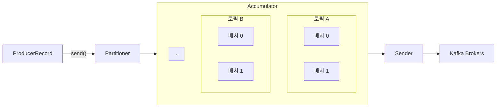

# Producer

## 개념

* 브로커에 데이터를 전송할 때 내부적으로 파티셔너, 배치 생성 단계를 거친다.
* 데이터를 보낼 때 파티션 번호를 직접 지정하거나 타임스탬프, 메시지 키 등을 설정할 수 있다.
* **Partitioner**에 의해 구분된 레코드는 데이터를 전송하기 전 **Accumulator**에 버퍼로 쌓은 후 한꺼번에 보낸다. 이를 통해 카프카의 프로듀서 처리량을 향상시킬 수 있다.
* 압축 옵션을 지정하면 압축된 데이터를 전송한다. 네트워크 처리량에 이득을 볼 수 있지만 압축 시 CPU, 메모리 리소스를 사용하므로 사용 환경에 따라 적절히 사용해야 한다.



## Kafka Client로 프로듀서 구현하기

*   자바를 통해 프로듀서를 구현하기 위해서는 Kafka Client의 클래스들을 사용할 수 있다.

    * `Properties` 객체에 카프카 클러스터의 주소와 메시지 키와 값을 직렬화하는 클래스를 선언한다.
      * StringSerializer는 String 객체를 직렬화해주는 클래스이다.
    * `KafkaProducer` 객체를 생성하고 메시지는 `ProducerRecord` 타입으로 작성한 후 send 메서드를 호출하면 메시지를 전송할 수 있다.

    ```java
    Properties configs = new Properties();
    configs.put(ProducerConfig.BOOTSTRAP_SERVERS_CONFIG, "localhost:9092");
    configs.put(ProducerConfig.KEY_SERIALIZER_CLASS_CONFIG, StringSerializer.class.getName());
    configs.put(ProducerConfig.VALUE_SERIALIZER_CLASS_CONFIG, StringSerializer.class.getName());

    KafkaProducer<String, String> producer = new KafkaProducer<String, String>(configs);

    String messageKey = "key1";
    String messageValue = "testMessage";
    ProducerRecord<String, String> record = new ProducerRecord(TOPIC_NAME, messageKey, messageValue);
    producer.send(record);
    producer.flush();
    producer.close();
    ```

    * send 메서드에서는 내부적으로 `Serialization`, `Partitioning`, `Compression` 작업이 이루어지고 최종적으로 Accumulator의 마지막 배치에 레코드가 저장된다.
    * flush 메서드를 호출하면 프로듀서 내부 버퍼에 있던 배치를 바로 브로커에 전송한다.
    * close 메서드를 호출하여 producer 객체의 리소스를 안전하게 종료한다.
    * Accumulator에는 Partition마다 Deque를 가지고 있으며 Deque 내부에는 batch를 통해 레코드들을 묶어놓는다.

    <figure><figcaption></figcaption></figure>

    * Sender는 브로커 별로 레코드를 전송하는 역할을 하는데, 브로커의 파티션마다 보내야 할 batch 데이터를 가져와 `Ready List`에 저장해둔 후 한꺼번에 보낸다. 이 때 한 번의 요청이 처리할 수 있는 최대 용량까지만 batch 데이터를 담을 수 있다.

    <figure><figcaption></figcaption></figure>
* Accumulator에 레코드가 충분히 차면 배치 형태로 묶어 Sender에 전달한다. Sender는 이 데이터를 브로커에 전송한다.
* send 메서드의 결과로는 `Future<RecordMetadata>` 타입이 반환되는데, 만약 레코드가 정상적으로 적재되었다면 파티션 번호와 오프셋 번호가 담겨 반환된다. 혹은 send 메서드에 Callback 객체를 담아 응답이 왔을 때 콜백이 호출되도록 할 수 있다.

```java
Future<RecordMetadata> f = producer.send(record);
RecordMetadata rm = f.get();
```

```java
producer.send(record, new ProducerCallback());
```

## 파티셔너

* 메시지 키가 존재하는 경우 해시값과 파티션을 매칭해 전송하지만, 메시지 키가 존재하지 않는 경우 파티션에 최대한 동일하게 분배하는 파티셔너가 존재한다.
* UniformStickyPartitioner
  * 프로듀서 동작에 특화되어 높은 처리량과 낮은 리소스 사용률을 가진다.
  * 어큐뮬레이터에서 데이터가 배치로 모두 묶일 때까지 기다렸다가, 배치로 묶인 데이터를 모두 동일한 파티션에 전송한다.
* RoundRobinPartitioner
  * 메시지가 들어오는대로 파티션을 라운드 로빈으로 순회하며 전송하므로 메시지가 배치로 묶이는 빈도가 낮다.

### 커스텀 파티셔너

* 직접 파티셔너 인터페이스를 구현한 커스텀 파티셔너 클래스를 만들고 이를 KafkaProducer 생성 시 프로퍼티로 지정하면 커스텀 파티셔너를 사용할 수 있다.

```java
public class CustomPartitioner implements Partitioner {
    @Override
    public int partition(String topic, Object key, byte[] keyBytes, Object value, byte[] valueBytes, Cluster cluster) {
        // ...
    }

    @Override
    public void configure(Map<String, ?> configs) {
        // ...
    }
    
    @Override
    public void close() {
        // ...
    }
}
```

```java
Properties configs = new Properties();
configs.put(ProducerConfig.PARTITIONER_CLASS_CONFIG, CustomPartitioner.class);
KafkaProducer<String, String> producer = new KafkaProducer<String, String>(configs);
```

## 주요 옵션

### 필수 옵션

* bootstrap.servers
* key.serializer
* value.serializer

### 선택 옵션

* acks
  * 프로듀서가 전송한 데이터가 브로커들에 정상적으로 저장되었는지 여부를 확인하기 위한 옵션이다.
  * 기본값은 1이며, 리더 파티션에 데이터가 저장되면 성공으로 판단한다. 복제 개수를 2 이상으로 운영할 경우 리더 파티션에 적재된 데이터가 팔로워 파티션에는 동기화되지 않은 상황에서 리더 파티션에 장애가 나면 데이터가 유실될 수 있다. 리더 파티션으로부터 응답값을 받을 때 까지 기다리므로 acks를 0으로 설정하는 것에 비해 느리다.
  * 0으로 설정하면 프로듀서가 리더 파티션으로 데이터를 전송한 후 바로 성공했다고 판단한다. 따라서 리더 파티션에 데이터가 몇 번째 오프셋으로 저장되었는지 확인할 수 없다. 또한 데이터 전송의 실패 여부도 알 수 없기 때문에 retries 옵션값을 주어도 무의미해진다. 데이터가 일부 유실되더라도 전송 속도만 빠르면 될 경우 유용하다.
  * -1로 설정하면 토픽의 min.insync.replicas 개 만큼의 팔로워 파티션에 데이터가 저장되었음을 확인해야 성공으로 판단한다. 일부 브로커에 장애가 발생해도 안전하게 데이터를 전송하고 저장할 수 있다.
  * all로 설정하면 ISR에 포함된 파티션들(리더 파티션도 포함) 중 min.insync.replicas 개 만큼의 파티션에 데이터가 적재되었음을 보장한다. min.insync.replicas를 1로 두면 acks를 1로 둔 것과 동일한데, 이는 리더 파티션이 ISR에 포함되어 있고 가장 먼저 적재가 완료되기 때문이다. min.insync.replicas를 2 이상으로 두면 브로커가 동시에 여러 개 중단될 가능성이 거의 없으므로 데이터가 유실되지 않을 것이다.
  * min.insync.replicas 개수보다 실제 브로커 개수가 항상 커야 한다. 만약 그렇지 않으면 NotEnoughRepilcasException 등의 예외가 발생하여 토픽으로 데이터를 보낼 수 없게 된다. 또한 브로커 개수와 동일한 숫자로 설정하면 버전 업그레이드 등으로 인해 롤링 다운 타임이 발생할 때 예외가 발생하므로, 브로커 개수 미만으로 설정해야 한다.
  * 3대 이상의 브로커를 클러스터 형태로 운영할 경우 토픽의 복제 개수는 3, min.insync.replicas는 2, acks는 all로 설정하는 것이 좋다.
* buffer.memory
  * 브로커에 전송할 데이터를 배치로 모을 때 버퍼 메모리 용량을 설정한다.
  * 기본값은 32MB이다.
* retries
  * 프로듀서가 브로커로부터 에러를 받고난 뒤 재시도하는 횟수를 지정한다. 기본값은 max integer 값이다.
* batch.size
  * 배치로 전송할 레코드 최대 용량을 지정한다. 너무 작게 설정하면 브로커에 전송하는 빈도가 높아져 네트워크 부담이 있고, 너무 크게 설정하면 메모리를 많이 사용하게 된다.
  * 기본값은 16384 bytes이다.
* linger.ms
  * 배치를 전송할 때 까지 기다리는 최소 시간이다.
  * 기본값은 0이다.
* partitioner.class
  * 레코드를 파티션에 전송할 때 적용하는 파티셔너 클래스를 지정한다.
  * 커스텀 파티셔너 클래스를 생성해 지정할 수도 있다.
  * 기본값은 null이며, UniformStickyParrtitioner 방식대로 동작하게 된다.
* enable.idempotence
  * 멱등성 프로듀서로 동작할지 여부를 설정한다.
  * 기본값은 false이다.
* transactional.id
  * 레코드 전송 시 트랜잭션 단위로 묶을지 여부를 설정한다. 프로듀서 고유의 트랜잭션 아이디를 설정하면 트랜잭션 프로듀서로 동작한다.
  * 기본값은 null이다.

## 멱등성 프로듀서

* 동일한 데이터를 여러 번 전송해도 카프카 클러스터에 한 번만 저장되는 프로듀서이다.
* 기본 프로듀서는 적어도 한번 전달(at least once delivery) 하는 것을 지원한다. 이로 인해 네트워크 장애 등의 이슈로 동일한 데이터가 2번 이상 적재될 수 있어 데이터가 중복 처리될 수 있다.
* 멱등성 프로듀서는 정확히 한번 전달(exactly once delivery) 하는 것을 지원한다.
* 데이터를 브로커에 전달할 때 프로듀서의 PID, 시퀀스 넘버를 함께 전달하여 브로커가 동일 메시지 적재 요청이 여러번 왔을 때 한 번만 적재하도록 한다.
* 단, 동일한 세션에서만 정확히 한번 전달을 지원한다. 동일한 세션이란 PID의 생명 주기를 의미하며, 프로듀서가 재구동되어 PID가 달라질 경우 브로커는 다른 프로듀서 프로세스가 데이터를 보냈다고 판단하기 때문이다.
* 따라서 멱등성 프로듀서는 프로듀서가 다운되는 장애가 발생하지 않을 경우에만 정상 동작한다.
* enable.idempotence를 true로 설정하면 멱등성 프로듀서로 동작하는데, 이 때 retries값은 Integer.MAX\_VALUE로 설정되고 acks 옵션은 all로 설정된다. 왜냐하면 프로듀서가 적어도 한 번 이상 브로커에 데이터를 보내 단 한 번만 데이터가 적재되는 것을 보장하기 위해서이다.
* 시퀀스 넘버는 0부터 시작해 1씩 더한 값이 전달된다. 브로커가 예상한 시퀀스 넘버가 아닌 다른 시퀀스 넘버가 온 경우, OutOfOrderSequenceException이 발생한다. 순서가 중요한 데이터를 전송하는 경우 예외 처리를 잘 해야 한다.

## 트랜잭션 프로듀서

* 다수의 파티션에 데이터를 저장할 경우 모든 데이터에 대해 동일한 원자성을 만족시키기 위해 사용된다.
* enable.idempotence를 true로 설정하고 transactional.id를 임의의 String 값으로 정의한다. 컨슈머의 isolation.level을 read\_committed로 설정한다.
* 트랜잭션 프로듀서와 컨슈머는 트랜잭션으로 처리 완료된 데이터만 읽고 쓰게 된다.
* 트랜잭션 프로듀서는 트랜잭션의 시작과 끝을 트랜잭션 레코드를 한 개 더 보낸다. 트랜잭션이 끝난 상태를 표시하는 정보를 가지며, 레코드이기 때문에 오프셋 한 개를 차지한다.
* 아래 그림에서 commit 이라는 레코드가 트랜잭션 레코드이다.

<figure><figcaption><p><a href="https://gunju-ko.github.io/kafka/2018/03/31/Kafka-Transaction.html">https://gunju-ko.github.io/kafka/2018/03/31/Kafka-Transaction.html</a></p></figcaption></figure>

* 트랜잭션 컨슈머는 파티션에 저장된 트랜잭션 레코드를 확인하면 트랜잭션이 완료되었다고 간주하고 데이터를 읽는다. 만약 트랜잭션 레코드가 존재하지 않으면 아직 트랜잭션이 완료되지 않았다고 판단하고 데이터를 가져가지 않는다.

## 스프링 카프카 프로듀서

* 기본 카프카 템플릿을 아래와 같이 사용할 수 있다.
  * KafkaTemplate 객체를 직접 빈으로 등록하지 않아도 스프링 카프카에서 application.yml 속성을 반영한 기본적인 KafkaTempalte을 주입해준다.
  * send 메서드를 통해 토픽에 데이터를 보낸다.

```java
private static String TOPIC_NAME = "test";
@Autowired
private KafkaTemplate<Integer, String> template;

public void run() {
    for (int i = 0; i < 10; i++) {
        template.send(TOPIC_NAME, "test" + i);
    }
}
```

* 직접 프로듀서 팩토리를 이용해 카프카 템플릿을 생성해 사용할 수도 있다. 여러 클러스터에 데이터를 전송하고자 한다면 KafkaTemplate 객체를 여러 개 만들어 사용해야 한다.

```java
@Configuration
public class KafkaTemplateConfiguration {

    @Bean
    public KafkaTemplate<String, String> customKafkaTemplate() {

        Map<String, Object> props = new HashMap<>();
        props.put(ProducerConfig.BOOTSTRAP_SERVERS_CONFIG, "my-kafka:9092");
        props.put(ProducerConfig.KEY_SERIALIZER_CLASS_CONFIG, StringSerializer.class);
        props.put(ProducerConfig.VALUE_SERIALIZER_CLASS_CONFIG, StringSerializer.class);
        props.put(ProducerConfig.ACKS_CONFIG, "all");

        ProducerFactory<String, String> pf = new DefaultKafkaProducerFactory<>(props);

        return new KafkaTemplate<>(pf);
    }
}
```

* 아래와 같이 ListenableFuture를 통해 작업이 완료되었을 때 실행할 콜백을 등록할 수도 있다.

```java
ListenableFuture<SendResult<String, String>> future = customKafkaTemplate.send(TOPIC_NAME, "test");
future.addCallback(new KafkaSendCallback<String, String>() {
    @Override
    public void onSuccess(SendResult<String, String> result) {
        // ...
    }

    @Override
    public void onFailure(KafkaProducerException ex) {
        // ...
    }
});
```

