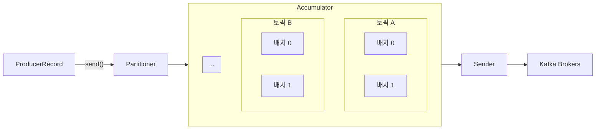

# Producer

## 개념

* 브로커에 데이터를 전송할 때 내부적으로 파티셔너, 배치 생성 단계를 거친다.
* 데이터를 보낼 때 파티션 번호를 직접 지정하거나 타임스탬프, 메시지 키 등을 설정할 수 있다.
* **Partitioner**에 의해 구분된 레코드는 데이터를 전송하기 전 **Accumulator**에 버퍼로 쌓은 후 한꺼번에 보낸다. 이를 통해 카프카의 프로듀서 처리량을 향상시킬 수 있다.
* 압축 옵션을 지정하면 압축된 데이터를 전송한다. 네트워크 처리량에 이득을 볼 수 있지만 압축 시 CPU, 메모리 리소스를 사용하므로 사용 환경에 따라 적절히 사용해야 한다.



## Kafka Client로 프로듀서 구현하기

*   자바를 통해 프로듀서를 구현하기 위해서는 Kafka Client의 클래스들을 사용할 수 있다.

    * `Properties` 객체에 카프카 클러스터의 주소와 메시지 키와 값을 직렬화하는 클래스를 선언한다.
      * StringSerializer는 String 객체를 직렬화해주는 클래스이다.
    * `KafkaProducer` 객체를 생성하고 메시지는 `ProducerRecord` 타입으로 작성한 후 send 메서드를 호출하면 메시지를 전송할 수 있다.

    ```java
    Properties configs = new Properties();
    configs.put(ProducerConfig.BOOTSTRAP_SERVERS_CONFIG, "localhost:9092");
    configs.put(ProducerConfig.KEY_SERIALIZER_CLASS_CONFIG, StringSerializer.class.getName());
    configs.put(ProducerConfig.VALUE_SERIALIZER_CLASS_CONFIG, StringSerializer.class.getName());

    KafkaProducer<String, String> producer = new KafkaProducer<String, String>(configs);

    String messageKey = "key1";
    String messageValue = "testMessage";
    ProducerRecord<String, String> record = new ProducerRecord(TOPIC_NAME, messageKey, messageValue);
    producer.send(record);
    producer.flush();
    producer.close();
    ```

    * send 메서드에서는 내부적으로 `Serialization`, `Partitioning`, `Compression` 작업이 이루어지고 최종적으로 Accumulator의 마지막 배치에 레코드가 저장된다.
    * flush 메서드를 호출하면 프로듀서 내부 버퍼에 있던 배치를 바로 브로커에 전송한다.
    * close 메서드를 호출하여 producer 객체의 리소스를 안전하게 종료한다.
    * Accumulator에는 Partition마다 Deque를 가지고 있으며 Deque 내부에는 batch를 통해 레코드들을 묶어놓는다.

    <figure><figcaption></figcaption></figure>

    * Sender는 브로커 별로 레코드를 전송하는 역할을 하는데, 브로커의 파티션마다 보내야 할 batch 데이터를 가져와 `Ready List`에 저장해둔 후 한꺼번에 보낸다. 이 때 한 번의 요청이 처리할 수 있는 최대 용량까지만 batch 데이터를 담을 수 있다.

    <figure><figcaption></figcaption></figure>
* Accumulator에 레코드가 충분히 차면 배치 형태로 묶어 Sender에 전달한다. Sender는 이 데이터를 브로커에 전송한다.
* send 메서드의 결과로는 `Future<RecordMetadata>` 타입이 반환되는데, 만약 레코드가 정상적으로 적재되었다면 파티션 번호와 오프셋 번호가 담겨 반환된다. 혹은 send 메서드에 Callback 객체를 담아 응답이 왔을 때 콜백이 호출되도록 할 수 있다.

```java
Future<RecordMetadata> f = producer.send(record);
RecordMetadata rm = f.get();
```

```java
producer.send(record, new ProducerCallback());
```

## 파티셔너

* 메시지 키가 존재하는 경우 해시값과 파티션을 매칭해 전송하지만, 메시지 키가 존재하지 않는 경우 파티션에 최대한 동일하게 분배하는 파티셔너가 존재한다.
* UniformStickyPartitioner
  * 프로듀서 동작에 특화되어 높은 처리량과 낮은 리소스 사용률을 가진다.
  * 어큐뮬레이터에서 데이터가 배치로 모두 묶일 때까지 기다렸다가, 배치로 묶인 데이터를 모두 동일한 파티션에 전송한다.
* RoundRobinPartitioner
  * 메시지가 들어오는대로 파티션을 라운드 로빈으로 순회하며 전송하므로 메시지가 배치로 묶이는 빈도가 낮다.

### 커스텀 파티셔너

* 직접 파티셔너 인터페이스를 구현한 커스텀 파티셔너 클래스를 만들고 이를 KafkaProducer 생성 시 프로퍼티로 지정하면 커스텀 파티셔너를 사용할 수 있다.

```java
public class CustomPartitioner implements Partitioner {
    @Override
    public int partition(String topic, Object key, byte[] keyBytes, Object value, byte[] valueBytes, Cluster cluster) {
        // ...
    }

    @Override
    public void configure(Map<String, ?> configs) {
        // ...
    }
    
    @Override
    public void close() {
        // ...
    }
}
```

```java
Properties configs = new Properties();
configs.put(ProducerConfig.PARTITIONER_CLASS_CONFIG, CustomPartitioner.class);
KafkaProducer<String, String> producer = new KafkaProducer<String, String>(configs);
```

## 주요 옵션

### 필수 옵션

* bootstrap.servers
* key.serializer
* value.serializer

### 선택 옵션

* acks
  * 프로듀서가 전송한 데이터가 브로커들에 정상적으로 저장되었는지 여부를 확인하기 위한 옵션이다.
  * 기본값은 1이며, 리더 파티션에 데이터가 저장되면 성공으로 판단한다.
  * 0으로 설정하면 프로듀서가 전송한 즉시 성공으로 판단한다.
  * \-1로 설정하면 토픽의 min.insync.replicas 개 만큼의 파티션에 데이터가 저장되면 성공으로 판단한다.
* buffer.memory
  * 브로커에 전송할 데이터를 배치로 모을 때 버퍼 메모리 용량을 설정한다.
  * 기본값은 32MB이다.
* retries
  * 프로듀서가 브로커로부터 에러를 받고난 뒤 재시도하는 횟수를 지정한다. 기본값은 max integer 값이다.
* batch.size
  * 배치로 전송할 레코드 최대 용량을 지정한다. 너무 작게 설정하면 브로커에 전송하는 빈도가 높아져 네트워크 부담이 있고, 너무 크게 설정하면 메모리를 많이 사용하게 된다.
  * 기본값은 16384 bytes이다.
* linger.ms
  * 배치를 전송할 때 까지 기다리는 최소 시간이다.
  * 기본값은 0이다.
* partitioner.class
  * 레코드를 파티션에 전송할 때 적용하는 파티셔너 클래스를 지정한다.
  * 커스텀 파티셔너 클래스를 생성해 지정할 수도 있다.
  * 기본값은 null이며, UniformStickyParrtitioner 방식대로 동작하게 된다.
* enable.idempotence
  * 멱등성 프로듀서로 동작할지 여부를 설정한다.
  * 기본값은 false이다.
* transactional.id
  * 레코드 전송 시 트랜잭션 단위로 묶을지 여부를 설정한다. 프로듀서 고유의 트랜잭션 아이디를 설정하면 트랜잭션 프로듀서로 동작한다.
  * 기본값은 null이다.
