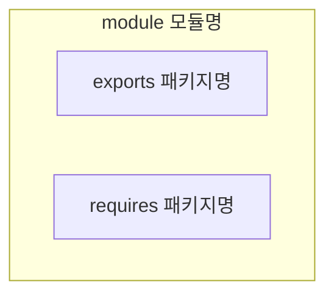

# 14장: 자바 모듈 시스템

## 모듈의 필요성

### 관심사 분리

* SoC(Separation of concerns)로 줄여 말하며, 컴퓨터 프로그램을 고유의 기능으로 나누는 동작을 권장하는 원칙
* 각각의 기능에 따라 코드 그룹을 분리할 수 있다.
* 자바 9 모듈은 클래스가 어떤 다른 클래스를 볼 수 있는지 컴파일 타임에 제어할 수 있다.
* 개별 기능을 따로 작업할 수 있으므로 협업에 용이하고, 재사용에 용이하고, 전체 시스템의 유지 보수에 좋다.

### 정보 은닉

* 세부 구현을 숨기도록 장려하는 원칙
* 프로그램의 어떤 부분을 바꿨을 때 다른 부분에 영향을 미칠 가능성을 줄여 코드를 관리하고 보호할 수 있다.
* `private` 등의 접근 제한자를 적절하게 사용했는지를 기준으로 캡슐화를 확인할 수 있지만, 클래스와 패키지가 의도된 대로 공개되었는지 컴파일러로 확인할 수 없다.
* 기존에는 클래스 수준의 접근 제한자, 캡슐화만 지원하고 패키지, JAR 수준에서는 캡슐화를 거의 지원하지 않는다.

### 클래스 경로

* 클래스 경로에는 같은 클래스를 구분하는 버전 개념이 없어 클래스 경로에 버전이 다른 같은 라이브러리가 존재하면 어떤 일이 일어날지 예측할 수 없다.
* 클래스 경로는 명시적인 의존성을 지원하지 않아 어떤 JAR가 다른 JAR에 포함된 클래스 집합을 사용할 것을 명시적으로 정의할 수 없다.
* 자바 9 이전에는 자바, JVM에서 명시적인 의존성 정의를 지원하지 않아 컴파일 타임에 클래스 경로 에러를 잡기 어려웠다.
* Maven이나 Gradle 같은 빌드 도구가 이런 문제를 해결하는데에 도움을 준다.

### 거대한 JDK

* 자바 개발 키트(JDK)는 자바 프로그램을 만들고 실행하는데 도움을 주는 도구의 집합이다.
* JDK 의 많은 내부 API 는 공개되지 않아야 하는데 자바 언어의 낮은 캡슐화 지원으로 인해 외부에 공개되었다.
* 예를 들어 `sun.misc.Unsafe` 클래스는 JDK 내부용으로 만든 클래스이지만 Spring, Netty, Mockito에서 사용되어 하위 호환성을 깨지 않고는 API를 바꾸기 어려운 상황이 되었다.

## 자바의 모듈

* 자바 8에서는 모듈이라는 새로운 자바 프로그램 구조 단위를 제공한다.
* 모듈을 정의하기 위해서는 `module` 키워드에 이름과 바디를 추가해야 한다.
* 모듈 디스크립터는 패키지와 같은 위치에 존재하는 `module-info.java` 라는 파일에 저장되며, 여러 패키지를 서술하고 캡슐화할 수 있긴 하지만 일반적으로 한 개 패키지만 노출시킨다.
* Maven, Gradle을 사용하는 경우 IDE가 모듈의 많은 세부사항을 처리하여 사용자에게는 잘 드러나지 않는다.
* 모듈 디스크립터는 아래와 같은 구조로 구성되어 모듈의 의존성과 어떤 기능을 외부로 노출할 지 정의할 수 있다.



### exports 구문

* 모듈 시스템은 화이트 리스트 기법으로 캡슐화를 제공하므로, 다른 모듈에서 사용할 수 있는 기능을 명시해야 한다.
* 아래는 readers라는 패키지에 module-info.java 를 작성하고, 해당 패키지 하위에 존재하는 특정 패키지를 export하여 다른 모듈에서 사용할 수 있도록 한다.&#x20;

> 패키지 구조는 `expenses.readers.com.example.request.readers.file` 과 같이 구성된 경우를 가정한다.

```java
module expenses.readers {
    exports com.example.request.readers;
    exports com.example.request.readers.file;
    exports com.example.request.readers.http;
}
```

* exports to 구문을 이용해 사용자에게 공개할 기능을 제한할 수 있다.

```java
module com.iteratrlearning.ui {
    // widgets 접근 권한을 가진 사용자의 권한을 widgetuser 로 제한 
    exports com.iteratrlearning.ui.widgets to
      com.iteratrlearning.ui.widgetuser;
}
```

### requires 구문

* 해당 모듈이 의존할 모듈을 지정한다.
* 모든 모듈은 java.base라는 플랫폼 모듈에 의존하는데, 이는 net, io, util 등의 자바 메인 패키지를 포함한다. 다만 이는 명시적으로 정의할 필요는 없다.

```java
module expenses.readers {
    requires java.base;
    
    exports com.example.expenses.readers;
    exports com.example.expenses.readers.file;
    exports com.example.expenses.readers.http;  
}
```

* transitive 키워드를 함께 사용하여 다른 모듈이 제공하는 공개 형식을 한 모듈에서 사용할 수 있다고 지정할 수 있다.

```java
module com.iteratrlearning.ui {
    requires transitive com.iteratrlearning.core;
    
    exports com.iteratrlearning.ui.panels;
    exports com.iteratrlearning.ui.widgets;
}

module com.iteratrlearning.application {
    // com.iteratrlearning.core 에도 접근 가능
    requires com.iteratrlearning.ui;
}
```

### open 구문

* open 한정자를 사용해 모든 패키지를 다른 모듈에 reflective한 접근을 허용할 수 있다. 자바 9 에서는 리플렉션으로 객체의 비공개 상태를 확인할 수 없기 때문에 해당 기능이 필요하면 open 구문을 명시하고 사용해야 한다.
* opens 구문을 사용해 필요한 개별 패키지만 개방할 수 있다. (`to` 키워드로 특정 모듈만 지정 가능)

```java
open module com.iteratrlearning.ui {
}

module com.iteratrlearning.ui {
    opens com.iteratrlearning.ui.panels
}
```

### uses / provides 구문

* provides 구문을 사용해 서비스 제공자를 지정할 수 있다.
* uses 구문을 사용해 서비스 소비자를 지정할 수 있다.

### 모듈명

* 모듈 이름은 패키지명처럼 인터넷 인터넷 도메인명을 역순으로 지정하도록 권고한다.
* 모듈명은 노출된 주요 API 패키지와 이름이 같아야 한다.

## 컴파일과 패키징

* 모듈은 독립적으로 컴파일 되기 때문에 자체적으로 각각이 한 개의 프로젝트이다.
* Maven을 사용할 겨웅 전체 프로젝트 빌드를 위해 모든 모듈의 부모 모듈(전역 모듈)에 pom.xml 을 추가하고, 각 모듈마다도 pom.xml을 추가해주어야 한다.
* 전역 모듈에는 아래와 같이 하위 모듈을 참조한다.

```xml
<modules>
    <module>expenses.application</module>
    <module>expenses.readers</module>
</modules>
```

* 각 모듈에는 부모 모듈을 추가한다.

```xml
    <parent>
        <groupId>com.example</groupId>
        <artifactId>expenses</artifactId>
        <version>1.0</version>
    </parent>
```

* 다른 모듈을 참조하고자 하면 아래와 같이 의존성을 추가하면 된다.

```xml
    <dependencies>
        <dependency>
            <groupId>com.example</groupId>
            <artifactId>expenses.readers</artifactId>
            <version>1.0</version>
        </dependency>
    </dependencies>
```

* `mvn clean package` 명령으로 모듈을 각각의 jar 로 생성할 수 있으며, 두 jar 을 모듈 경로에 포함해 모듈 애플리케이션을 실행한다.

```
java --module-path \
./expenses.application/target/expenses.application-1.0.jar:\
./expenses.readers/target/expenses.readers-1.0.jar \
  --module expenses.application/com.example.expenses.application.ExpensesApplication
```

## 자동 모듈

* 자바는 JAR 를 자동 모듈이라는 형태로 적절하게 변환한다. 모듈 경로 상에 있으나 `module-info.java` 파일을 가지지 않은 모든 JAR는 자동 모듈이 된다.
