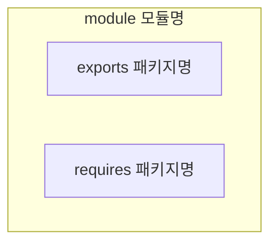

# 14장: 자바 모듈 시스템

## 모듈의 필요성

### 관심사 분리

* SoC(Separation of concerns)로 줄여 말하며, 컴퓨터 프로그램을 고유의 기능으로 나누는 동작을 권장하는 원칙
* 각각의 기능에 따라 코드 그룹을 분리할 수 있다.
* 자바 9 모듈은 클래스가 어떤 다른 클래스를 볼 수 있는지 컴파일 타임에 제어할 수 있다.
* 개별 기능을 따로 작업할 수 있으므로 협업에 용이하고, 재사용에 용이하고, 전체 시스템의 유지 보수에 좋다.

### 정보 은닉

* 세부 구현을 숨기도록 장려하는 원칙
* 프로그램의 어떤 부분을 바꿨을 때 다른 부분에 영향을 미칠 가능성을 줄여 코드를 관리하고 보호할 수 있다.
* `private` 등의 접근 제한자를 적절하게 사용했는지를 기준으로 캡슐화를 확인할 수 있지만, 클래스와 패키지가 의도된 대로 공개되었는지 컴파일러로 확인할 수 없다.
* 기존에는 클래스 수준의 접근 제한자, 캡슐화만 지원하고 패키지, JAR 수준에서는 캡슐화를 거의 지원하지 않는다.

### 클래스 경로

* 클래스 경로에는 같은 클래스를 구분하는 버전 개념이 없어 클래스 경로에 버전이 다른 같은 라이브러리가 존재하면 어떤 일이 일어날지 예측할 수 없다.
* 클래스 경로는 명시적인 의존성을 지원하지 않아 어떤 JAR가 다른 JAR에 포함된 클래스 집합을 사용할 것을 명시적으로 정의할 수 없다.
* 자바 9 이전에는 자바, JVM에서 명시적인 의존성 정의를 지원하지 않아 컴파일 타임에 클래스 경로 에러를 잡기 어려웠다.
* Maven이나 Gradle 같은 빌드 도구가 이런 문제를 해결하는데에 도움을 준다.

### 거대한 JDK

* 자바 개발 키트(JDK)는 자바 프로그램을 만들고 실행하는데 도움을 주는 도구의 집합이다.
* JDK 의 많은 내부 API 는 공개되지 않아야 하는데 자바 언어의 낮은 캡슐화 지원으로 인해 외부에 공개되었다.
* 예를 들어 `sun.misc.Unsafe` 클래스는 JDK 내부용으로 만든 클래스이지만 Spring, Netty, Mockito에서 사용되어 하위 호환성을 깨지 않고는 API를 바꾸기 어려운 상황이 되었다.

## 자바의 모듈

* 자바 8에서는 모듈이라는 새로운 자바 프로그램 구조 단위를 제공한다.
* 모듈을 정의하기 위해서는 `module` 키워드에 이름과 바디를 추가해야 한다.
* 모듈 디스크립터는 패키지와 같은 위치에 존재하는 `module-info.java` 라는 파일에 저장되며, 여러 패키지를 서술하고 캡슐화할 수 있긴 하지만 일반적으로 한 개 패키지만 노출시킨다.
* Maven, Gradle을 사용하는 경우 IDE가 모듈의 많은 세부사항을 처리하여 사용자에게는 잘 드러나지 않는다.

