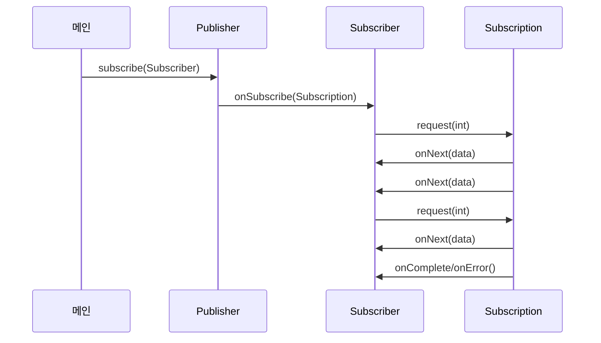

# 17장: 리액티브 프로그래밍

* 기존 소프트웨어 아키텍처로는 페타 바이트 단위로 구성되어 매일 증가하는 빅데이터, 다양한 환경에 배포되는 애플리케이션, 1년 내내 밀리초 단위의 응답을 처리할 수 없다.
* 리액티브 프로그래밍은 다양한 시스템과 소스로부터 들어오는 데이터를 비동기적으로 처리하고 합치는 방식을 사용할 수 있다.
* 리액티브 프로그래밍은 리액티브 스트림을 사용하여 잠재적인 무한의 비동기 데이터를 순서대로, 블록하지 않는 역압력을 전재해 처리하는 표준 기술이다.
* 역압력이란 발행-구독 프로토콜에서 이벤트 스트림의 구독자가 발행자의 이벤트 제공 속도보다 느린 속도로 이벤트를 소비할 때 문제가 발생하지 않도록 보장하는 장치이다. 이벤트 발행 속도를 늦추라고 알리거나 얼마나 많은 이벤트를 수신할 수 있는지 알림으로써 발행자가 이벤트를 제공할 때 신경쓸 수 있도록 한다.
* 리액티브 시스템을 구성하는 여러 컴포넌트를 조절하는 데에도 리액티브 기법을 사용할 수 있다.

## Reactive Manifesto

### 핵심 원칙

* 반응성(responsive)
  * 리액티브 시스템은 빠를 뿐 아니라 일정하고 예상가능한 반응 시간을 제공하여 사용자가 어떤 동작을 할 지 기대할 수 있다.
* 회복성(resilient)
  * 장애가 발생하여도 시스템은 반응해야 한다.
  * 회복성을 달성할 수 있는 기법으로는 컴포넌트 실행 복제, 여러 컴포넌트의 시간(발신자와 수신자의 생명주기 분리)과 공간(발신자와 수신자의 프로세스 분리), 각 컴포넌트가 비동기적으로 작업을 다른 컴포넌트에 위임하는 등이 있다.
* 탄력성(elastic)
  * 애플리케이션의 생명주기 동안 다양한 작업 부하가 발생하는데, 대량의 작업 부하가 발생할 경우 자동으로 컴포넌트에 할당된 자원 수를 늘린다.
* 메시지 주도(message-driven)
  * 회복성과 탄력성을 지원하려면 약한 결합, 고립, 위치 투명성(모든 컴포넌트가 수신자의 위치에 상관없이 모든 서비스와 통신이 가능한 것) 등을 지원할 수 있도록 시스템을 구성하는 컴포넌트의 경계를 명확히 정의해야 한다.
  * 비동기 메시지를 전달하여 컴포넌트 끼리의 통신이 이루어지므로 회복성(장애를 메시지로 처리)과 탄력성(주고받은 메시지 양을 감지하여 적절히 리소스 할당)을 얻을 수 있다.

### 애플리케이션 수준의 리액티브

* 이벤트 스트림을 블록하지 않고 비동기로 처리하여 최신 멀티코어 CPU의 (스레드) 사용률을 극대화 할 수 있다.
* 리액티브 프레임워크나 라이브러리는 스레드를 퓨처, 액터, 일련의 콜백을 발생시키는 이벤트 루프 등과 공유하고, 처리할 이벤트를 변환 및 관리한다.
* 스레드를 다시 쪼개는 종류의 기술을 사용할 경우 메인 이벤트 루프 안에서는 절대 동작을 블록(Block)하지 않아야 한다.
* 데이터베이스나 파일 시스템 접근, 작업 완료 시간을 예측하기 어려운 외부 시스템 호출 등 I/O 관련 작업이 블록 동작에 해당한다. 수많은 이벤트 스트림을 처리하는 여러 스레드가 있을 때 블록 작업이 수행중인 스레드는 다른 이벤트를 처리할 수 없다.
* 따라서 CPU 작업과 I/O 작업을 분리하여 스레드 풀과 크기를 조정해야 한다.

### 시스템 수준의 리액티브

* 리액티브 시스템은 여러 애플리케이션이 한 개의 일관적인, 회복가능한 플랫폼을 구성할 수 있게 해줄 뿐 아니라 이들 애플리케이션 중 하나가 실패해도 전체 시스템은 계속 운영될 수 있도록 도와주는 소프트웨어 아키텍처다.
* 리액티브 애플리케이션은 비교적 짧은 시간동안 유지되는 데이터 스트림에 기반한 연상을 수행하여 **이벤트 주도**로 분류된다. 리액티브 시스템은 애플리케이션을 조립하고 상호소통을 조절하여 **메시지 주도**로 분류된다.
* 리액티브 시스템에서는 수신자와 발신자가 각각 수신/발신 메시지와 결합하지 않도록 비동기로 처리해야 한다.
* 컴포넌트를 고립시키기 위해 결합되지 않도록 해야하며, 이를 통해 리액티브 시스템이 장애(회복성)와 높은 부하(탄력성)에서도 반응성을 유지할 수 있다.
* 위치 투명성을 통해 시스템을 복제하고 현재 작업 부하에 따라 자동으로 애플리케이션을 확장할 수 있다.

## 리액티브 스트림과 Flow 클래스

* 자바 9에서는 리액티브 스트림의 정의에 따른 Flow 클래스를 제공한다. 단, 이는 Reactor, RxJava와는 독립된 또다른 컴포넌트이다.
*
* Publisher가 이벤트를 발행하면 Subscriber는 한 개씩 혹은 여러 개씩 소비하는 것을 관리할 수 있도록 Subscription을 제공한다.
* Subscriber는 Publisher가 발행하는 이벤트의 리스너로 자신을 등록할 수 있고, Subscription은 Publisher와 Subscriber 사이의 제어 흐름, 역압력을 관리한다.
* Flow 클래스에서는 Publisher, Subscriber, Subscription, Processor 의 네 가지 인터페이스를 제공하며 각각 생명주기를 다룬 다이어그램은 아래와 같다.
  * Publisher의 subscribe 메서드에 Subscriber 객체를 입력하면, Publisher는 onSubscribe 메서드를 호출할 것이다.
  * Subscriber가 Subscription의 request(int) 메서드를 호출하면, Subscription이 onNext(T t)를 호출하여 이벤트를 발행할 것이다.
  * 언뜻 생각하기에는 Publisher가 직접 이벤트를 발행하고 이를 Subscriber가 받는 것 아닌가? 생각할 수 있는데, 사실 Publisher는 Subscriber와 Subscription을 이어주는 매개체 역할을 한다.



* 각각 클래스에 대한 설명은 아래에 이어진다.

### Publisher

```java
@FunctionalInterface
public interface Publisher<T> {
  void subscribe(Subscriber<? super T> s);
}
```

* 반드시 Subscription의 request 메서드에 정의된 개수 이하의 요소만 Subscriber에 전달해야 한다.
* onNext()로 전달할 수 있으며, 동작이 성공적으로 끝나면 onComplete, 실패하면 onError를 호출해 Subscription을 종료할 수 있다.

### Subscriber

```java
public interface Subscriber<T> {
  void onSubscribe(Subscription s);
  void onNext(T t);
  void onError(Throwable t);
  void onComplete();
}
```

* Publisher는 `onSubscribe onNext* (onError | onComplete)?` 의 순서대로 메서드를 호출하여 이벤트를 발행한다. onNext는 여러번 호출될 수 있다.
* Subscriber는 Publisher에게 요소를 받아 처리할 수 있음을 알려 역압력을 행사할 수 있다.
* Subscription#request 메서드 호출 없이도 언제든 종료 시그널을 받을 준비가 되어있어야 하며, Subscription#cancel 메서드가 호출된 이후여도 한 개 이상의 onNext를 받을 준비가 되어야 한다.

### Subscription

```java
public interface Subscription {
  void request(long n);
  void cancel();
}
```

* Publisher와 Subscriber는 정확히 Subscription을 공유해야 한다.
* 따라서 onSubscriber와 onNext 메서드에서 Subscriber는 request 메서드를 동기적으로 호출 가능해야 한다.
* cancel() 메서드는 여러번 호출되어도 영향이 없도록 thread-safe해야 한다.

### Processor

```java
public interface Processor<T, R> extends Subscriber<T>, Publisher<R> { }
```

* 리액티브 스트림에서 처리하는 이벤트의 변환 단계를 나타낸다.
* 즉, 특정 Publisher를 구독하여 이벤트가 들어오면 해당 이벤트의 내용을 가공하고, 이를 다시 Publish하기 위한 목적으로 사용한다.
* 에러를 수신하면 이를 회복하거나 onError로 모든 Subscriber에 에러를 전파하도록 만들 수 있다.

## 리액티브 애플리케이션 예제

### Subscription 구성

* 가장 먼저 원격 온도계와 비슷하도록 특정 지역의 온도를 임의로 반환하는 `TempInfo` 클래스를 만들고, `TempSubscription` 클래스에서 request 메서드를 통해 구독자가 데이터를 요청하면 임의의 온도를 담은 임의의 `TempInfo` 클래스를 반환해주도록 한다.
* 아래는 `TempInfo` 클래스이다. 특정 지역의 온도를 담아 반환하는 메서드를 제공하며  1/10 확률로 실패해 예외가 발생할 수 있다.

```java
import java.util.Random;

@Getter
public class TempInfo {
  public static final Random random = new Random();
  
  private final String town;
  private final int temp;
  
  public TempInfo(String town, int temp) {
    this.town = town;
    this.temp = temp;
  }
  
  public static TempInfo fetch(String town) {
    if (random.nextInt(10) == 0)
      throw new RuntimeException("Error!");
  
    return new TempInfo(town, random.nextInt(100));
  }
}
```

* 아래는 `TempSubscription` 클래스이다. 앞서 말했듯 request 메서드를 호출 시 원하는 만큼의 데이터를 onNext 메서드의 인자로 넣어 Subscriber가 받을 수 있도록 한다.
* 만약 데이터 생성에 실패할 경우 onError 메서드를 통해 예외를 전파시킨다.

```java
import java.util.concurrent.Flow.*;

@AllArgsConstructor
public class TempSubscription implements Subscription {
  private final Subscriber<? super TempInfo> subscriber;
  private final String town;

  @Override
  public void request(long n) {
    executor.submit(() -> {
      for (long i = 0L; i < n; i++) {
        try {
          subscriber.onNext(TempInfo.fetch(town));
        } catch (Exception e) {
          subscriber.onError(e);
          break;
        }
      }
    });
  }
  
  @Override
  public void cancel() {
    subscriber.onComplete(); //구독 취소되면 완료신호를 Subscriber로 전달
  }
}
```

### Subscriber 구현

* 아래는 TempSubscriber 클래스이다. 새로운 데이터가 들어오면 출력해주는 onNext(...) 메서드를 구현하였다.

```java
import java.util.concurrent.Flow.*;

public class TempSubscriber implements Subscriber<TempInfo> {
  private Subscription subscription;

  @Override
  public void onSubscribe(Subscription subscription) { // 구독을 저장하고 첫 번째 요청을 전달
    this.subscription = subscription;
    subscription.request(1);
  }
  
  @Override
  public void onNext(TempInfo tempInfo) { // 수신한 온도를 출력하고 다음 정보를 요청
    System.out.println(tempInfo);
    subscription.request(1);
  }
  
  @Override
  public void onError(Throwable t) {
    System.out.println(t.getMessage());
  }
  
  @Override
  public void onComplete() {
    System.out.println("done!");
  }
}
```

### Publisher 구현 및 구독 관계 등록

* 함수형 인터페이스인 Publisher를 람다 형태로 반환한 getTemperatures 메서드에 subscribe 메서드를 체이닝하여 구독 관계를 만들면 해당 지역의 온도가 이벤트로 전달될 것이다.

```java
public class Main {
  public static void main(String[] args) {
    getTemperatures("New York").subscribe(new TempSubscriber());
  }
  
  private static Publisher<TempInfo> getTemperatures(String town) {
    return subscriber -> subscriber.onSubscribe(
        new TempSubscription(subscriber, town)
    );
  }
}
```

## Processor 예제

* 아래는 이벤트에 담겨온 화씨 온도를 섭씨 온도로 바꾸어 다시 이벤트를 전달하는 Processor 구현체이다.
* onNext 메서드 내부에서 화씨 온도를 섭씨 온도로 변환하는 부분이 존재하고, 나머지 메서드에서는 subscriber의 동작을 그대로 수행하도록 한다.

```java
import java.util.concurrent.Flow.*;

public class TempProcessor implements Processor<TempInfo, TempInfo> {
  private Subscriber<? super TempInfo> subscriber;
  
  @Override
  public void subscribe(Subscriber<? super TempInfo> subscriber) {
    this.subscriber = subscriber;
  }
  
  @Override
  public void onNext(TempInfo tempInfo) {
    subscriber.onNext(
      new TempInfo(tempInfo.getTown(), (tempInfo.getTemp() - 32) * 5 / 9));
  }
  
  @Override
  public void onError(Throwable t) {
    subscriber.onError(t);
  }
  
  @Override
  public void onComplete() {
    subscriber.onComplete();
  }
}
```

```java
public class Main {
  public static void main(String[] args) {
    getTemperatures("New York").subscribe(new TempSubscriber());
  }
  
  private static Publisher<TempInfo> getTemperatures(String town) {
    return subscriber -> {
      TempProcessor processor = new TempProcessor();
      processor.subscribe(subscriber);
      processor.onSubscribe(new TempSubscription(processor, town));
    };
  }
}
```

## RxJava 사용하기

* RxJava는 넷플릭스의 Reactive Extensions(Rx) 프로젝트의 일부로 시작되어 2.0 버전에서는 자바 9의 java.util.concurrent.Flow와 Reactive Streams API를 지원하도록 개발되었다.
* Observable 인터페이스와 Flowable 클래스를 제공하며, 이를 통해 리액티브 스트림을 만들 수 있다.

### 구성 요소

#### Observable

* just 팩토리 메서드를 사용해 한 개 이상의 요소를 방출하는 Observable 구현체를 사용할 수 있다.

```java
Observable<String> strings = Observable.just("first", "second");
```

* interval 팩토리 메서드를 사용해 특정 시간 간격으로 값을 방출하는 Observable 구현체를 사용할 수 있다.

```java
Observable<Long> nums = Observable.interval(1, TimeUnit.SECONDS);
```

* RxJava에서 Observable은 Publisher 역할을 하며, Observer는 Subscriber 역할을 한다.

#### Observer

* Observable의 subscribe 메서드에 람다식을 입력해 onNext만 정의하는 Observer 객체를 등록할 수 있다. subscribe 메서드는 데몬 스레드에서 작업을 수행하므로 메인 스레드가 이보다 먼저 종료되면 아무 동작도 하지 않는다. 이러한 경우에는 요청한 스레드에서 콜백을 호출하여 블로킹되는 blockingSubscribe 메서드를 사용하면 된다.

```java
nums.subscribe(i -> System.out.println(TempInfo.fetch("New York"));

nums.blockingSubscribe(i -> System.out.println(TempInfo.fetch("New York"));
```

#### Emitter

* 아래는 매 초마다 온도를 방출하며, 최대 5번만 방출하고 종료하는 팩토리 메서드의 구현이다.
* 소비된 Observer가 폐기되었다면 이전 스트림에서 에러가 발생한 것이므로 더이상 작업을 수행하지 않도록 하였다.

```java
public static Observable<TempInfo> getTemperature(String town) {
      return Observable.create(emitter ->
              Observable.interval(1, TimeUnit.SECONDS)
                .subscribe(i -> {
                  if(!emitter.isDisposed()) {
                    if (i >= 5) {
                      emitter.onComplete();
                    } else {
                      try {
                        emitter.onNext(TempInfo.fetch(town));
                      } catch (Exception e) {
                        emitter.onError(e);
                      }
                    }
                  }
              })
      );
    }
```

* create 메서드를 사용해 Emitter를 거쳐 데이터를 방출하는 Observable 객체를 만들고 있다.
* Emitter는 새 Disposable을 설정하는 메서드와 다운스트림이 폐기되었는지 확인하는 메서드 등을 제공한다.

### 간단한 함수 소개

#### map

* Observable이 발행하는 요소를 변환하는 메서드를 제공한다.
* 아래는 화씨온도를 방출하는 Observable을 섭씨 온도를 방출하는 Observable로 바꾸어 반환하는 예제이다.

```java
private Observable<TempInfo> getCelsiusTemperature(String town) {
  return getTemperature(town)
          .filter(tempInfo -> tempInfo.getTemp() > 0)
          .map(temp -> new TempInfo(temp.getTown(), (temp.getTemp() - 32) * 5 / 9));
}
```

#### filter

* Predicate를 인수로 받아 조건을 만족하는 요소만 방출하는 Observable을 반환하는 메서드이다.
* 아래는 영하의 온도일 때에만 방출하는 Observable을 반환하는 메서드이다.

```java
private Observable<TempInfo> getNegativeTemperature(String town) {
  return getCelsiusTemperature(town)
          .filter(tempInfo -> tempInfo.getTemp() < 0);
}
```

#### merge

* 여러 Observable에서 방출되는 요소를 하나의 Observable에서 방출되도록 합치는 메서드이다.
* 아래 그림을 보면 쉽게 이해할 수 있다. Observable의 이벤트 중 실패한 것이 있다면 해당 부분 이후에 방출되는 이벤트는 수신할 수 없다.

<figure><figcaption></figcaption></figure>

* 아래는 여러 도시의 온도를 방출하는 Observable들을 리스트로 만든 후 merge 메서드를 적용하는 코드이다.

```java
private Observable<TempInfo> getCelsiusTemperaturesInRxJava(String... towns) {
  return Observable.merge(Arrays.stream(towns)
          .map(TempObservable::getCelsiusTemperature)
          .collect(toList()));
}
```
