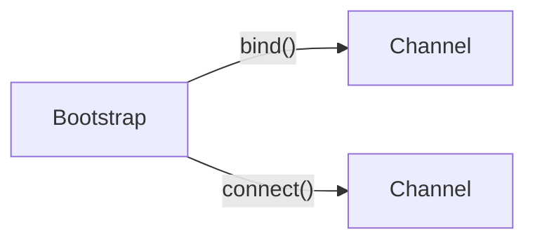

# 부트스트랩

## 부트스트랩이란

* 네티 애플리케이션 작성할 때 가장 기본이 되는 **애플리케이션의 수행 동작과 설정을 지정**할 수 있다.
* 설정할 수 있는 요소들은 다음과 같다.
  * 전송 계층 (소켓 모드 및 I/O 종류)
  * 이벤트 루프 (단일/다중 스레드)
  * 채널 파이프라인 설정
  * 소켓 주소와 포트
  * 소켓 옵션
  * 프로토콜
* 소켓 요청을 보내는 서버 애플리케이션을 위한 **ServerBootstrap**과 소켓 대기하는 클라이언트 애플리케이션을 위한 **Bootstrap**이 존재한다. **AbstractBootstrap**에서는 두 애플리케이션에서 공통된 작업을 수행하는 기능을 제공한다.
* 부트스트랩 클래스들은 모두 Cloneable 인터페이스를 구현하고 있는데, 이는 여러 채널을 비슷하거나 동일한 설정으로 생성해야 할 때 `clone()` 메서드를 이용해 즉시 동일한 내용을 가진 다른 객체를 생성하기 위함이다.
* 네트워크 애플리케이션의 성능은 부트스트랩의 설정을 잘하냐에 따라 달라지기보다는, 애플리케이션 성격에 따라 알맞게 설정해야 좋다.
  * 클라이언트의 요청에 따라 DB 질의 결과를 돌려주는 애플리케이션은 네트워크 처리량보다 DB 질의 결과를 대기하는 시간이 더 길 것이다.
  * 반면 캐시 서버에서 데이터를 조회하여 전송하는 애플리케이션은 데이터 조회 시간보다 네트워크 입출력이 많은 서비스이므로 NIO, Epoll 입출력을 사용하여 더 나은 성능을 낼 수 있다.

## ServerBootstrap

* ServerBootstrap 클래스는 서버 애플리케이션에 대한 수행 동작과 설정을 지정할 수 있도록 여러 메서드를 제공한다.
* 아래는 ServerBootstrap을 사용하는 예제이다.
* bind 메서드가 호출되면 `ServerChannel`이 생성되고, `ServerChannel`은 다수의 `자식 Channel`을 관리하게 된다.

```jsx
EventLoopGroup bossGroup = new NioEventLoopGroup(1);
EventLoopGroup workerGroup = new NioEventLoopGroup();
try {
    ServerBootstrap b = new ServerBootstrap();
    b.group(bossGroup, workerGroup) 
    .channel(NioServerSocketChannel.class)
    .childHandler(new ChannelInitializer<SocketChannel>() {
       @Override
       public void initChannel(SocketChannel ch) {
           ChannelPipeline p = ch.pipeline();
           p.addLast(new EchoServerHandler());
       }
   });
   ChannelFuture f = b.bind(new InetSocketAddress(8080));
    // ..
} finally {
    workerGroup.shutdownGracefully();
    bossGroup.shutdownGracefully();
}
```

#### group

* 클라이언트로부터 연결이 완료된 후 데이터 송수신 처리를 위해 하나의 이벤트 루프를 사용한다.
* **연결 요청 수락을 위한 루프 그룹**과 **데이터 송수신 처리를 위한 루프 그룹**을 따로 지정할 수 있다.
  * bossGroup: 클라이언트의 연결을 수락하는 역할 (위 예제 코드에서는 단일 스레드로 동작하도록 했다.)
  * workerGroup: 클라이언트 소켓과 연결된 소켓의 데이터 송수신 및 이벤트 처리를 담당 (위 예제 코드에서는 하드웨어 CPU 코어 \* 2개의 스레드로 동작하도록 했다.)

#### channel

* 서버 소켓이 사용할 네트워크 입출력 모드를 설정한다.
* 부트스트랩 클래스를 통해 생성된 채널의 입출력 모드를 설정할 수 있다.
* channel 메서드에 등록된 소켓 채널 생성 클래스가 소켓 채널을 생성한다.
*   설정가능한 클래스 목록

    > Channel과 EventLoopGroup는 동일한 모드로 설정해주어야 한다. 만약 그렇지 않다면 호환성이 깨져 IllegalStateException이 발생할 것이다.

    * LocalServerChannel
      * 하나의 JVM에서 가상 통신을 위한 서버 소켓 채널 생성
    * OioServerSocketChannel
      * 블로킹 모드의 서버 소켓 채널 생성
    * NioServerSocketChannel
      * 논블로킹 모드의 서버 소켓 채널 생성
    * EpollServerSocketChannel
      * 리눅스 커널의 epoll 입출력 모드를 지원하는 서버 소켓 채널 생성
    * OioDatagramSocketChannel
      * 비연결 프로토콜에 사용할 수 있는 데이터그램 채널 생성
      * connect 메서드를 호출하지 않고 bind 메서드만 호출한다.

#### handler

* 서버 소켓 채널의 이벤트를 처리할 핸들러를 설정한다.
* ChannelHandler 인터페이스를 구현한 클래스를 지정해야 한다.
* 데이터 송수신에 대한 이벤트는 여기서 처리되지 않고, childHandler에서 등록된 핸들러에 의해 처리된다.
* LoggingHandler를 등록하여 이벤트 루프에 등록, 포트 바인딩, 포트 활성화, 클라이언트 접속 등의 로그를 남길 수 있다.

#### childHandler

* 자식 채널의 초기화 방법을 지정한다.
* 클라이언트 소켓 채널로 송수신되는 데이터를 가공하는 데이터 핸들러를 설정한다.
* 서버에 연결된 클라이언트 소켓 채널에서 발생하는 이벤트를 수신하여 처리한다.
* 서버 소켓 채널로 연결된 클라이언트 채널에 파이프라인을 설정하는 역할을 수행할 수 있다.
* 위 코드에서 childHandler로 지정된 ChannelInitializer는 클라이언트로부터 연결된 채널이 초기화될 때의 기본 동작이 지정된 추상 클래스이다. 채널 파이프라인에 handler를 등록해 클라이언트의 연결이 생성되었을 때 데이터 처리를 담당하도록 한다.
* 채널 파이프라인에는 ChannelHandler 인터페이스를 구현한 클래스를 핸들러로 추가할 수 있다.
* 여러 개의 ChannelHandler를 추가할 수도 있다.
  * 여러 프로토콜을 지원해야하는 복잡한 애플리케이션의 경우 여러 ChannelHandler를 이용하는 것이 편리하다.
  * ChannelInboundHandlerAdapter#initChannel 메서드를 사용하여 여러 ChannelHandler를 ChannelPipeline에 추가할 수 있다.

#### option

* 서버 소켓 채널의 소켓 옵션(동작 방식)을 설정한다.
* 부트스트랩에서 생성하는 모든 채널에 자동으로 소켓 옵션을 적용하여 커널에서 해당 옵션이 사용되도록 한다.
* 애플리케이션에서 socket.send() 호출 시 커널의 시스템 함수를 호출해 애플리케이션에서 수신한 데이터를 데이터 송신용 커널 버퍼에 쌓아두었다가 인터넷으로 전송한다.

<figure><figcaption></figcaption></figure>

* 이렇게 전달된 데이터는 데이터 수신용 커널 버퍼에 쌓이고, 애플리케이션에서 socket.read() 호출 시 데이터를 읽을 수 있다.
* 네티는 JVM 기반으로 동작하므로 자바에서 설정할 수 있는 소켓 옵션을 모두 사용 가능하다.
* 주요 소켓 옵션은 다음과 같으며, 책 출간 시점과 현재의 JDK 소켓 옵션에 차이가 있을 수 있다.

<table><thead><tr><th width="177">옵션</th><th>설명</th><th>기본값</th></tr></thead><tbody><tr><td>TCP_NODELAY</td><td>데이터 송수신에 Nagle 알고리즘 비활성화 여부를 지정</td><td>false</td></tr><tr><td>SO_KEEPALIVE</td><td>운영체제에서 지정된 시간에 한번씩 keepalive 패킷을 상대에 전송</td><td>false</td></tr><tr><td>SO_SNDBUF</td><td>상대에게 송신할 커널 송신 버퍼 크기</td><td>커널 설정</td></tr><tr><td>SO_RCVBUF</td><td>상대로부터 수신할 커널 수신 버퍼 크기</td><td>커널 설정</td></tr><tr><td>SO_REUSEADDR</td><td>TIME_WAIT 상태의 포트를 서버 소켓에 바인드 가능 여부</td><td>false</td></tr><tr><td>SO_LINGER</td><td>소켓을 닫을 때 커널의 송신 버퍼에 전송되지 않은 데이터의 전송 대기시간</td><td>false</td></tr><tr><td>SO_BACKLOG</td><td>동시에 수용 가능한 소켓 연결 <strong>요청</strong> 수</td><td>-</td></tr></tbody></table>

> 애플리케이션 서버의 강제 종료 또는 비정상 종료로 인해 재시작하는 상황에서, 사용하던 포트의 상태가 TIME\_WAIT라면 bind가 실패할 수 있다. 이 경우를 방지하기 위해 SC\_REUSEADDR를 활성화할 수 있다.

> SC\_BACKLOG 값이 너무 작으면 클라이언트가 연결 생성을 못할 수 있으며, 너무 크면 클라이언트 연결 요청이 폭주할 때 대기 시간이 길어져 클라이언트에서 타임아웃이 발생할 수 있다.

* 아래와 같이 소켓 옵션을 지정할 수 있다.

```java
bootstrap.option(ChannelOption.SO_KEEPALIVE, true)
         .option(ChannelOption.CONNECT_TIMEOUT_MILLIS, 5000);
```

#### childOption

* 클라이언트 소켓 채널의 옵션을 설정한다.
* SO\_LINGER 옵션을 사용하면, 커널 버퍼의 데이터를 모두 상대방에 전송하고 ACK을 기다린다. 그리고 타임아웃 값을 0으로 주어 포트 상태가 TIME\_WAIT로 전환하는 것을 방지할 수 있다.

#### attr

* ServerChannel의 attribute를 적용하기 위한 메서드로, bind 메서드가 호출될때 실제로 설정된다.
* 일반적인 속성과 데이터 중 일부를 이용할 수 없는 경우 AttributeMap, AttributeKey를 사용할 수 있도록 제공한다.

```java
final AttributeKey<Integer> id = AttributeKey.newInstance("ID");
Bootstrap bootstrap = new Bootstrap();
bootstrap.group(new NioEventLoopGroup())
    .channel(NioSocketChannel.class)
    .handler(
        new SimpleChannelInboundHandler<ByteBuf>() {
            @Override
            public void channelRegistered(ChannelHandlerContext ctx)
                throws Exception {
                Integer idValue = ctx.channel().attr(id).get(); // attribute 값 사용
            }

            @Override
            protected void channelRead0(
                ChannelHandlerContext channelHandlerContext,
                ByteBuf byteBuf) throws Exception {
                System.out.println("Received data");
            }
        }
    );
bootstrap.attr(id, 123456); // attribute 값 설정
```

#### childAttr

* 클라이언트 소켓 채널에 attribute를 적용한다.


## Bootstrap

* 비연결 프로토콜을 이용하는 애플리케이션이나 클라이언트에서 이용되는 클래스이다.
* 클라이언트 애플리케이션에 대한 수행 동작과 설정을 지정하는 메서드를 제공한다.
* bind나 connect 메서드를 호출하기 전 group, channel, handler 메서드를 반드시 호출해 필수 컴포넌트를 설정해야 한다.
* 클라이언트에서 사용하는 단일 소켓 채널에 대한 설정이므로 부모와 자식 관계의 설정은 없다. 따라서 ServerBootstrap과 달리 childHandler, childOption 등의 메서드가 없다.
* 대부분의 API는 ServerBootstrap API와 유사하다.

#### connect / bind

* 일반적인 TCP 연결의 경우 원격 피어에 연결하는 connect 메서드를 사용하고, UDP와 같은 비연결형 통신을 할 경우 채널을 생성하고 바인드하는 bind 메서드를 사용하기를 권장한다.



#### localAddress

* 채널이 바인딩될 로컬 주소를 지정한다. 이를 지정하지 않으면 운영체제에서 임의의 주소를 생성한다.

#### group

* 소켓 채널의 모든 이벤트 처리를 위한 이벤트 루프 객체를 설정한다.
* 클라이언트 애플리케이션은 서버에 연결한 소켓 채널 하나만 가지기 때문에 단 하나의 이벤트 루프만 설정할 수 있다.

#### channel

* 클라이언트 소켓 채널의 입출력 모드를 설정한다.

#### handler

* 클라이언트 소켓 채널에서 발생하는 이벤트에 대한 알림을 받고 처리하는 핸들러를 설정할 수 있다.
* ChannelInitializer 클래스를 통해 등록할 수 있다.

#### option

* 클라이언트 소켓 채널의 소켓 옵션을 설정한다. 사용하는 채널 유형에 따라 옵션도 다르게 구성되며, bind / connect 메서드에 의해 채널의 옵션이 설정된다.
* 채널이 이미 생성된 후에는 영향을 미치지 않는다.

## 부트스트랩의 이벤트 루프 공유

* 서버가 다른 시스템에 대해 클라이언트처럼 동작해야 하는 경우 ServerChannel도 두고 클라이언트 Channel도 두어야 한다.
* 새로운 Bootstrap을 만들어 이를 해결할 수 있지만, 새로운 클라이언트 채널에 대한 EventLoop를 정의해야 하므로 새로운 스레드가 필요하다. 이 경우 ServerBootstrap의 자식 채널과 클라이언트 채널 간 데이터 교환 시 컨텍스트 스위칭이 필요하다.
* 자식 채널의 EventLoop를 부트스트랩의 group 메서드로 전달해 공유하면 컨텍스트 스위칭을 방지할 수 있다.
* EventLoop를 최대한 재사용하여 스레드 생성 비용을 줄이는 것이 네티 애플리케이션 가이드에서 권장되고 있다.
* 아래 그림과 같이 ServerChannel으로 생성된 자식 채널의 EventLoop를 클라이언트로써의 통신을 위해 생성한 Bootstrap과 채널에서 공유할 수 있다.

<figure><figcaption></figcaption></figure>

* 아래는 EventLoop를 공유하는 예시 코드이다. ChannelInboundHandler에서 새로운 부트스트랩을 만들고 이벤트 루프는 기존의 이벤트 루프를 사용한다.

```java
ServerBootstrap bootstrap = new ServerBootstrap();
bootstrap.group(new NioEventLoopGroup(), new NioEventLoopGroup())
    .channel(NioServerSocketChannel.class)
    .childHandler(
        new SimpleChannelInboundHandler<ByteBuf>() {
            ChannelFuture connectFuture;
            @Override
            public void channelActive(ChannelHandlerContext ctx)
                throws Exception {
                Bootstrap bootstrap = new Bootstrap();
                bootstrap.channel(NioSocketChannel.class).handler(
                    new SimpleChannelInboundHandler<ByteBuf>() {
                        @Override
                        protected void channelRead0(
                            ChannelHandlerContext ctx, ByteBuf in)
                            throws Exception {
                            System.out.println("Received data");
                        }
                    });
                bootstrap.group(ctx.channel().eventLoop()); // 이벤트 루프 공유
                connectFuture = bootstrap.connect(
                    new InetSocketAddress("www.manning.com", 80));
            }

            @Override
            protected void channelRead0(
                ChannelHandlerContext channelHandlerContext,
                    ByteBuf byteBuf) throws Exception {
                if (connectFuture.isDone()) {
                    // do something with the data
                }
            }
        });
ChannelFuture future = bootstrap.bind(new InetSocketAddress(8080));
```

## 종료

* 애플리케이션 종료 시 부트스트랩도 리소스를 모두 해제하여 정상적으로 종료시켜주어야 한다.
* EventLoopGroup을 종료해 대기중인 이벤트와 작업을 모두 처리한 후 모든 활성 스레드를 해제해야 한다.
* shutdownGracefully 메서드를 제공하여 비동기로 종료 작업을 진행한다.
* 아래는 graceful하게 종료하는 예제이다.

```java
EventLoopGroup group = new NioEventLoopGroup();
Bootstrap bootstrap = new Bootstrap();
bootstrap.group(group)
   .channel(NioSocketChannel.class)
   .handler(
      new SimpleChannelInboundHandler<ByteBuf>() {
          @Override
          protected void channelRead0(
                  ChannelHandlerContext channelHandlerContext,
                  ByteBuf byteBuf) throws Exception {
              System.out.println("Received data");
          }
      }
   );
bootstrap.connect(new InetSocketAddress("www.manning.com", 80)).syncUninterruptibly();

Future<?> future = group.shutdownGracefully();
// block until the group has shutdown
future.syncUninterruptibly();
```
