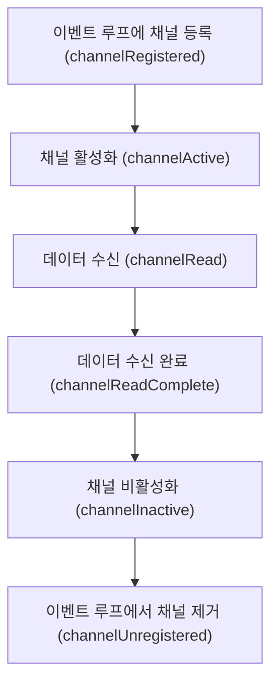

# 채널 파이프라인

## 이벤트 실행

* 네티 없이 일반 서버 네트워크 프로그램을 작성 시 아래와 같이 동작한다.

1. 소켓에 데이터가 있는지 확인
2. 데이터가 존재하면 데이터 읽는 메서드 호출 / 데이터가 존재하지 않으면 대기
3. 대기 중 네트워크가 끊어지면 에러 처리 메서드 호출

* 네티를 사용하면 이벤트를 채널 파이프라인과 이벤트 핸들러로 추상화하여 데이터가 수신되었는지 확인하거나 소켓과 연결이 끊겼는지 직접 메서드 호출을 하지 않아도 된다.
* 대신 이벤트가 발생했을 때 호출할 메서드만 구현해두면 된다.
* 네티를 사용해 서버 네트워크 프로그램을 작성 시 아래와 같이 동작한다.

1. 부트스트랩으로 네트워크 애플리케이션에 필요한 설정 지정 및 이벤트 핸들러로 채널 파이프라인 구성
2. 이벤트 핸들러의 데이터 수신 이벤트 메서드에서 데이터를 읽는다.
3. 이벤트 핸들러의 네트워크 끊김 이벤트 메서드에서 에러 처리를 한다.

* 소켓 채널에 데이터가 수신되었을 때 네티는 아래와 같이 수신 이벤트 메서드를 실행한다.

1. 이벤트 루프는 채널 파이프라인에 등록된 첫 이벤트 핸들러를 가져온다.
2. 이벤트 핸들러에 데이터 수신 이벤트 메서드가 구현되어 있다면 실행하고, 구현되어 있지 않으면 다음 이벤트 핸들러를 가져온다.
3. 2번 과정을 마지막 핸들러에 도달할 때까지 반복한다.

## 채널 파이프라인

### 구조

<figure><figcaption></figcaption></figure>

* 네티의 채널, 이벤트, 이벤트 핸들러는 전기의 흐름과 비슷하다.
* 채널은 일반적인 소켓 프로그래밍에서 말하는 소켓과 같다. (발전소)
* 이 소켓에서 발생한 이벤트는 채널 파이프라인을 따라 흐른다. (전선 / 멀티탭)
* 이벤트 핸들러는 채널에서 발생한 이벤트들을 수신하고 처리한다. (가전제품)
* 하나의 채널 파이프라인에는 여러 이벤트 핸들러를 등록할 수 있다.

### 동작

* childHandler를 통해 클라이언트가 사용할 채널 파이프라인을 설정한다.
* ChannelInitializer 인터페이스의 `initChannel` 메서드는 클라이언트 소켓 채널이 생성될 때 실행된다.
* 클라이언트 소켓 채널을 생성할 때에는 빈 채널 파인프라인 객체를 생성해 할당한다.
* 이 때 채널 파이프라인에는 이벤트 핸들러를 여러 개 등록할 수 있다.

```java
ServerBootstrap b = new ServerBootstrap();
b.group(bossGroup, workerGroup)
    .channel(NioServerSocketChannel.class)
    .childHandler(new ChannelInitializer<SocketChannel>() {
        @Override
        public void initChannel(SocketChannel ch) {
            // 채널 파이프라인 설정
            ChannelPipeline p = ch.pipeline();
            p.addLast(new EchoServerHandler());
        }
    });
```

* 채널 파이프라인이 초기화되는 순서를 그림으로 살펴보면 아래와 같다.

<figure><figcaption></figcaption></figure>

* 먼저 클라이언트 연결에 대응되는 소켓 채널 객체를 생성하고, 빈 채널 파이프라인 객체를 생성해 소켓 채널에 할당한다.
* 소켓 채널에 등록된 ChannelInitializer 구현체의 initChannel 메서드를 호출한다.
* 소켓 채널 참조로부터 채널 파이프라인 객체를 가져와 이벤트 핸들러를 등록한다.
* 이렇게 초기화가 완료되면 채널이 등록되었다는 이벤트가 발생하고, 클라이언트와 서버 간 데이터 송수신을 위한 이벤트 처리가 시작된다.

## 이벤트 핸들러

* 네티는 비동기 호출을 지원하기 위해 Future 패턴과 리액터 패턴의 구현체인 이벤트 핸들러를 제공한다.
* 이벤트 핸들러는 네티의 소켓 체널에서 발생한 이벤트를 처리하는 인터페이스이다.
* 채널 파이프라인으로 입력되는 이벤트를 이벤트 루프가 가로채어 이벤트에 해당하는 메서드를 수행한다.

## 인바운드 이벤트

* 상대방이 어떤 동작을 취했을 때 소켓 채널에서 발생하는 이벤트
* 채널 활성화, 데이터 수신 등의 이벤트가 이에 해당한다.

<figure><figcaption></figcaption></figure>

* 인바운드 이벤트를 채널 파이프라인에 보내면, 이벤트 핸들러 중 ChannelInboundHandler 인터페이스를 구현한 인바운드 이벤트 핸들러들이 메서드를 수행한다.

### 인바운드 이벤트 발생 순서

* 아래와 같이 인바운드 이벤트 발생 순서를 나타낼 수 있으며, 각 과정에 대응되는 메서드가 ChannelInboundHandler 인터페이스에 존재한다.



### ChannelInboundHandler

* 인바운드 이벤트를 처리할 수 있도록 하는 ChannelInboundHandler 인터페이스의 메서드들을 하나씩 살펴본다.

#### channelRegistered

* 채널이 처음 생성되어 이벤트 루프에 등록되었을 때 호출되는 메서드이다.
* 서버에서는 처음 서버 소켓 채널을 생성할 때와 클라이언트가 서버에 접속해 소켓 채널이 생성될 때 이 메서드가 호출된다.
* 클라이언트에서는 서버 접속을 위한 connect() 메서드를 수행할 때 이 메서드가 호출된다.

#### channelActive

* channelRegistered 이벤트 이후에 채널 입출력을 수행할 상태가 되었을 때 호출되는 메서드이다.
* &#x20;서버 또는 클라이언트가 상대방에 연결한 직후 한번 수행할 작업을 처리하기에 적합하다.
  * 서버에 연결된 클라이언트 개수를 세거나, 최초 연결에 대한 메시지를 전송할 때 사용될 수 있다.

#### channelRead

* 데이터가 수신되었을 때 읽기 작업을 위해 호출되는 메서드이다.
* 아래 EchoServerV1Handler 클래스는 데이터가 수신되었을 때 데이터를 출력하고 상대방에게 그대로 돌려주는 이벤트 핸들러이다.
* 네티 내부에서는 모든 데이터가 ByteBuf로 관리되므로, Object 타입을 ByteBuf로 형변환하여 메시지를 확인할 수 있다.

```java
public class EchoServerV1Handler extends ChannelInboundHandlerAdapter {
    @Override
    public void channelRead(ChannelHandlerContext ctx, Object msg) {
        ByteBuf readMessage = (ByteBuf) msg;
        System.out.println("channelRead : " + readMessage.toString(Charset.defaultCharset()));
        ctx.writeAndFlush(msg);
    }

    @Override
    public void exceptionCaught(ChannelHandlerContext ctx, Throwable cause) {
        cause.printStackTrace();
        ctx.close();
    }
}
```

#### channelReadComplete

* 채널의 데이터를 다 읽고 더이상 데이터가 없는 상태가 되어 읽기 작업이 완료되었을 때 호출되는 메서드이다.
* 아래 EchoServerV2Handler 클래스는 EchoServerV1Handler와 달리 channelRead에서는 write만 해두고 데이터 수신이 모두 완료되었을 때 flush하여 클라이언트에 데이터를 전송한다.

```java
public class EchoServerV2Handler extends ChannelInboundHandlerAdapter {
    @Override
    public void channelRead(ChannelHandlerContext ctx, Object msg) {
        ByteBuf readMessage = (ByteBuf) msg;
        System.out.println("channelRead : " + readMessage.toString(Charset.defaultCharset()));
        ctx.write(msg);
    }

    @Override
    public void channelReadComplete(ChannelHandlerContext ctx) {
        System.out.println("channelReadComplete 발생");
        ctx.flush();
    }

    @Override
    public void exceptionCaught(ChannelHandlerContext ctx, Throwable cause) {
        cause.printStackTrace();
        ctx.close();
    }
}
```

#### channelInactive

* 채널이 비활성화되어 로컬 피어에 대한 연결이 해제되었을 때 호출되는 메서드이다.
* 이 메서드 호출 후에는 채널에 대한 입출력 작업을 수행할 수 없다.

#### channelUnregistered

* 채널이 이벤트루프에서 제거되었을 때 발생하는 이벤트이다.
* 이 메서드 호출 후에는 채널에서 발생한 이벤트를 처리할 수 없다.

***

#### channelWritabilityChanged

* Channel의 기록 가능 상태가 변경되면 호출된다. OutOfMemoryError를 방지하기 위해 너무 빠르게 기록되지 않게 하거나 Channel이 기록 가능한 상태가 되면 기록을 재개할 수 있다.
* Channel의 isWritable() 메서드를 호출해 해당 채널의 기록 가능 여부를 감지할 수 있다. 기록 가능 여부를 결정하는 임계값은 Channel.config().setWriteHighWaterMark()와 Channel.config().setWriteLowWaterMark()메서드로 설정한다.

#### userEventTriggered

* POJO가 ChannelPipeline을 통해 전달되어 ChannelInboundHandler.fireUserEventTriggered()가 트리거되면 호출되는 메서드이다.

### SimpleChannelInboundHandler

*   ChannelInboundHandler 구현체가 channelRead() 메서드를 재정의하는 경우 풀링된 ByteBuf 인스턴스의 메모리를 아래와 같이 명시적으로 해제해주어야 한다.

    ```java
    @Override
    public void channelRead(ChannelHandlerContext ctx, Object msg) throws Exception {
        // ...
        ReferenceCountUtil.release(msg);
    }
    ```
*   SimpleChannelInboundHandler를 사용하면 리소스를 자동으로 해제해주어 편리하게 사용 가능하다.

    ```java
    @Sharable
    public class SimpleDiscardHandler extends SimpleChannelInboundHandler<Object>
    {
        @Override
        public void channnelRead0(ChannelHandlerContext ctx, Object msg)
        {
            // 리소스를 명시적으로 해제할 필요가 없음
        }
    }
    ```

## 아웃바운드 이벤트

* 네티 사용자가 요청한 동작에 해당하는 이벤트
* 연결 요청, 데이터 전송, 소켓 종료 등이 이에 해당한다.
* 아웃바운드 작업과 데이터는 ChannelOutboundHandler 인터페이스를 구현한 아웃바운드 핸들러에 의해 처리된다.
* 원격 피어에 대한 쓰기 작업이 일시 중단된 경우 flush 작업을 지연하여 나중에 재개할 수 있는 등 정교하게 요청을 처리할 수 있다.

### ChannelOutboundHandler

#### bind

* 서버 소켓 채널을 로컬 주소에 바인딩할 때(클라이언트의 연결을 받아들이는 ip, port 정보 설정) 호출되는 메서드이다.
* 서버 소켓 채널이 사용하는 IP, 포트 정보를 확인할 수 있다.

#### connect

* 클라이언트 소켓 채널이 서버에 연결 요청을 보냈을 때 호출되는 메서드이다.
* 원격지의 SocketAddress 정보와 로컬 SocketAddress 정보가 인수로 입력되며, 연결 생성 시 로컬 SocketAddress를 입력하지 않았다면 여기서 수신하는 로컬 SocketAddress는 null이다.

#### disconnect

* 클라이언트 소켓 채널의 연결을 끊을 때 호출되는 메서드이다.

#### close

* 클라이언트 소켓 채널 연결이 닫을 때 호출되는 메서드이다.

#### read

* 소켓 채널에서 데이터 읽기 요청이 들어왔을 때 호출되는 메서드이다.

#### write

* 소켓 채널에 데이터가 기록되었을 때 호출되는 메서드이다.
* 기록된 데이터 버퍼가 인수로 들어온다.
* 이 메서드에서는 작업을 처리하고 메시지를 폐기하고 싶은 경우 아래와 같이 메시지를 해제해주고, ChannelPromise에 성공함을 알려 ChannelFutureListener가 메시지 처리에 대한 알림을 받을 수 있도록 한다.

```java
@Override
public void write(ChannelHandlerContext ctx, Object msg, ChannelPromise promise) throws Exception {
    ReferenceCountUtil.release(msg);
    promise.setSuccess();
}
```

#### flush

* 소켓 채널에 대한 flush 메서드가 호출되었을 때 발생하는 이벤트이다.

### 다중 이벤트 핸들러 처리

* 한 채널 파이프라인에는 여러 이벤트 핸들러를 등록할 수 있다.
* 여러 이벤트 핸들러에서 각각 다른 이벤트를 다루는 메서드를 구현할 경우, 각각의 이벤트가 발생하면 이벤트에 해당하는 메서드가 실행될 것이다.
* 하지만 여러 이벤트 핸들러에서 동일한 이벤트를 다루는 메서드를 각자 다르게 구현할 경우, 첫번째 이벤트 핸들러에서 이벤트를 다루면 두번째 이벤트 핸들러에서는 이벤트를 받아볼 수 없다. 왜냐하면 이벤트 메서드를 수행하면 이벤트가 사라지기 때문이다.
* 하나의 이벤트가 발생했을 때 여러 이벤트 핸들러의 이벤트 메서드를 실행시키고 싶다면, 첫 이벤트 핸들러의 이벤트 메서드에서 해당 이벤트를 재발생시켜주어야 한다.
* 아래 예제와 같이 FirstHandler에서 이벤트를 재발생 시키게 하지 않으면 SecondHandler의 channelRead 메서드는 영영 불리지 않게 된다.

```java
public class EchoServerV4FirstHandler extends ChannelInboundHandlerAdapter {
    @Override
    public void channelRead(ChannelHandlerContext ctx, Object msg) {
        ByteBuf readMessage = (ByteBuf) msg;
        System.out.println("FirstHandler channelRead : " + readMessage.toString(Charset.defaultCharset()));
        ctx.write(msg);
        ctx.fireChannelRead(msg); // channelRead 이벤트 재발생
    }
}
```

```java
public class EchoServerV4SecondHandler extends ChannelInboundHandlerAdapter {
    @Override
    public void channelRead(ChannelHandlerContext ctx, Object msg) {
        ByteBuf readMessage = (ByteBuf) msg;
        System.out.println("SecondHandler channelRead : " + readMessage.toString(Charset.defaultCharset()));
    }
    
    @Override
    public void channelReadComplete(ChannelHandlerContext ctx) {
        System.out.println("channelReadComplete 발생");
        ctx.flush();
    }

    @Override
    public void exceptionCaught(ChannelHandlerContext ctx, Throwable cause) {
        cause.printStackTrace();
        ctx.close();
    }
}
```

## ChannelHandlerAdapter

* ChannelHandlerAdapter의 구현체인 ChannelInboundHandlerAdapter, ChannelOutboundHandlerAdapter에는 기본 구현이 되어 있으므로 이 클래스를 상속받아 원하는 메서드만 오버라이드하여 핸들러를 쉽게 추가할 수 있다.
* ChannelHandlerAdapter 추상 클래스는 isSharable 메서드를 제공하여 Sharable 어노테이션을 붙인 핸들러는 별도의 채널 파이프라인에서 동작하도록 한다.

## 메모리 관리

* 네티는 ResourceLeakDetector 클래스를 통해 잠재적인 문제 진단을 돕기 위해 애플리케이션 버퍼 할당의 약 1%를 샘플링하여 메모리 누출을 검사한다.
* `-Dio.netty.leakDetectionLevel` 실행 인자를 사용해 원하는 누수 감지 수준을 설정할 수 있다.
* 누수 감지 수준은 아래 네 가지가 존재한다.
  * DISABLED
    * 누출 감지를 비활성화한다. 이 설정은 포괄적인 테스트를 거친 후에만 이용한다.
  * SIMPLE
    * 기본 샘플링 비율 1%를 이용해 발견된 누출을 보고한다. 기본 샘플링 비율은 대부분의 경우 적합하다.
  * ADVANCED
    * 발견된 누출과 메시지에 접근한 위치를 보고한다. 기본 샘플링 비율을 이용한다.
  * PARANOID
    * ADVANCED와 비슷하지만 모든 접근을 샘플링한다. 성능에 큰 영향을 미치므로 디버깅 단계에서만 이용해야 한다.

## ChannelPipeline

* 하나의 채널이 생성될 때 채널 파이프라인이 할당된다.
* 채널 파이프라인은 ChannelHandler 객체들이 체이닝된 집합이다.
* 채널파이프라인에서는 인바운드 이벤트가 트리거되면 인바운드 핸들러들이 차례로 수행되고, 아웃바운드 이벤트가 트리거되면 아웃바운드 핸들러들이 차례로 수행된다. 전체적인 흐름은 아래와 같다.

```
                                                  I/O Request
                                             via Channel or
                                         ChannelHandlerContext
                                                       |
   +---------------------------------------------------+---------------+
   |                           ChannelPipeline         |               |
   |                                                  \|/              |
   |    +---------------------+            +-----------+----------+    |
   |    | Inbound Handler  N  |            | Outbound Handler  1  |    |
   |    +----------+----------+            +-----------+----------+    |
   |              /|\                                  |               |
   |               |                                  \|/              |
   |    +----------+----------+            +-----------+----------+    |
   |    | Inbound Handler N-1 |            | Outbound Handler  2  |    |
   |    +----------+----------+            +-----------+----------+    |
   |              /|\                                  .               |
   |               .                                   .               |
   | ChannelHandlerContext.fireIN_EVT() ChannelHandlerContext.OUT_EVT()|
   |        [ method call]                       [method call]         |
   |               .                                   .               |
   |               .                                  \|/              |
   |    +----------+----------+            +-----------+----------+    |
   |    | Inbound Handler  2  |            | Outbound Handler M-1 |    |
   |    +----------+----------+            +-----------+----------+    |
   |              /|\                                  |               |
   |               |                                  \|/              |
   |    +----------+----------+            +-----------+----------+    |
   |    | Inbound Handler  1  |            | Outbound Handler  M  |    |
   |    +----------+----------+            +-----------+----------+    |
   |              /|\                                  |               |
   +---------------+-----------------------------------+---------------+
                   |                                  \|/
   +---------------+-----------------------------------+---------------+
   |               |                                   |               |
   |       [ Socket.read() ]                    [ Socket.write() ]     |
   |                                                                   |
   |  Netty Internal I/O Threads (Transport Implementation)            |
   +-------------------------------------------------------------------+
```

* 부트스트랩을 생성할 때 핸들러를 등록하면서 채널 파이프라인의 다양한 메서드를 사용할 수 있다. 아래 예제에서는 addLast메서드를 사용했다.
  * addFirst, addBefore, addAfter, addLast 메서드를 통해 원하는 위치에 핸들러를 추가할 수 있고, remove, replace 메서드를 사용해 핸들러를 제거하거나 교체할 수 있다.

```java
Bootstrap b = new Bootstrap();
b.group(group)
  .channel(NioSocketChannel.class)
  .remoteAddress(new InetSocketAddress(host, port))
  .handler(new ChannelInitializer<SocketChannel>() {
    @Override
    public void initChannel(SocketChannel ch)
        throws Exception {
      ch.pipeline().addLast(
          new EchoClientHandler());
    }
  });
```

* 채널파이프라인의 핸들러는 이벤트 루프를 통해 수행되기 때문에 입출력 처리 전체 프로세스에 영향을 주지 않으려면 블로킹되지 않는 작성하는 것이 중요하다.
* 만약 블로킹되는 로직이 필요한 상황이라면 addXXX 메서드를 통해 핸들러를 등록할 때 EventExecutorGroup 객체와 함께 등록하여 이벤트 루프가 아닌 EventExecutor에서 별도로 수행되도록 해야 한다.
* 아래는 DefaultEventExecutorGroup에 스레드 개수를 넣어 새로운 Executor를 만들고 이벤트가 들어왔을 때 해당 Executor 내부에서 핸들러가 동작하도록 하는 코드이다.

```java
ch.pipeline().addLast(new DefaultEventExecutorGroup(1), new EchoClientHandler());
```

* 채널 파이프라인에 속한 핸들러에 접근하는 메서드들도 아래와 같이 존재한다.

```java
// 핸들러를 이름 또는 타입으로 조회
ChannelHandler channelHandler = ch.pipeline().get("handler1");
ChannelHandler channelHandler = ch.pipeline().get(EchoClientHandler.class);

// 채널 파이프라인에 존재하는 모든 핸들러의 이름 반환
List<String> names = ch.pipeline().names();
```

## ChannelHandlerContext

* ChannelHandlerContext는 ChannelHandler와 ChannelPipeline 간의 연결을 나타내며, ChannelHandlerContext를 이용해 핸들러 간 상호작용을 할 수 있다.
* 다음 ChannelHandler에 알림을 전하거나 채널 파이프라인을 수정할 수도 있다.
* ChannelHandler와 연결된 ChannelHandlerContext는 절대 변경되지 않으므로 참조를 저장해 캐싱해두어도 된다.
* ChannelHandlerContext 에서 제공하는 API는 다른 클래스의 메서드에 비해 이벤트 흐름이 짧아 잘 활용하여 성능상 이점을 챙길 수 있다.

### write 호출의 차이

* 소켓에 쓰기 작업을 할 때 ChannelHandlerContext의 channel() 메서드를 통해 Channel에 대한 참조를 얻어 write할 수도 있고, pipelline() 메서드를 통해 ChannelPipeline에 대한 참조를 얻어 write할 수도 있다.

```java
ChannelHandlerContext ctx = ...;
ctx.channel().write(Unpooled.copiedBuffer("Netty In Action", CharsetUtil.UTF-8));

ChannelHandlerContext ctx = ...;
ctx.pipeline().write(Unpooled.copiedBuffer("Netty In Action", CharsetUtil.UTF-8));
```

* 위와 같이 호출하게 되면 채널 파이프라인의 맨 처음 핸들러부터 시작해 모든 핸들러가 이벤트를 받게 된다.
* ChannelHandlerContext에서 write() 메서드를 직접 호출하게 되면 매핑된 ChannelHandler 이후의 핸들러부터 이벤트를 받아보게 된다.
* 이처럼 ChannelPipeline의 특정 지점에서 이벤트를 전파하면, 관련없는 핸들러를 건너뛰어 오버헤드를 줄일 수 있고, 이벤트와 관련된 특정 핸들러에서 이벤트가 처리되는 것을 방지할 수 있다.

### 참조 캐싱 방식

* ChannelHandlerContext의 참조를 변수에 담아두어 사용할 수 있다.

```java
public class WriteHanlder extends ChannelHandlerAdapter{
    private ChannelHandlerContext ctx;
    @Override
    public void handlerAdded(ChannelHanderContext ctx) {
        this.ctx = ctx;
    }
    
    public void send(String msg) {
        ctx.writeAndFlush(msg); // 이전에 저장한 ChannelHandlerContext를 이용해 메시지를 전송
    }
}
```

### 공유 가능한 ChannelHandler

* 둘 이상의 ChannelPipeline에 속하는 ChannelHandler라면 여러 ChannelHandlerContext와 바인딩될 수 있다. 이 경우에는 ChannelHandler에 `@Sharable` 어노테이션을 지정해야 하고, thread-safe하기 위해 객체 내부에 상태를 저장하면 안된다.
* 같은 ChannelHandler를 여러 ChannePipeline에 추가하는 가장 일반적인 이유는 여러 Channel에서 통계 정보를 얻기 위해서이다.
* 아래는 공유 가능한 ChannelHandler의 구현 예제이다.

```java
@Sharable
public class SharableHandler extends ChannelInboundHandlerAdapter {
    @Override
    public void channelRead(ChannelHandlerContext ctx, Object msg) {
        System.out.println("Channel read message : " + msg);
        ctx.fireChannelRead(msg);
    }
}
```

## 예외 처리

### 인바운드 예외 처리

* 인바운드 이벤트 처리 중 예외가 발생하면 채널 파이프라인의 예외가 인바운드 핸들러들을 계속해서 통과하게 된다.
* 예외가 파이프라인 끝에 도달하면 예외가 처리되지 않았음을 알리는 로그가 남게 된다.
* 핸들러에서 예외를 처리하고자 한다면 exceptionCaught() 메서드를 재정의해야 한다.
* 일반적으로 ChannelPipeline의 끝부분에 예외 처리하는 로직이 담긴 핸들러를 배치하여 어떤 위치에서 예외가 발생하든 처리할 수 있도록 한다.
* 예외를 처리하는 방법은 다양하며, Channel을 닫거나 복구를 시도할 수 있다.

### 아웃바운드 예외 처리

* 모든 아웃바운드 작업은 ChannelFuture를 반환한다. 작업이 완료되면 ChannelFuture에 등록된 ChannelFutureListener에 성공이나 오류에 대한 알림이 제공된다.
* ChannelOutboundHandler의 거의 모든 메서드에는 ChannelPromise가 전달된다. ChannelFuture의 하위 클래스인 ChannelPromise에도 비동기 알림을 위한 수신기를 할당할 수 있으며, 즉시 알림을 지원하는 쓰기 가능 메서드도 있다.
* ChannelFutureListener를 추가하려면 ChannelFuture 인스턴스의 addListener 메서드를 사용하면 된다.
* 아래와 같이 future에 리스너를 직접 등록하거나, 핸들러의 ChannelPromise 인자를 사용해 리스너를 등록할 수 있다.

```java
ChannelFuture future = channel.write(someMessage);
future.addListener(new ChannelFutureListener() {
    @Override
    public void operationComplete(ChannelFuture f) {
        if (!f.isSuccess()) {
            f.cause().printStackTrace();
            f.channel().close();
        }
    }
})
```

```java
public class OutboundExceptionHandler extends ChnnaelOutboundHandlerAdapter {
    @Override
    public void write(ChannelHandlerContext ctx, Object msg, ChannelPromise promise) {
        promise.addListener(new ChannelFutureListener() {
            @Override
            public void operationComplete(ChannelFuture f) {
                if (!f.isSuccess()) {
                    f.cause().printStackTrace();
                    f.channel().close();
                }
            }
        })
    }
}
```
