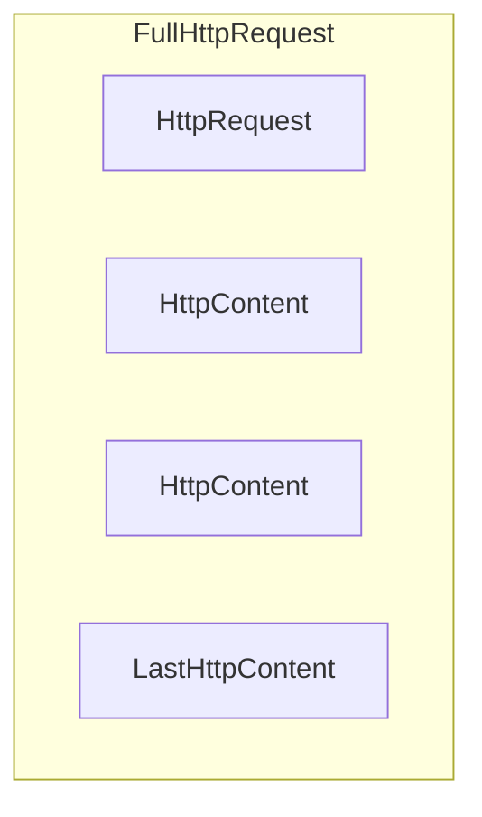
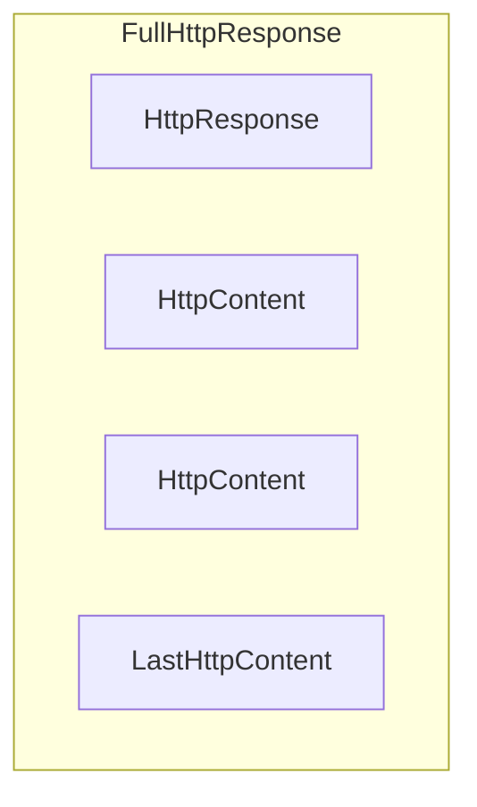

# HTTPS와 웹소켓 지원

## SSL/TLS

* 네티는 내부적으로 JDK의 SSLEngine 클래스를 이용해 작업하는 SslHandler 구현체를 제공한다. JDK에서 제공하는 SSLEngine보다 성능이 우수한 OpenSSLEngine을 사용하는 구현체도 제공한다.
* SslHandler는 암호화된 인바운드 데이터를 복호화하여 다음 인바운드 핸들러로 넘기고, 암호화되지 않은 아웃바운드 데이터를 암호화하여 아웃바운드 핸들러에게 넘기는 역할을 한다.
* 아래와 같이 SslHandler를 ChannelPipeline에 추가할 수 있다. 대부분의 경우 SslHandler는 파이프라인의 첫 핸들러가 된다.

```java
public class SslChannelInitializer extends ChannelInitializer<Channel> {
    private final SslContext context;
    private final boolean startTls;

    public SslChannelInitializer(SslContext context,
        boolean startTls) {
        this.context = context;
        this.startTls = startTls;
    }
    @Override
    protected void initChannel(Channel ch) throws Exception {
        SSLEngine engine = context.newEngine(ch.alloc());
        ch.pipeline().addFirst("ssl",
            new SslHandler(engine, startTls));
    }
}
```

* 상대의 유효성을 검사하고 암호화 방식을 협의하는 핸드쉐이크 단계의 수행에 타임아웃을 설정하거나(setHandshakeTimeout), 핸드쉐이크가 완료된 후 알림을 주는 메서드(setCloseNotifyTimeout)를 제공한다.

## &#x20;HTTP/HTTPS

* HTTP는 요청/응답 패턴에 기반을 두고 있어 클라이언트가 요청을 서버로 보내면 서버가 응답하는 형태이다.
* 네티는 이를 간편하게 만드는 인코더, 디코더를 제공한다.

### 메시지 구성

* HTTP 요청/응답은 둘 이상의 데이터 파트로 구성 가능하며, 항상 LastHttpContent 파트로 끝난다.
* FullHttpRequest와 FullHttpResponse 메시지는 각각 완성된 요청과 응답을 나타내는 특수한 하위 형식이며, HttpObject 인터페이스를 구현한다.





### 파이프라인 적용

* 아래와 같이 파이프라인에 네티가 지원하는 인코더, 디코더를 추가하여 HTTP 를 지원할 수 있다.

```java
public class HttpPipelineInitializer extends ChannelInitializer<Channel> {
    private final boolean client;

    public HttpPipelineInitializer(boolean client) {
        this.client = client;
    }

    @Override
    protected void initChannel(Channel ch) throws Exception {
        ChannelPipeline pipeline = ch.pipeline();
        if (client) {
            pipeline.addLast("decoder", new HttpResponseDecoder());
            pipeline.addLast("encoder", new HttpRequestEncoder());
        } else {
            pipeline.addLast("decoder", new HttpRequestDecoder());
            pipeline.addLast("encoder", new HttpResponseEncoder());
        }
    }
}
```

### HTTP 메시지 집계

* HTTP 요청과 응답은 여러 파트로 구성될 수 있으므로 각 파트들을 연결해 하나의 FullHttpRequest/FullHttpResponse 메시지로 병합해야 한다.
* 네티에는 이를 지원하기 위해 HttpObjectAggregator 클래스를 제공한다.

```java
ChannelPipeline pipeline = ch.pipeline();
if (isClient) {
    pipeline.addLast("codec", new HttpClientCodec());
} else {
    pipeline.addLast("codec", new HttpServerCodec());
}
pipeline.addLast("aggregator", new HttpObjectAggregator(512 * 1024));
```

### HTTP 압축

* HTTP를 이용할 때는 압축을 적용해 전송되는 데이터 크기를 최대한 줄여야 한다.
* 압축을 사용하면 CPU 사용률이 증가하지만, 텍스트 데이터의 경우 효과가 크다.
* 네티는 gzip, deflate 인코딩을 지원하는 압축 클래스를 제공한다.

```java
ChannelPipeline pipeline = ch.pipeline();
if (isClient) {
    pipeline.addLast("codec", new HttpClientCodec());
    pipeline.addLast("decompressor",
    new HttpContentDecompressor()); // 압축 해제
} else {
    pipeline.addLast("codec", new HttpServerCodec());
    pipeline.addLast("compressor",
    new HttpContentCompressor()); // 압축
}
```

### HTTPS 지원

* Https를 사용하려면 SslHandler를 파이프라인에 추가해준 후 Http 코덱을 추가해야 한다.

```java
ChannelPipeline pipeline = ch.pipeline();
SSLEngine engine = context.newEngine(ch.alloc());
pipeline.addFirst("ssl", new SslHandler(engine));

if (isClient) {
    pipeline.addLast("codec", new HttpClientCodec());
} else {
    pipeline.addLast("codec", new HttpServerCodec());
}
```

### 웹소켓

* 요청-응답 상호작용에 기반을 두는 HTTP 프로토콜과 달리 실시간으로 정보를 갱신해야 하는 상황에 사용되는 프로토콜이다.
* 양방향 트래픽을 위한 단일 TCP 연결을 지원하여 HTTP 풀링 방식보다 효율적이다.
* 웹소켓이 정의하는 특수한 메시지 형식인 프레임이 존재하며, 데이터 프레임과 제어 프레임으로 나뉜다.
* 데이터 프레임은 바이너리 혹은 텍스트 데이터가 존재할 수 있고, 제어 프레임은 close, ping, pong에 대한 데이터가 존재한다.
* 아래는 웹소켓 지원을 위해 파이프라인을 구성한 것이다.
  * WebSocketServerProtocolHandler 클래스를 파이프라인에 추가하여 핸드쉐이크와 세가지 제어 프레임을 처리한다.
  * TextFrameHandler, BinaryFrameHandler, ContinuationFrameHandler 클래스를 정의하여 각 데이터 프레임을 처리할 수 있도록 한다.

```java
public class WebSocketServerInitializer extends ChannelInitializer<Channel> {
    @Override
    protected void initChannel(Channel ch) throws Exception {
        ch.pipeline().addLast(
            new HttpServerCodec(),
            new HttpObjectAggregator(65536),
            new WebSocketServerProtocolHandler("/websocket"),
            new TextFrameHandler(),
            new BinaryFrameHandler(),
            new ContinuationFrameHandler());
    }

    public static final class TextFrameHandler extends
        SimpleChannelInboundHandler<TextWebSocketFrame> {
        @Override
        public void channelRead0(ChannelHandlerContext ctx,
            TextWebSocketFrame msg) throws Exception {
            // Handle text frame
        }
    }

    public static final class BinaryFrameHandler extends
        SimpleChannelInboundHandler<BinaryWebSocketFrame> {
        @Override
        public void channelRead0(ChannelHandlerContext ctx,
            BinaryWebSocketFrame msg) throws Exception {
            // Handle binary frame
        }
    }

    public static final class ContinuationFrameHandler extends
        SimpleChannelInboundHandler<ContinuationWebSocketFrame> {
        @Override
        public void channelRead0(ChannelHandlerContext ctx,
            ContinuationWebSocketFrame msg) throws Exception {
            // Handle continuation frame
        }
    }
}
```

## 유휴 연결과 시간 만료

* 리소스를 시기적절하게 해제하려면 유휴 연결을 감지하고 시간을 만료시켜야 한다. 이 작업은 매우 일반적이므로 네티에서도 구현체를 제공한다.

### IdleStateHandler

* 연결이 오랫동안 유휴 상태인 경우 IdleStateEvent를 생성한다.
* IdleStateEvent를 처리하려면 ChannelInboundHandler에서 userEventTriggered()를 재정의해야 한다.
* 아래는 연결이 되어있지만 60초동안 수신한 데이터가 없는 경우 Event가 발생하여 heartbeat 메시지를 보내보고, 만약 연결이 끊겨있다면 연결을 해제해 리소스를 확보하는 예제이다.

```java
public class IdleStateHandlerInitializer extends ChannelInitializer<Channel> {
    @Override
    protected void initChannel(Channel ch) throws Exception {
        ChannelPipeline pipeline = ch.pipeline();
        pipeline.addLast(
                new IdleStateHandler(0, 0, 60, TimeUnit.SECONDS));
        pipeline.addLast(new HeartbeatHandler());
    }

    public static final class HeartbeatHandler
        extends ChannelInboundHandlerAdapter {
        private static final ByteBuf HEARTBEAT_SEQUENCE =
                Unpooled.unreleasableBuffer(Unpooled.copiedBuffer(
                "HEARTBEAT", CharsetUtil.ISO_8859_1));
        @Override
        public void userEventTriggered(ChannelHandlerContext ctx,
            Object evt) throws Exception {
            if (evt instanceof IdleStateEvent) {
                ctx.writeAndFlush(HEARTBEAT_SEQUENCE.duplicate())
                   .addListener(ChannelFutureListener.CLOSE_ON_FAILURE);
            } else {
                super.userEventTriggered(ctx, evt);
            }
        }
    }
}
```

### ReadTimeoutHandler

* 지정한 기간동안 인바운드 데이터를 받지 못한 경우 ReadTimeoutException을 생성하고 Channel을 닫는다.
* ReadTimeoutException을 처리하려면 ChannelHandler에서 exceptionCaught 메서드를 재정의해야 한다.

### WriteTimeoutHandler

* 지정한 기간동안 인바운드 데이터를 받지 못한 경우 WriteTimeoutException을 생성하고 Channel을 닫는다.
* WriteTimeoutException을 처리하려면 ChannelHandler에서 exceptionCaught 메서드를 재정의해야 한다.

## 구분 기호 기반 프로토콜 디코딩

### 구분 기호 기반 프로토콜

* 구분 기호 메시지 프로토콜이란 프레임이라고 하는 메시지나 메시지 세그먼트 시작과 끝을 정의된 문자로 표시한다.
* SMTP, POP3, IMAP, Telnet과 같이 공식적으로 RFC 문서로 정의된 여러 프로토콜이 구분 기호 프로토콜에 해당한다.
* 네티에서 지원하는 디코더를 이용하면 어떤 프로토콜이든 다양한 토큰 시퀀스로 구분되는 프레임을 추출할 수 있다.

### 디코더 종류

* DelimeterBasedFrameDecoder
  * 사용자가 제공한 구분 기호를 이용해 프레임을 추출하는 범용 디코더
*   LineBasedFrameDecoder

    * 행 종료(\n) 혹은 \r\n 문자로 구분된 프레임을 추출하는 디코더이며, DelimeterBasedFrameDecoder보다 빠르다.
    * 예를 들면 `data\r\nhello\r\n` 이라는 바이트 스트림은 `data\r\n` 프레임과 `hello\r\n` 프레임으로 구분된다.
    * 아래는 LineBasedFrameDecoder를 파이프라인에 추가하고, 이 디코더에 의해 분리된 프레임을 처리하는 핸들러도 파이프라인에 추가하는 예제이다.

    ```java
    public class LineBasedHandlerInitializer extends ChannelInitializer<Channel>
        {
        @Override
        protected void initChannel(Channel ch) throws Exception {
            ChannelPipeline pipeline = ch.pipeline();
            pipeline.addLast(new LineBasedFrameDecoder(64 * 1024));
            pipeline.addLast(new FrameHandler());
        }

        public static final class FrameHandler
            extends SimpleChannelInboundHandler<ByteBuf> {
            @Override
            public void channelRead0(ChannelHandlerContext ctx,
                ByteBuf msg) throws Exception {
                // Do something with the data extracted from the frame
            }
        }
    }
    ```
*   커스텀 디코더

    * 아래는 \n 으로 구분되는 데이터 스트림이 들어오고, 공백 문자를 기준으로 명령 이름과 파라미터로 구성되는 `명령어` 처리 디코더를 직접 구현하는 예제이다.
      * 명령어를 표현하는 Cmd 클래스와 데이터 스트림을 프레임 단위로 구분해주는 CmdDecoder, Cmd 프레임을 처리하는 CmdHandler 클래스를 정의하고, 적절하게 파이프라인에 추가해준다.
      * CmdDecoder 클래스는 LineBasedFrameDecoder를 상속받아 줄바꿈 문자가 존재하면 프레임을 분리하고, 첫번째 공백 문자의 인덱스를 찾아 명령어와 파라미터를 분리하여 Cmd 객체로 변환한다.

    ```java
    public class CmdHandlerInitializer extends ChannelInitializer<Channel> {
        private static final byte SPACE = (byte)' ';
        @Override
        protected void initChannel(Channel ch) throws Exception {
            ChannelPipeline pipeline = ch.pipeline();
            pipeline.addLast(new CmdDecoder(64 * 1024));
            pipeline.addLast(new CmdHandler());
        }

        public static final class Cmd {
            private final ByteBuf name;
            private final ByteBuf args;

            public Cmd(ByteBuf name, ByteBuf args) {
                this.name = name;
                this.args = args;
            }

            public ByteBuf name() {
                return name;
            }

            public ByteBuf args() {
                return args;
            }
        }

        public static final class CmdDecoder extends LineBasedFrameDecoder {
            public CmdDecoder(int maxLength) {
                super(maxLength);
            }

            @Override
            protected Object decode(ChannelHandlerContext ctx, ByteBuf buffer)
                throws Exception {
                ByteBuf frame = (ByteBuf) super.decode(ctx, buffer);
                if (frame == null) {
                    return null;
                }
                int index = frame.indexOf(frame.readerIndex(),
                        frame.writerIndex(), SPACE);
                return new Cmd(frame.slice(frame.readerIndex(), index),
                        frame.slice(index + 1, frame.writerIndex()));
            }
        }

        public static final class CmdHandler
            extends SimpleChannelInboundHandler<Cmd> {
            @Override
            public void channelRead0(ChannelHandlerContext ctx, Cmd msg)
                throws Exception {
                // Do something with the command
            }
        }
    }
    ```

## 길이 기반 프로토콜 디코딩

* 특수한 구문 문자로 끝을 표시하는 구분 기호 기반과 달리 프레임의 헤더 세그먼트에 프레임의 길이를 인코딩하는 방법으로 프레임을 정의한다.
* FixedLengthFrameDecoder
  * 생성자 호출 시에 지정된 고정 크기를 기반으로 프레임을 추출한다.
*   LengthFieldBasedFrameDecoder

    * 프레임 헤더의 필드에 인코딩된 길이 값을 기준으로 프레임을 추출한다.
    * 필드의 오프셋과 길이는 생성자에서 지정한다.
    * 아래는 디코더 사용 예제이다.&#x20;
      * 프레임의 최대 크기와 lengthFieldOffset, lengthFieldLength 인수를 받는 생성자를 이용하였다.
      * &#x20;lengthFieldOffset부터 시작하여 lengthFieldLength 길이만큼의 데이터를 읽어 프레임의 길이를 읽는다. 그리고 프레임 길이 만큼 데이터를 읽게 된다.
      * 이렇게 헤더는 제거하고 데이터만 정제하여 프레임 형태로 반환하면 FrameHandler에서 이를 처리하게 된다.

    ```java
    public class LengthBasedInitializer extends ChannelInitializer<Channel> {
        @Override
        protected void initChannel(Channel ch) throws Exception {
            ChannelPipeline pipeline = ch.pipeline();
            pipeline.addLast(
                    new LengthFieldBasedFrameDecoder(64 * 1024, 0, 8));
            pipeline.addLast(new FrameHandler());
        }

        public static final class FrameHandler
            extends SimpleChannelInboundHandler<ByteBuf> {
            @Override
            public void channelRead0(ChannelHandlerContext ctx,
                 ByteBuf msg) throws Exception {
                // Do something with the frame
            }
        }
    }
    ```

## 대용량 데이터 기록

* 대용량 데이터 기록 작업은 네트워크 포화의 가능성이 있으므로 특수한 문제로 다뤄진다.
* 기록 작업은 논블로킹인데 원격 피어와의 느린 연결 속도로 인해 메모리 해제가 지연될 가능성이 있다.
* 아래는 제로 카피 파일 전송을 위해 파일의 전체 크기로 새로운 DefaultFileRegion을 생성하고 이를 채널에 기록하는 예제이다.&#x20;

```
public class FileRegionWriteHandler extends ChannelInboundHandlerAdapter {
    private static final Channel CHANNEL_FROM_SOMEWHERE = new NioSocketChannel();
    private static final File FILE_FROM_SOMEWHERE = new File("");

    @Override
    public void channelActive(final ChannelHandlerContext ctx) throws Exception {
        File file = FILE_FROM_SOMEWHERE; //get reference from somewhere
        Channel channel = CHANNEL_FROM_SOMEWHERE; //get reference from somewhere
        //...
        FileInputStream in = new FileInputStream(file);
        FileRegion region = new DefaultFileRegion(
                in.getChannel(), 0, file.length());
        channel.writeAndFlush(region).addListener(
            new ChannelFutureListener() {
            @Override
            public void operationComplete(ChannelFuture future)
               throws Exception {
               if (!future.isSuccess()) {
                   Throwable cause = future.cause();
                   // Do something
               }
            }
        });
    }
}
```

* 데이터를 파일 시스템에서 사용자 메모리로 복사해야 하는 경우 ChunkWriterHandler를 이용해 메모리 소비를 최소화하면서 대용량 데이터 스트림을 비동기식으로 기록하도록 지원할 수 있다.
* ChunkWriterHandler에서는 아래와 같은 데이터 스트림을 처리한다.
  * ChunkedFile
    * 플랫폼에서 제로 카피를 지원하지 않거나 데이터를 전송할 때 이용하기 위해 파일에서 청크 단위로 데이터를 가져온다.
  * ChunkedNioFile
    * FileChannel을 이용해 데이터를 가져온다.
  * ChunkedStream
    * InputStream에서 청크 단위로 내용을 전송한다.
  * ChunkedNioStream
    * ReadableByteChannel에서 청크 단위로 내용을 전송한다.
* 아래는 WriteStreamHandler 클래스를 생성해 File을 ChunkedStream을 통해 청크 단위로 데이터를 전송하도록 하는 예제이다.
  * ChunkInput 프레임을 활용하고자 한다면 파이프라인에 ChunkedWriteHandler를 설치하면 된다.

```java
public class ChunkedWriteHandlerInitializer extends ChannelInitializer<Channel> {
    private final File file;
    private final SslContext sslCtx;
    public ChunkedWriteHandlerInitializer(File file, SslContext sslCtx) {
        this.file = file;
        this.sslCtx = sslCtx;
    }

    @Override
    protected void initChannel(Channel ch) throws Exception {
        ChannelPipeline pipeline = ch.pipeline();
        pipeline.addLast(new SslHandler(sslCtx.newEngine(ch.alloc())));
        pipeline.addLast(new ChunkedWriteHandler());
        pipeline.addLast(new WriteStreamHandler());
    }

    public final class WriteStreamHandler
        extends ChannelInboundHandlerAdapter {

        @Override
        public void channelActive(ChannelHandlerContext ctx)
            throws Exception {
            super.channelActive(ctx);
            ctx.writeAndFlush(new ChunkedStream(new FileInputStream(file)));
        }
    }
}
```

## 데이터 직렬화

### JDK 기본 직렬화

* JDK는 네트워크를 통해 전송하는 기본형 데이터 형식과 POJO를 직렬화/역직렬화하기 위한 ObjectOutputStream/ObjectInputStream을 제공한다. Serializable 인터페이스를 구현하는 모든 객체에 적용할 수 있지만 그닥 효율적이지는 않다.
* 네티는 이 JDK 직렬화를 지원하기 위해 CompatibleObjectDecoder/Encoder , ObjectDecoder/Encoder 클래스를 제공한다.

### JBoss 마셜링 직렬화

* JDK 직렬화보다 3배 빠르고 크기도 작은 직렬화 방법이다. Serializable 및 관련 API와의 호환성을 유지하면서 다양한 플러그 방식의 매개변수 튜닝 등 추가 기능을 제공한다.
* CompatibleMarshallingDecoder/Encoder 클래스를 통해 JDK 직렬화를 이용하는 피어와 호환할 수 있다.
* MarshallingDecoder/Encoder 클래스를 통해 JBoss 마셜링을 이용하는 피어와 호환할 수 있다.

### 프로토콜 버퍼 직렬화

* 구조화된 데이터를 작고 효율적으로 인코딩/디코딩하며 여러 프로그래밍 언어를 위한 바인딩을 제공한다.
* 네티에서는 ProtobufDecoder/ProtobufEncoder 클래스를 제공하여 protobuf로 메시지를 디코딩/인코딩할 수 있다.
