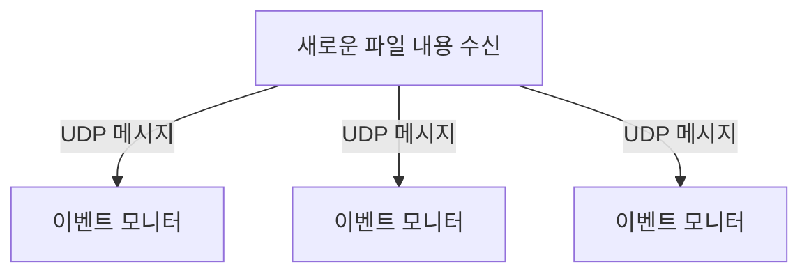

# UDP 브로드캐스팅

## UDP 개념

* UDP는 비연결 프로토콜으로 각 메시지가 독립적으로 전송된다.
* 모든 핸드쉐이크와 메시지 관리가 배제되어 TCP보다 훨씬 빠르다.
* 하지만 메시지 전달 순서 보장, 오류 수정 메커니즘 등이 없어 안정성을 보장하지 못한다.
* UDP는 여러 수신자에게 전송하는 멀티캐스트 모드, 브로드캐스트 모드를 제공한다.
  * 멀티캐스트 모드를 이용하면 정의된 호스트 그룹으로 메시지를 전송할 수 있다.
  * 브로드캐스트 모드를 이용하면 동일 네트워크 상의 모든 호스트가 메시지를 수신할 수 있다.
* 아래와 같이 UDP 포트를 수신하는 모든 이벤트 모니터는 브로드캐스팅 메시지를 수신할 수 있다.



## 브로드캐스터

* 브로드캐스터는 로그 파일로부터 전달된 LogEvent 메시지를 DatagramPacket으로 변환하여 DatagramChannel에서 원격 피어와 통신할 수 있도록 한다.
* 이를 위해 내부적으로 LogEventEncoder를 사용해 LogEvent 메시지를 DatagramPacket 메시지로 변환한다.

```java
public class LogEventEncoder extends MessageToMessageEncoder<LogEvent> {
    private final InetSocketAddress remoteAddress;

    public LogEventEncoder(InetSocketAddress remoteAddress) {
        this.remoteAddress = remoteAddress;
    }

    @Override
    protected void encode(ChannelHandlerContext channelHandlerContext,
        LogEvent logEvent, List<Object> out) throws Exception {
        byte[] file = logEvent.getLogfile().getBytes(CharsetUtil.UTF_8);
        byte[] msg = logEvent.getMsg().getBytes(CharsetUtil.UTF_8);
        ByteBuf buf = channelHandlerContext.alloc()
            .buffer(file.length + msg.length + 1);
        buf.writeBytes(file);
        buf.writeByte(LogEvent.SEPARATOR);
        buf.writeBytes(msg);
        out.add(new DatagramPacket(buf, remoteAddress));
    }
}
```

* &#x20;아래는 브로드캐스터 클래스로, run 메서드를 통해 부트스트랩으로 서버를 구동하고 로그 파일에 새로운 내용이 있으면 채널에 write하도록 한다.
* `-Dlogfile=/var/log/messages -DPort=9999` 와 같이 모니터링할 로그 파일과 바인드할 포트를 환경변수로 설정한 후 실행시키면 된다.

```java
public class LogEventBroadcaster {
    private final EventLoopGroup group;
    private final Bootstrap bootstrap;
    private final File file;

    public LogEventBroadcaster(InetSocketAddress address, File file) {
        group = new NioEventLoopGroup();
        bootstrap = new Bootstrap();
        bootstrap.group(group).channel(NioDatagramChannel.class)
             .option(ChannelOption.SO_BROADCAST, true)
             .handler(new LogEventEncoder(address));
        this.file = file;
    }

    public void run() throws Exception {
        Channel ch = bootstrap.bind(0).sync().channel();
        long pointer = 0;
        for (;;) {
            long len = file.length();
            if (len < pointer) {
                // file was reset
                pointer = len;
            } else if (len > pointer) {
                // Content was added
                RandomAccessFile raf = new RandomAccessFile(file, "r");
                raf.seek(pointer);
                String line;
                while ((line = raf.readLine()) != null) {
                    ch.writeAndFlush(new LogEvent(null, -1,
                    file.getAbsolutePath(), line));
                }
                pointer = raf.getFilePointer();
                raf.close();
            }
            try {
                Thread.sleep(1000);
            } catch (InterruptedException e) {
                Thread.interrupted();
                break;
            }
        }
    }

    public void stop() {
        group.shutdownGracefully();
    }

    public static void main(String[] args) throws Exception {
        if (args.length != 2) {
            throw new IllegalArgumentException();
        }
        LogEventBroadcaster broadcaster = new LogEventBroadcaster(
                new InetSocketAddress("255.255.255.255",
                    Integer.parseInt(args[0])), new File(args[1]));
        try {
            broadcaster.run();
        }
        finally {
            broadcaster.stop();
        }
    }
}
```

## 이벤트 모니터

* LogEventBroadcaster가 브로드캐스팅하는 UDP DatagramPacket을 수신하고 LogEvent로 디코딩하여 출력하는 역할을 한다.
* 브로드캐스터와 마찬가지로 내부적으로 LogEventDecoder를 사용해 DatagramPacket 메시지를 LogEvent 메시지로  변환한다.

```java
public class LogEventDecoder extends MessageToMessageDecoder<DatagramPacket> {

    @Override
    protected void decode(ChannelHandlerContext ctx,
        DatagramPacket datagramPacket, List<Object> out)
        throws Exception {
        ByteBuf data = datagramPacket.content();
        int idx = data.indexOf(0, data.readableBytes(), LogEvent.SEPARATOR);
        String filename = data.slice(0, idx).toString(CharsetUtil.UTF_8);
        String logMsg = data.slice(idx + 1, data.readableBytes()).toString(CharsetUtil.UTF_8);
        
        LogEvent event = new LogEvent(datagramPacket.sender(),
            System.currentTimeMillis(), filename, logMsg);
        out.add(event);
    }
}
```

* 그리고 LogEventHandler를 등록해 간단하게 LogEvent 메시지를 출력한다.

```java
public class LogEventHandler
    extends SimpleChannelInboundHandler<LogEvent> {

    @Override
    public void exceptionCaught(ChannelHandlerContext ctx,
        Throwable cause) throws Exception {
        cause.printStackTrace();
        ctx.close();
    }

    @Override
    public void channelRead0(ChannelHandlerContext ctx,
        LogEvent event) throws Exception {
        System.out.println(event.toString());
    }
}
```

* 아래는 이벤트 모니터 클래스로, 부트스트랩에 파이프라인을 구성하여 서버와 연결하면 브로드캐스트된 데이터를 출력하게 된다.&#x20;

```java
public class LogEventMonitor {
    private final EventLoopGroup group;
    private final Bootstrap bootstrap;

    public LogEventMonitor(InetSocketAddress address) {
        group = new NioEventLoopGroup();
        bootstrap = new Bootstrap();
        bootstrap.group(group)
            .channel(NioDatagramChannel.class)
            .option(ChannelOption.SO_BROADCAST, true)
            .handler( new ChannelInitializer<Channel>() {
                @Override
                protected void initChannel(Channel channel)
                    throws Exception {
                    ChannelPipeline pipeline = channel.pipeline();
                    pipeline.addLast(new LogEventDecoder());
                    pipeline.addLast(new LogEventHandler());
                }
            } )
            .localAddress(address);
    }

    public Channel bind() {
        return bootstrap.bind().syncUninterruptibly().channel();
    }

    public void stop() {
        group.shutdownGracefully();
    }

    public static void main(String[] args) throws Exception {
        if (args.length != 1) {
            throw new IllegalArgumentException(
            "Usage: LogEventMonitor <port>");
        }
        LogEventMonitor monitor = new LogEventMonitor(
            new InetSocketAddress(Integer.parseInt(args[0])));
        try {
            Channel channel = monitor.bind();
            System.out.println("LogEventMonitor running");
            channel.closeFuture().sync();
        } finally {
            monitor.stop();
        }
    }
}
```
