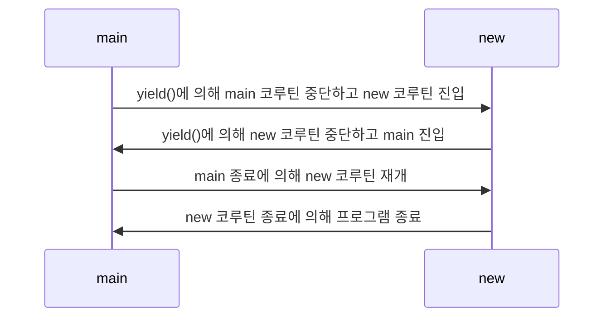

# 코루틴

## 루틴과 코루틴

### routine

* 어떠한 작업을 수행하는 `함수` 와 같은 개념이다.
* 아래와 같이 main() 함수와 newRoutine() 함수를 작성하여 2개의 루틴을 만들 수 있다.
* main 루틴은 `START` 를 출력한 후 new 루틴을 호출해 `3` 을 출력하도록 한다. 그리고 new 루틴이 종료되면 `END` 를 출력하고 main 루틴도 종료한다.

```kotlin
fun main() {
  println("START")
  new()
  println("END")
}

fun new() {
  val num1 = 1
  val num2 = 2
	println("${num1 + num2}")
}
```

* 루틴은 호출에 의해서만 진입할 수 있으므로 진입하는 곳이 한 곳이다.
* 루틴이 종료되면 해당 루틴에서 사용되었던 변수 등의 정보가 초기화된다.

### co-routine

* “서로 협력하는 루틴” 이라는 뜻으로, 기본적인 루틴의 동작 방식과 달리 루틴을 중단했다가 재개할 수 있다.
* 코틀린에서 코루틴을 사용하려면 아래와 같이 의존성을 추가해주어야 한다.

```kotlin
dependencies {
    implementation("org.jetbrains.kotlinx:kotlinx-coroutines-core:1.7.2")
}
```

## 코루틴 만들기

* runBlocking 함수를 통해 새로운 코루틴을 만들 수 있다.
* launch 함수를 통해서도 새로운 코루틴을 만들 수 있으며, 주로 반환 값이 없는 코루틴을 만들 때 사용한다.
* yield() 함수는 현재 코루틴의 실행을 잠시 멈추고 다른 코루틴이 실행되도록 양보한다.
* `suspend fun` 을 통해 suspend 함수를 만들 수 있으며, suspend 함수 내부에서만 다른 suspend 함수를 호출할 수 있다.
* 아래는 main과 newRoutine이라는 두 코루틴을 생성하였고 yield에 의해 각 코루틴이 중단되었다가 재개되었다가 하며 수행된다.

```kotlin
fun main(): Unit = runBlocking {
  println("START")
  launch {
    new()
  }
	yield()
  println("END")
}
suspend fun new() {
  val num1 = 1
  val num2 = 2
  yield()
  println("${num1 + num2}")
}
```

```kotlin
START
END
3
```

* 프로세스를 다이어그램으로 나타내면 아래와 같다.



#### 코루틴 디버깅하기

* 코루틴은 일반적인 루틴 방식에 비해 복잡하게 실행된다.
* 이를 좀 더 이해하기 쉽게하기 위해 `-Dkotlinx.coroutines.debug` 옵션을 주면 출력 결과와 함께 코루틴의 정보를 볼 수 있다.

## 스레드와 코루틴

* 코루틴은 스레드보다 작은 개념이다.
* 코루틴의 코드가 실행되려면 스레드가 반드시 존재해야 한다. 하지만 반드시 코루틴의 모든 코드가 하나의 스레드에서 동작하리라는 보장은 없다.
* 코루틴은 중단되었다가 재개될 수 있기 때문에 특정 코드는 `스레드1`에서 수행되고 특정 코드는 `스레드2`에서 수행될 수 있는 것이다.
* 코루틴 간의 context switching은 동일한 스레드에서 실행될 경우에 메모리를 공유하기 때문에 스레드 간 context switching에 비해 비용이 훨씬 적다. (스레드의 context switching 시에는 stack 영역이 교체된다.)
* 여러 코루틴이 하나의 스레드에서 번갈아 실행될 수 있기 때문에 단 하나의 스레드에서도 동시성을 확보할 수 있다.

> 동시성: 여러 작업이 아주 빠르게 전환되어 동시에 수행되는 것 처럼 보이는 것 병렬성: 여러 CPU 코어에서 실제로 동시에 여러 작업을 수행하는 것

* 코루틴은 스스로 다른 코루틴이 실행될 수 있도록 양보하는 `비선점형` 방식이다.

## 코루틴 빌더, Job

* 코루틴 빌더란 코루틴을 만드는 함수를 의미한다.

#### runBlocking

* 코루틴이 모두 완료될 때 까지 스레드를 블락시킨다.
* 따라서 프로그램에 진입하는 최초의 메인 함수나 테스트 코드를 시작할 때만 사용하는 게 좋다.

#### launch

* 코루틴 빌더이며, 반환 값이 없는 코드를 실행할 때 사용한다.
*

## 코루틴 취소하기

## 코루틴 예외 처리와 Job 상태 변화
