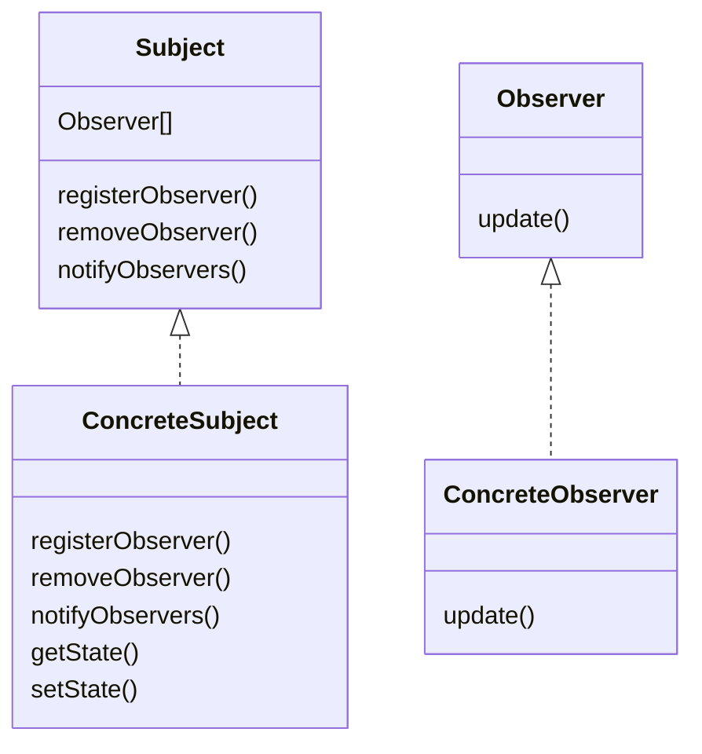

# 옵저버 패턴

## 접근

* 값의 변화, 새로운 소식 등의 이벤트가 발생하면 이를 특정 객체가 항상 확인하여 자신의 필드 등에 반영해주어야 한다면?
* 이벤트를 확인해야 하는 객체가 여러 개라면?
* 데이터를 관리하는 측에서 이벤트가 발생하면 이를 주시하고 있는 객체들에게 알려야 한다.
* 상호작용하는 객체 사이에는 가능하면 느슨한 결합을 사용해야 한다.

## 개념

* 한 객체의 상태가 바뀌면 그 객체에 의존하는 여러 객체에 이벤트를 알리는 구독 메커니즘을 정의할 수 있도록 한다.
* **주제** 객체는 주제와 관련된 데이터를 관리하며 이벤트가 발생하면 **옵저버**에게 소식을 전한다.
* 옵저버 객체들은 주제를 구독하여 이벤트를 전달받아 반영한다. 구독을 취소할 수도 있다.
* 새로운 옵저버를 추가하더라도 주제 클래스에 변경이 일어나지 않는다.
* Publish-Subscribe 패턴의 경우 서로 다른 유형의 메시지에 관심을 가질 수 있고 Publisher와 Subscriber를 더 세세하게 분리할 수 있으므로, 주제가 직접 옵저버에게 메시지를 전달하는 옵저버 패턴과는 다른 형태이다.

## 사용 방법

* 주제 인터페이스와 옵저버 인터페이스를 정의하여 이를 각각 구현하도록 한다.
* 주제는 여러 옵저버들을 필드로 가지며, 등록을 요청한 옵저버들에게 이벤트 발생 시 전달하는 notifyObservers 메서드를 구현한다.
* 이 때 내용을 전달하기 위해 옵저버의 update 메서드를 호출한다.
* update 메서드에 이벤트에 대한 데이터를 직접 전달할 수도 있고, update 메서드 내부에서 주제 객체의 getter를 호출해 데이터를 직접 가져와 사용할 수도 있다.

## 예시

* 날씨 정보가 변화할 때 각 화면에 변화를 주기 위해서 옵저버 패턴을 사용할 수 있다.
* 날씨 정보에 대한 데이터를 담당하는 클래스가 **주제**가 된다. 따라서 옵저버들을 등록/제거하는 메서드와 옵저버들에게 이벤트를 알리는 메서드를 구현한다.
* 계속해서 변경되는 날씨 데이터를 표현하는 화면 클래스들은 **옵저버**가 된다. **주제**로부터 갱신된 데이터를 받아 처리하기 위한 메서드를 구현한다.

<figure><figcaption></figcaption></figure>
