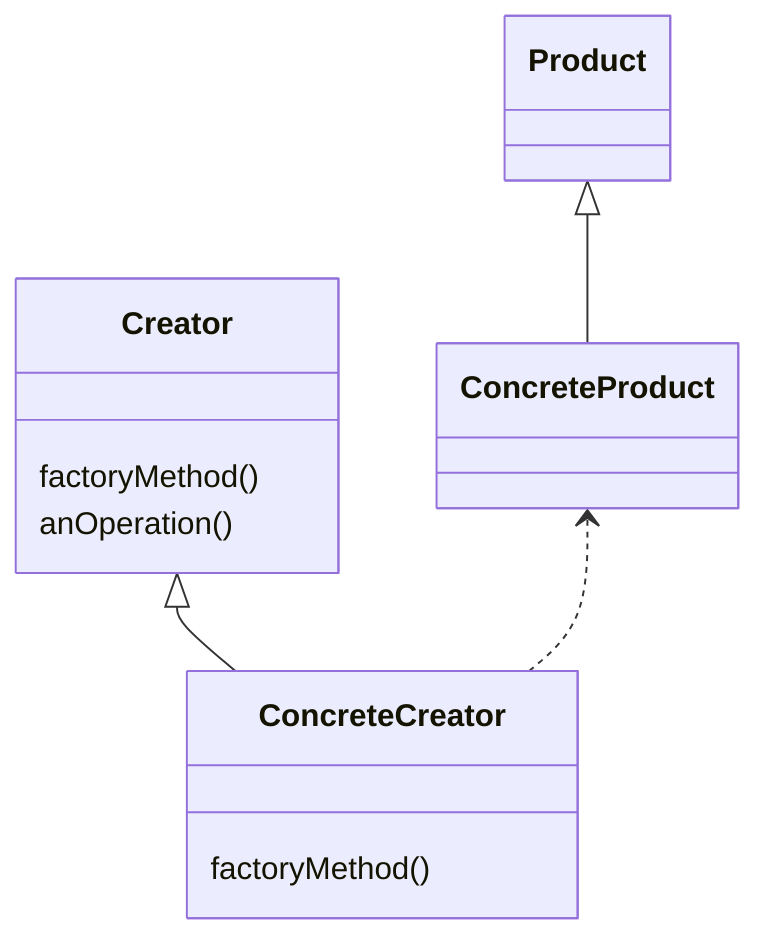

# 팩토리 패턴

## 접근

* 구현 클래스의 인스턴스가 여러 개가 있으며 실행 시 주어진 조건에 따라 어떤 인스턴스를 사용할 지 결정되는 경우, **인스턴스 생성의 책임을 팩토리 클래스에 캡슐화**한다.
* 여러 변화가 발생할 수 있기 때문에 인터페이스에 구현체의 인스턴스를 할당할 때는 항상 조심해야 한다.

## 개념

* 객체 생성을 캡슐화하는 디자인 패턴으로, 여기서 파생된 **팩토리 메서드 패턴**과 **추상 팩토리 패턴**이 존재한다.
* 두 패턴의 가장 큰 차이점은 팩토리 클래스가 객체를 하나 생성하는지, 여러 객체의 집단을 생성하는지이다.

### 팩토리 메서드 패턴

* 객체를 생성할 때 필요한 인터페이스를 정의하고 어떤 클래스의 인스턴스를 생성할 지는 서브클래스에서 결정하도록 맡기는 디자인 패턴이다.
* 좀 더 구체적으로 말하면, 객체 생성 로직을 담도록 정의한 추상 메서드를 사용하는 추상 클래스를 두고, 객체 생성을 구현 클래스에 위임한다. 따라서 사용하는 서브 클래스에 따라 생성되는 객체 인스턴스가 결정된다.
* 서브 클래스에서는 인터페이스의 여러 클래스 중 하나를 구현하게 된다.
* 이를 통해 객체의 생성하는 방식이 변경되더라도 Creator 구현 클래스만 변경하면 되기 때문에 유연한 구조가 된다.

* 의존성 역전 원칙이 적용되었기 때문에 Creator 객체를 사용하는 곳에서는 세세한 객체에 의존하지 않고 추상화된 인터페이스에만 의존할 수 있다.
* 팩토리 메서드 패턴은 템플릿 메서드 패턴의 일종으로 볼 수 있다.

### 추상 팩토리 패턴

* 구현 클래스에 의존하지 않고도 서로 연관되거나 의존적인 객체로 이뤄진 **제품군**을 생산하는 인터페이스를 제공한다. 서브 클래스에서 구현 클래스를 생성한다.
* 클라이언트에서 추상 인터페이스로 Product를 공급받을 수 있으며 구체적인 Product가 어떤지는 몰라도 된다.
* 추상 팩토리를 사용하려면 클라이언트에서 추상 팩토리 인스턴스를 만든 후 메서드를 호출해야 한다.

<figure><figcaption></figcaption></figure>

## 장단점

* 장점
  * 생성하는 역할과 생성된 객체를 사용하는 역할이 느슨하게 결합되어 변경에 유리하다. 즉, 단일 책임 원칙과 개방 폐쇄 원칙을 지킨다.
* 단점
  * 패턴을 구현하기 위해 팩토리 클래스들을 도입해야 하므로 코드가 복잡해질 수 있다.

## 예시

