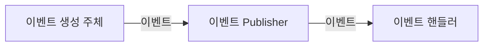

# 10장: 이벤트

## 이벤트의 용도와 장점

### 이벤트의 필요성

* 주문을 취소하게 되어 환불 처리를 하기 위해서는 환불 외부 서비스 호출 등을 통해 처리하기 위해 도메인 서비스를 구현해야 한다.

```java
public class Order {
	...
	// 외부 서비스를 실행하기 위해 도메인 서비스를 파라미터로 전달받음
	public void cancel(RefundService refundService) {
		verifyNotYetShipped();
		this.state = OrderState.CANCELED;
		this.refundStatus = State.REFUND_STARTED;
		try {
		refundService.refund(getPaymentId());
			this.refundStatus = State.REFUND_COMPLETED;
		} catch(Exception ex) {
			???
		}
	}
	...
}
```

* 이 때 외부 서비스가 정상이 아닌 경우 트랜잭션의 처리를 어떻게 할 지 결정해야 하며, 외부 시스템의 응답 시간이 길어지면 환불 기능의 대기 시간 자체도 길어지기 때문에 직접적으로 영향을 받게 된다.
* 환불 도메인 서비스를 주문 도메인 객체에 주입하게 되면, 결국 결제 도메인 로직이 섞이는 문제가 발생하게 된다.
* 주문을 취소한 뒤에 환불 뿐만 아니라 취소했다는 통지 이벤트를 보내는 기능을 추가하려면 이 역시 주문 취소 메서드 내부에서 호출해야 하므로 외부 서비스에 대한 로직이 섞여버리게 된다.
* 이러한 문제가 발생하는 이유는 주문 바운디드 컨텍스트와 결제 바운디드 컨텍스트 간의 강결합(high coupling) 때문이다.
* 이벤트를 사용하면 강결합을 없앨 수 있다. 비동기 이벤트를 사용하면 두 시스템 간 결합을 크게 낮출 수 있다.

### 이벤트란

* ‘과거에 벌어진 어떤 것’을 의미하며 보통 웹 환경에서는 상태가 변경되었음을 의미하고, 이벤트에 반응하여 원하는 동작을 수행하도록 구현한다.
* 이벤트를 도입하려면 아래와 같이 네 개의 구성 요소를 구현해야 한다.
  * 이벤트 : 변경이 발생함에 따라 이벤트 종류, 발생 시간, 추가 데이터를 담는다.
  * 이벤트 생성 주체 : 이벤트를 생성해 디스패처에 전달한다.
  * 이벤트 디스패처(퍼블리셔) : 이벤트를 처리할 수 있는 핸들러에 이벤트를 전파한다. 디스패처의 구현 방식에 따라 이벤트 생성과 처리를 동기/비동기로 실행한다.
  * 이벤트 핸들러(구독자): 발생한 이벤트에 담긴 데이터를 사용해 원하는 기능을 실행한다.



### 간단 구현

*   이벤트 정보를 담을 클래스를 생성한다. 이 때 이벤트는 이미 벌어진 것에 대한 내용이므로 과거형을 사용한다. 이벤트 클래스에는 이벤트 핸들러가 작업을 수행하는 데 필요한 데이터를 모두 담아야 한다.

    * 아래 코드는 배송지 정보가 변경되었을 때 생성될 이벤트 클래스이다.

    ```java
    @AllArgsConstructor
    @Getter
    public class ShippingInfoChangedEvent {
    	private String orderNumber;
    	private long timestamp;
    	private ShippingInfo newShippingInfo;
    }
    ```
*   이벤트를 생성/발생시키기 위해 `Events#raise` 메서드를 사용한다.

    * 아래 코드는 주문 도메인에서 배송지 정보가 변경되면 이벤트를 발생시킨다.

    ```java
    public class Order {
    public void changeShippingInfo(ShippingInfo newShippingInfo) {
    	verifyNotYetShipped();
    	setShippingInfo(newShippingInfo);
    	Events.raise(new ShippingInfoChangedEvent(number, newShippingInfo));
    }
    ```
*   이벤트를 전달받기 위해 `@EventListener` 어노테이션을 메서드에 붙인다.

    * 아래 코드는 배송지 정보가 변경되었을 때 이를 처리한다.

    ```java
    public class ShippingInfoChangedHandler {
    	@EventListener(ShippingInfoChangedEvent.class)
    	public void handle(ShippingInfoChangedEvent evt) {
    		shippingInfoSynchronizer.sync(
    		evt.getOrderNumber(),
    		evt.getNewShippingInfo());
    	}
    	// ...
    }
    ```

### 이벤트의 용도

*   이벤트의 첫 번째 용도는 트리거이다.

    * 도메인의 상태가 바뀔 때 후처리를 실행하기 위한 트리거로 이벤트를 사용할 수 있다.
    * 만약 주문 취소를 했을 때 환불 처리를 해야 한다면 주문 취소 이벤트를 환불 처리를 위한 트리거로 사용할 수 있다.

    <figure><figcaption></figcaption></figure>
* 두번째 용도는 서로 다른 시스템 간의 동기화이다.
  * 배송지를 변경하면 외부 배송 서비스에 변경 이벤트를 전송해 두 시스템 간의 배송지 정보를 동기화 할 수 있다.

### 이벤트의 장점

* 서로 다른 도메인 로직이 섞이는 것을 방지할 수 있다.
* 기능 확장 시 도메인 코드에 새로운 처리 방식을 추가하는 대신 새로운 이벤트 핸들러를 추가하면 된다.
* 아래와 같이 주문 취소 이벤트는 그대로 발생하지만, 이를 소비하는 핸들러를 추가하면 도메인 로직에 영향 없이 기능을 확장할 수 있다.

<figure><figcaption></figcaption></figure>

## 스프링을 사용한 이벤트 기능 구현

### 이벤트 클래스

* 이벤트 클래스는 POJO로 구현하면 된다.
* 이벤트는 과거에 벌어진 상태 변화나 사건을 의미하므로 이벤트 클래스의 이름을 결정할 때에는 과거 시제를 사용해야 한다는 점만 유의하면 된다.
* 핸들러에서 이벤트를 처리하는 데 필요한 데이터를 모두 포함해야 한다.

```java
public class OrderCanceledEvent {
	private long timestampl
	private String orderNumber;
	public OrderCanceledEvent(String number) {
		this.timestamp = System.currentTimeMillis();
		this.orderNumber = number;
	}
	public String getOrderNumber() { return orderNumber; }
}
```

### 이벤트 발행 클래스

* 이벤트 발행을 위해서는 스프링이 제공하는 ApplicationEventPublisher를 사용할 수 있다. ApplicationEventPublisher는 publishEvent 메서드를 제공해 원하는 이벤트 클래스를 발행한다.

```java
public class Events {
	private static ApplicationEventPublisher publisher;

	static void setPublisher(ApplicationEventPublisher publisher) {
		Events.publisher = publisher;
	}

	public static void raise(Object event) {
		if (publisher != null) {
			publisher.publishEvent(event);
		}
	}
}
```

* ApplicationEventPublisher 의 객체로는 Spring 구동 시 빈으로 등록되어 있는 ApplicationContext를 사용하도록 한다.

```java
@Configuration
public class EventsConfiguration {
	@Autowired
	private ApplicationContext applicationContext;
	@Bean
	public InitializingBean eventsInitializer() {
		return () -> Events.setPublisher(applicationContext);
	}
}
```

* 이제 이벤트를 발생시켜야 하는 부분에서 Events#raise 메서드를 호출하면 된다.

```java
public class Order {
	public void cancel() {
		verifyNotYetShipped();
		this.state = OrderState.CANCELED;
		Events.raise(new OrderCanceledEvent(number.getNumber()));
	}
	// ...
}
```

### 이벤트 핸들러

* 이벤트를 처리할 핸들러에는 `@EventListener` 어노테이션을 붙인다. ApplicationEventPublisher#publishEvent () 메서드를 실행할 때 OrderCanceledEvent타입 객체를 전달하면, OrderCanceledEvent.class 값을 갖는 @EventListener 애너테이션을 붙인 메서드를 찾아 실행하게 된다.

```java
@Service
public class OrderCanceledEventHandler {
	private RefundService refundService;

	public OrderCanceledEventHandler(RefundService refundService) {
		this.refundService = refundService;
	}

	@EventListener(OrderCanceledEvent.class)
	public void handle(OrderCanceledEvent event) {
		refundService.refund(event.getOrderNumber());
	}
}
```

## 비동기 이벤트 처리

* 외부 시스템과의 연동을 동기로 처리할 때 발생하는 성능과 트랜잭션 범위 문제를 해소하는 방법은 이벤트를 비동기로 처리하거나 이벤트와 트랜잭션을 연계하는 것이다.
* 대부분 구현해야 하는 요구사항 중 ‘A 하면 이어서 B 하라’는 내용을 담고 있다면 실제로 ‘A 하면 최대 언제까지 B 하라’인 경우가 많다. 혹은 일정 간격으로 재시도하거나 수동으로 처리해도 되는 경우도 있다.
* 이러한 요구사항들은 이벤트를 비동기 처리하는 방식으로 구현할 수 있다.

### 구현 방식

#### 로컬 핸들러 비동기 실행

* 이벤트 핸들러를 별도 스레드로 실행하도록 하는 방법이다.
* Main 클래스나 Configuration 중 하나에 @EnableAsync 어노테이션을 붙이고, @Async 어노테이션을 메서드에 붙이면 해당 메서드는 별도 스레드에서 수행된다.

```java
@EnableAsync
public class XXXConfiguration {
	// ...
}
```

```java
@Service
public class OrderCanceledEventHandler {
	@Async
	@EventListener(OrderCanceledEvent.class)
	public void handle(OrderCanceledEvent event) {
		refundService.refund(event.getOrderNumber());
	}
}
```

#### 메시지 큐 사용

* Kafka, RabbitMQ 등 메시징 시스템을 이용해 이벤트를 메시지 리스너에 전달하고, 메시지 리스너가 알맞은 이벤트 핸들러에 이벤트를 보낸다.
* 이벤트를 메시지 큐에 저장하는 과정과 메시지 큐에서 이벤트를 읽어와 처리하는 과정은 별도 스레드나 프로세스로 처리된다.

<figure><figcaption></figcaption></figure>

* 이벤트를 발생시키는 도메인 로직과 메시지 큐에 이벤트를 저장하는 로직을 하나의 트랜잭션으로 묶어야 할 수 있다.
* 도메인 기능을 실행한 결과를 DB에 반영하고 이 과정에서 발생한 이벤트를 메시지 큐에 저장하는 것을 같은 트랜잭션 범위에서 실행하려면 글로벌 트랜잭션이 필요하다.
  * 다만 글로벌 트랜잭션으로 인해 전체 성능이 떨어질 수 있으며, 글로벌 트랜잭션을 사용하는 경우는 거의 없다고 한다.
  * RabbitMQ의 경우 글로벌 트랜잭션을 지원하지만 Kafka는 지원하지 않는다.
* 메시지 큐를 사용하면 보통 이벤트를 발생시키는 주체와 이벤트 핸들러가 별도 프로세스에서 동작한다.

#### 이벤트 저장소와 이벤트 포워더 사용

* 이벤트가 발생하면 핸들러는 저장소에 이벤트를 저장한다.
* 포워더는 주기적으로 이벤트 저장소에서 이벤트를 가져와 이벤트 핸들러를 실행한다. 포워더는 별도 스레드를 이용하기 때문에 이벤트 발행과 처리가 비동기로 처리된다.
* 도메인의 상태와 이벤트 저장소로 동일한 DB를 사용하여 도메인의 상태 변화와 이벤트 저장이 로컬 트랜잭션으로 처리된다.

<figure><figcaption></figcaption></figure>

#### 이벤트 저장소와 이벤트 제공 API 사용

* 이벤트를 외부에 제공하는 API를 만들어 외부의 이벤트 핸들러가 사용하도록 하는 방법도 있다.
* 클라이언트 API를 이용해서 언제든지 원하는 이벤트를 가져올 수 있기 때문에 이벤트 처리에 실패하면 다시 실패한 이벤트부터 읽어와 이벤트를 재처리할 수 있다. API 서버에 장애가 발생한 경우에도 주기적으로 재시도를 해서 API 서버가 살아나면 이벤트를 처리할 수 있다.

<figure><figcaption></figcaption></figure>

## 이벤트 적용 시 고려 사항

* 비동기 이벤트 처리 방식을 구현할 때 특정 도메인이 발생시킨 이벤트임을 이벤트 핸들러가 알 수 있도록 이벤트를 발생시킨 상황에 대한 정보를 추가해주어야 할 것이다.
* 이벤트 포워더에서 이벤트 전송 실패를 어느 정도로 허용할 지 결정해야 한다. 계속 전송 실패가 발생하지 않도록 재전송 횟수 제한을 두고 실패용 DB, 메시지 큐에 저장해야 안정적으로 시스템을 운영할 수 있다.
* 이벤트 발생 순서가 중요하다면 이벤트 저장소를 사용하거나, 사용하는 메시징 시스템 처리 방식을 잘 알아봐야 한다.
* 동일 이벤트가 여러 번 왔을 때 재처리를 어떻게 할 지 결정해야 한다.
* 이벤트 처리 실패와 트랜잭션 실패를 함께 고려해야 한다. 트랜잭션이 성공할 때만 이벤트 핸들러를 실행하는 @TransactionalEventListener 어노테이션을 사용하면 트랜잭션 상태에 따라 이벤트 핸들러를 실행할 수 있다.
