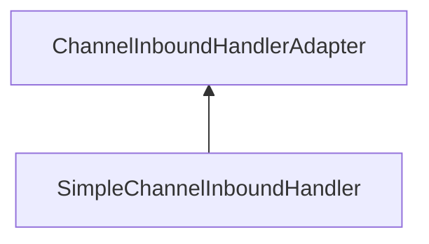

# 1장: 네티 맛보기

### Echo Server

#### 에코 서버

```java
public class EchoServer {
    public static void main(String[] args) throws Exception {

        EventLoopGroup bossGroup = new NioEventLoopGroup(1);
        EventLoopGroup workerGroup = new NioEventLoopGroup();

        try {
            ServerBootstrap b = new ServerBootstrap();
            b.group(bossGroup, workerGroup)
             .channel(NioServerSocketChannel.class)
             .childHandler(new ChannelInitializer<SocketChannel>() {
                @Override
                public void initChannel(SocketChannel ch) {
                    ChannelPipeline p = ch.pipeline();
                    p.addLast(new EchoServerHandler()); // 에코 서버 데이터 핸들러 등록
                }
						});
            ChannelFuture f = b.bind(8888).sync();
            f.channel().closeFuture().sync();
        }
        finally {
            workerGroup.shutdownGracefully();
            bossGroup.shutdownGracefully();
        }
    }
```

* ServerBootstrap 클래스의 bind 메서드로 접속할 포트 지정
* 접속된 클라이언트로부터 수신된 데이터를 처리할 핸들러를 등록

#### 에코 서버 데이터 핸들러

* 입력된 데이터를 처리하는 이벤트 핸들러



```java
public class EchoServerHandler extends ChannelInboundHandlerAdapter {
    @Override
    public void channelRead(ChannelHandlerContext ctx, Object msg) {
        String readMessage = ((ByteBuf) msg).toString(Charset.defaultCharset());

        System.out.println("수신한 문자열 [" + readMessage + "]");

        ctx.write(msg);
    }

    @Override
    public void channelReadComplete(ChannelHandlerContext ctx) {
        ctx.flush();
    }

    @Override
    public void exceptionCaught(ChannelHandlerContext ctx, Throwable cause) {
        // Close the connection when an exception is raised.
        cause.printStackTrace();
        ctx.close();
    }
}
```

* channelRead()
  * 데이터 수신 이벤트가 들어오면 네티가 호출하는 이벤트 메서드
  * 메서드 파라미터 중 msg라는 Object 객체는 ByteBuf 형태의 메시지로, 문자열로 변환할 수 있다.
  * ChannerHandlerContext 인터페이스의 객체로 채널 파이프라인에 대한 이벤트를 처리한다.
* channerReadComplete()
  * 이벤트 처리가 완료된 후 호출되는 이벤트 메서드
  * 채널 파이프라인에 저장된 버퍼를 전송하는 flush 메서드를 수행

### Echo Client

* 에코 서버 8888번 포트로 접속해 문자열을 전송하고, 서버의 응답을 수신해 출력하고 소켓을 종료하도록 한다.

#### 에코 클라이언트

```java
public final class EchoClient {
    public static void main(String[] args) throws Exception {
        EventLoopGroup group = new NioEventLoopGroup();

        try {
            Bootstrap b = new Bootstrap();
            b.group(group)
             .channel(NioSocketChannel.class)
             .handler(new ChannelInitializer<SocketChannel>() {
                 @Override
                 public void initChannel(SocketChannel ch) throws Exception {
                     ChannelPipeline p = ch.pipeline();
                     p.addLast(new EchoClientHandler());
                 }
             });

            ChannelFuture f = b.connect("localhost", 8888).sync();

            f.channel().closeFuture().sync();
        }
        finally {
            group.shutdownGracefully();
        }
    }
}
```

* 이벤트 루프, 부트스트랩, 채널 파이프라인, 핸들러 등을 초기화하는 코드는 에코 서버와 동일하다.
* 에코 서버와 달리 부트스트랩의 이벤트루프 그룹을 하나만 설정한다. 서버에 연결된 채널이 하나만 존재하기 때문이다.
* 부트스트랩의 채널을 NioSocketChannel로 설정하여 서버와 연결된 클라이언트의 소켓 채널은 NIO로 동작한다.
* 부트스트랩의 connect() 메서드를 호출해 ChannelFuture 객체를 반환받아 비동기 메서드의 처리 결과를 확인할 수 있다.
* ChannelFuture의 sync() 메서드는 ChannelFuture 객체의 요청이 완료될 때 까지 계속 대기하고, 요청이 실패되면 예외를 던진다.

#### 에코 클라이언트 데이터 핸들러

* 소켓 채널이 생성되면 데이터를 서버로 전송하고, 서버로부터 데이터를 전달받아 출력하는 간단 핸들러이다.
* 에코 서버 메시지 핸들러와 비슷하지만 데이터 전송을 위해 channelActive 메서드를 추가적으로 구현했다.

```java
public class EchoClientHandler extends ChannelInboundHandlerAdapter {
    @Override
    public void channelActive(ChannelHandlerContext ctx) {
        String sendMessage = "Hello netty";

        ByteBuf messageBuffer = Unpooled.buffer();
        messageBuffer.writeBytes(sendMessage.getBytes());
        System.out.println("전송한 문자열 [" + sendMessage + "]");

        ctx.writeAndFlush(messageBuffer);
    }

    @Override
    public void channelRead(ChannelHandlerContext ctx, Object msg) {
        String readMessage = ((ByteBuf) msg).toString(Charset.defaultCharset());
        System.out.println("수신한 문자열 [" + readMessage + "]");
    }

    @Override
    public void channelReadComplete(ChannelHandlerContext ctx) {
        ctx.close();
    }

    @Override
    public void exceptionCaught(ChannelHandlerContext ctx, Throwable cause) {
        cause.printStackTrace();
        ctx.close();
    }
}
```

* channelActive()
  * ChannelInboundHandler에 정의된 이벤트로써 소켓 채널이 최초 활성화되었을 때 실행된다.
  * ChannelHandlerContext의 writeAndFlush() 메서드를 통해 데이터를 기록하고 서버로 전송한다.
* channelRead()
  * 서버로부터 수신된 데이터가 있으면 호출된다.
* channelReadComplete()
  * 수신된 데이터를 모두 읽으면 서버와 연결된 채널을 닫는다.
  * 이후 데이터 송수신 채널이 닫히며 클라이언트 프로그램이 종료된다.

### 데이터 이동의 방향성

* 네트워크 송수신을 추상화하기 위해 인바운드 이벤트와 아웃바운드 이벤트라는 개념을 도입했다.
* 서버에서 데이터가 수신될 때 발생하는 이벤트를 사용해야 하면, 인바운드 이벤트 중 하나인 데이터 수신 이벤트 메서드에서 로직을 구현하면 된다.
