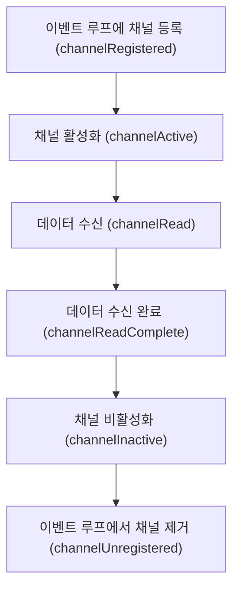

# 4장: 채널 파이프라인과 코덱

## 이벤트 실행

* 네티 없이 일반 서버 네트워크 프로그램을 작성 시 아래와 같이 동작한다.

1. 소켓에 데이터가 있는지 확인
2. 데이터가 존재하면 데이터 읽는 메서드 호출 / 데이터가 존재하지 않으면 대기
3. 대기 중 네트워크가 끊어지면 에러 처리 메서드 호출

* 네티를 사용하면 이벤트를 채널 파이프라인과 이벤트 핸들러로 추상화하여 데이터가 수신되었는지 확인하거나 소켓과 연결이 끊겼는지 직접 메서드 호출을 하지 않아도 된다.
* 대신 이벤트가 발생했을 때 호출할 메서드만 구현해두면 된다.
* 네티를 사용해 서버 네트워크 프로그램을 작성 시 아래와 같이 동작한다.

1. 부트스트랩으로 네트워크 애플리케이션에 필요한 설정 지정 및 이벤트 핸들러로 채널 파이프라인 구성
2. 이벤트 핸들러의 데이터 수신 이벤트 메서드에서 데이터를 읽는다.
3. 이벤트 핸들러의 네트워크 끊김 이벤트 메서드에서 에러 처리를 한다.

* 소켓 채널에 데이터가 수신되었을 때 네티는 아래와 같이 수신 이벤트 메서드를 실행한다.

1. 이벤트 루프는 채널 파이프라인에 등록된 첫 이벤트 핸들러를 가져온다.
2. 이벤트 핸들러에 데이터 수신 이벤트 메서드가 구현되어 있다면 실행하고, 구현되어 있지 않으면 다음 이벤트 핸들러를 가져온다.
3. 2번 과정을 마지막 핸들러에 도달할 때까지 반복한다.


## 채널 파이프라인

### 구조

(사진)

* 네티의 채널, 이벤트, 이벤트 핸들러는 전기의 흐름과 비슷하다.
* 채널은 일반적인 소켓 프로그래밍에서 말하는 소켓과 같다. (발전소)
* 이 소켓에서 발생한 이벤트는 채널 파이프라인을 따라 흐른다. (전선 / 멀티탭)
* 이벤트 핸들러는 채널에서 발생한 이벤트들을 수신하고 처리한다. (가전제품)
* 하나의 채널 파이프라인에는 여러 이벤트 핸들러를 등록할 수 있다.

### 동작

* childHandler를 통해 클라이언트가 사용할 채널 파이프라인을 설정한다.
* ChannelInitializer 인터페이스의 `initChannel` 메서드는 클라이언트 소켓 채널이 생성될 때 실행된다.
* 클라이언트 소켓 채널을 생성할 때에는 빈 채널 파인프라인 객체를 생성해 할당한다.
* 이 때 채널 파이프라인에는 이벤트 핸들러를 여러 개 등록할 수 있다.

```java
ServerBootstrap b = new ServerBootstrap();
b.group(bossGroup, workerGroup)
    .channel(NioServerSocketChannel.class)
    .childHandler(new ChannelInitializer<SocketChannel>() {
        @Override
        public void initChannel(SocketChannel ch) {
            // 채널 파이프라인 설정
            ChannelPipeline p = ch.pipeline();
            p.addLast(new EchoServerHandler());
        }
    });
```

* 채널 파이프라인이 초기화되는 순서를 그림으로 살펴보면 아래와 같다.


* 먼저 클라이언트 연결에 대응되는 소켓 채널 객체를 생성하고, 빈 채널 파이프라인 객체를 생성해 소켓 채널에 할당한다.
* 소켓 채널에 등록된 ChannelInitializer 구현체의 initChannel 메서드를 호출한다.
* 소켓 채널 참조로부터 채널 파이프라인 객체를 가져와 이벤트 핸들러를 등록한다.
* 이렇게 초기화가 완료되면 채널이 등록되었다는 이벤트가 발생하고, 클라이언트와 서버 간 데이터 송수신을 위한 이벤트 처리가 시작된다.

## 이벤트 핸들러

* 네티는 비동기 호출을 지원하기 위해 Future 패턴과 리액터 패턴의 구현체인 이벤트 핸들러를 제공한다.
* 이벤트 핸들러는 네티의 소켓 체널에서 발생한 이벤트를 처리하는 인터페이스이다.
* 채널 파이프라인으로 입력되는 이벤트를 이벤트 루프가 가로채어 이벤트에 해당하는 메서드를 수행한다.

### 인바운드 이벤트

* 상대방이 어떤 동작을 취했을 때 소켓 채널에서 발생하는 이벤트
* 채널 활성화, 데이터 수신 등의 이벤트가 이에 해당한다.

(사진)

* 인바운드 이벤트를 채널 파이프라인에 보내면 이벤트 핸들러 중 ChannelInboundHandler 인터페이스를 구현한 인바운드 이벤트 핸들러들이 메서드를 수행한다.
* ChannelInboundHandler 인터페이스의 정의는 아래와 같으며 각 메서드는 각 인바운드 이벤트와 대응된다.

```java
public interface ChannelInboundHandler extends ChannelHandler {

    void channelRegistered(ChannelHandlerContext ctx) throws Exception;

    void channelUnregistered(ChannelHandlerContext ctx) throws Exception;

    void channelActive(ChannelHandlerContext ctx) throws Exception;

    void channelInactive(ChannelHandlerContext ctx) throws Exception;

    void channelRead(ChannelHandlerContext ctx, Object msg) throws Exception;

    void channelReadComplete(ChannelHandlerContext ctx) throws Exception;

    void userEventTriggered(ChannelHandlerContext ctx, Object evt) throws Exception;

    void channelWritabilityChanged(ChannelHandlerContext ctx) throws Exception;

    @Override
    @SuppressWarnings("deprecation")
    void exceptionCaught(ChannelHandlerContext ctx, Throwable cause) throws Exception;
}
```

* 인바운드 이벤트 발생 순서는 아래와 같다.



#### channelRegistered

* 채널이 처음 생성되어 이벤트 루프에 등록되었을 때 발생하는 이벤트이다.
* 서버에서는 처음 서버 소켓 채널을 생성할 때와 클라이언트가 서버에 접속해 소켓 채널이 생성될 때 이벤트가 발생한다.
* 클라이언트에서는 서버 접속을 위한 connect() 메서드를 수행할 때 이벤트가 발생한다.

#### channelActive

* channelRegistered 이벤트 이후에 채널 입출력을 수행할 상태가 되었을 때 발생하는 이벤트이다.
* &#x20;서버 또는 클라이언트가 상대방에 연결한 직후 한번 수행할 작업을 처리하기에 적합하다.
  * 서버에 연결된 클라이언트 개수를 세거나, 최초 연결에 대한 메시지를 전송할 때 사용될 수 있다.

#### channelRead

* 데이터가 수신되었을 때 발생하는 이벤트이다.
* 아래 EchoServerV1Handler 클래스는 데이터가 수신되었을 때 데이터를 출력하고 상대방에게 그대로 돌려주는 이벤트 핸들러이다.
* 네티 내부에서는 모든 데이터가 ByteBuf로 관리되므로, Object 타입을 ByteBuf로 형변환하여 메시지를 확인할 수 있다.

```java
public class EchoServerV1Handler extends ChannelInboundHandlerAdapter {
    @Override
    public void channelRead(ChannelHandlerContext ctx, Object msg) {
        ByteBuf readMessage = (ByteBuf) msg;
        System.out.println("channelRead : " + readMessage.toString(Charset.defaultCharset()));
        ctx.writeAndFlush(msg);
    }

    @Override
    public void exceptionCaught(ChannelHandlerContext ctx, Throwable cause) {
        cause.printStackTrace();
        ctx.close();
    }
}
```

#### channelReadComplete

* 채널의 데이터를 다 읽고 더이상 데이터가 없는 상태가 되어 데이터 수신이 완료되었을 때 발생하는 이벤트이다.
* 아래 EchoServerV2Handler 클래스는 EchoServerV1Handler와 달리 channelRead에서는 write만 해두고 데이터 수신이 모두 완료되었을 때 flush하여 클라이언트에 데이터를 전송한다.

```java
public class EchoServerV2Handler extends ChannelInboundHandlerAdapter {
    @Override
    public void channelRead(ChannelHandlerContext ctx, Object msg) {
        ByteBuf readMessage = (ByteBuf) msg;
        System.out.println("channelRead : " + readMessage.toString(Charset.defaultCharset()));
        ctx.write(msg);
    }

    @Override
    public void channelReadComplete(ChannelHandlerContext ctx) {
        System.out.println("channelReadComplete 발생");
        ctx.flush();
    }

    @Override
    public void exceptionCaught(ChannelHandlerContext ctx, Throwable cause) {
        cause.printStackTrace();
        ctx.close();
    }
}
```

#### channelInactive

* 채널이 비활성화되었을 때 발생하는 이벤트이다.
* 이 이벤트가 발생한 후에는 채널에 대한 입출력 작업을 수행할 수 없다.

#### channelUnregistered

* 채널이 이벤트루프에서 제거되었을 때 발생하는 이벤트이다.
* 이 이벤트가 발생한 후에는 채널에서 발생한 이벤트를 처리할 수 없다.

### 아웃바운드 이벤트

* 네티 사용자가 요청한 동작에 해당하는 이벤트
* 연결 요청, 데이터 전송, 소켓 종료 등이 이에 해당한다.
* ChannelOutboundHandler 인터페이스를 구현한 아웃바운드 핸들러가&#x20;

#### bind

* 서버 소켓 채널이 클라이언트의 연결을 받아들이는 ip, port 정보 설정시 발생하는 이벤트이다.
* 서버 소켓 채널이 사용하는 IP, 포트 정보를 확인할 수 있다.

#### connect

* 클라이언트 소켓 채널이 서버에 연결되었을 때 발생하는 이벤트이다.
*

#### disconnect

* 클라이언트 소켓 채널의 연결이 끊어졌을 때 발생하는 이벤트이다.

#### close


#### write


