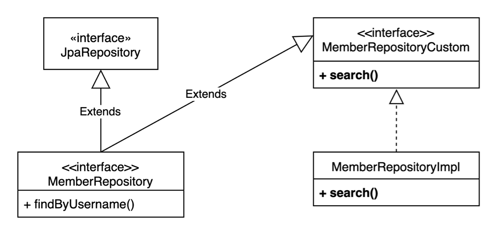

# 스프링 데이터 JPA와 QueryDSL

## 사용자 정의 리포지토리

* Spring Data JPA를 사용하려면 아래와 같이 작성해야 한다.

```java
public interface MemberRepository extends JpaRepository<Member, Long> {
  List<Member> findByUsername(String username);
 }
```

* 만약 QueryDSL로 원하는 메서드가 동작하도록 하기 위해서는 **사용자 정의 리포지토리**를 만들어 직접 구현 코드를 작성해야 한다.
* 재사용 가능성이 많은 메서드의 경우 다음과 같이 인터페이스와 구현체를 둔다.

<figure><figcaption></figcaption></figure>

* 사용자 정의 인터페이스

```java
public interface MemberRepositoryCustom {
      List<MemberTeamDto> search(MemberSearchCondition condition);
  }
```

* 사용자 정의 인터페이스의 구현체

```java
public class MemberRepositoryImpl implements MemberRepositoryCustom {
  private final JPAQueryFactory queryFactory;

  public MemberRepositoryImpl(EntityManager em) {
      this.queryFactory = new JPAQueryFactory(em);
	} 
	
	@Override
	public List<MemberTeamDto> search(MemberSearchCondition condition) {
		...
	}
```

* 사용자 정의 인터페이스를 상속받아 MemberRepository만 주입받아도 사용 가능하도록 한다.

```java
public interface MemberRepository extends JpaRepository<Member, Long>,
  MemberRepositoryCustom {
      List<Member> findByUsername(String username);
  }
```

***

* 만약 재사용 가능성이 적은 경우 별도 Repository 클래스를 구현해 주입받아 사용해도 된다.

```java
@Repository
public class MemberQueryRepository {
  private final JPAQueryFactory queryFactory;

  public MemberRepositoryImpl(EntityManager em) {
      this.queryFactory = new JPAQueryFactory(em);
	} 
	
	@Override
	public List<MemberTeamDto> searchForSomething(MemberSearchCondition condition) {
		...
	}
```

## QueryDSL 페이징 연동

* 스프링 데이터의 Page, Pageable을 활용하는 방법을 알아본다.

```java
public interface MemberRepositoryCustom {
      Page<MemberTeamDto> searchPageSimple(MemberSearchCondition condition,
  Pageable pageable);
      Page<MemberTeamDto> searchPageComplex(MemberSearchCondition condition,
  Pageable pageable);
  }
```

#### 데이터 내용과 **전체 카운트를 한번에 조회하는 방법**

* 다음은 지정한 offset부터 limit 개수만큼의 데이터를 조회하는 로직이다.
* 카운트 쿼리를 따로 작성하지 않아도 fetchResult.getTotal() 메서드를 호출하면 자동으로 카운트 쿼리가 날아가 데이터를 얻을 수 있다.
* fetch() vs fetchResults()
  * fetchResults를 사용하면 fetch(), fetchCount() 정보를 모두 얻을 수 있다.
  * count 쿼리를 최적화하려면 fetchResults() 대신 fetch(), fetchCount()를 각각 구현하는 것이 좋다.

```java
@Override
public Page<MemberTeamDto> searchPageSimple(MemberSearchCondition condition,
Pageable pageable) {
    QueryResults<MemberTeamDto> results = queryFactory
            .select(new QMemberTeamDto(
                    member.id,
                    member.username,
                    member.age,
                    team.id,
                    team.name))
            .from(member)
            .leftJoin(member.team, team)
            .where(usernameEq(condition.getUsername()),
                    teamNameEq(condition.getTeamName()),
                    ageGoe(condition.getAgeGoe()),
                    ageLoe(condition.getAgeLoe()))
            **.offset(pageable.getOffset()) // 어느 offset부터 시작할지 지정
            .limit(pageable.getPageSize()) // 몇 개의 데이터를 가져오는지 지정
            .fetchResults();**

		// 모든 데이터 얻기
    List<MemberTeamDto> content = results.getResults();
		// 총 데이터 개수
    long total = results.getTotal();

    return new PageImpl<>(content, pageable, total);
}
```

#### **데이터 내용과 전체 카운트를 별도로 조회하는 방법**

* 다음은 fetch()와 fetchCount()를 구분하여 작성한 로직이다.

```java
@Override
public Page<MemberTeamDto> searchPageComplex(MemberSearchCondition condition,
Pageable pageable) {
    List<MemberTeamDto> content = queryFactory
            .select(new QMemberTeamDto(
                    member.id,
                    member.username,
                    member.age,
                    team.id,
                    team.name))
            .from(member)
            .leftJoin(member.team, team)
            .where(usernameEq(condition.getUsername()),
                    teamNameEq(condition.getTeamName()),
                    ageGoe(condition.getAgeGoe()),
                    ageLoe(condition.getAgeLoe()))
            .offset(pageable.getOffset())
            .limit(pageable.getPageSize())
            .fetch();

    long total = queryFactory
            .select(member)
            .from(member)
            .leftJoin(member.team, team)
            .where(usernameEq(condition.getUsername()),
                    teamNameEq(condition.getTeamName()),
                    ageGoe(condition.getAgeGoe()),
                    ageLoe(condition.getAgeLoe()))
            .fetchCount();
    return new PageImpl<>(content, pageable, total);
 }
```

## CountQuery 최적화

* PageImpl 대신 `PageableExecutionUtils.getPage()` 를 반환해주면, count 쿼리가 생략 가능한 경우 쿼리가 날라가지 않도록 할 수 있다.
  * 페이지 시작이면서 컨텐츠 사이즈가 페이지 사이즈보다 작을 경우 count 쿼리 생략 가능
  * 마지막 페이지일 경우 offset + 컨텐츠 사이즈를 더해서 전체 사이즈를 구할 수 있음

```java
// 데이터 조회 쿼리로 content 구하는 부분 생략
// ...

JPAQuery<Member> countQuery = queryFactory
                  .select(member)
                  .from(member)
                  .leftJoin(member.team, team)
                  .where(usernameEq(condition.getUsername()),
                          teamNameEq(condition.getTeamName()),
                          ageGoe(condition.getAgeGoe()),
                          ageLoe(condition.getAgeLoe()));

return PageableExecutionUtils.getPage(content, pageable, countQuery::fetchOne);
```

## 스프링 데이터 정렬

* 페이징의 정렬 조건을 Querydsl의 정렬 조건으로 직접 전환할 수 있다.
* 하지만 단일 엔티티의 경우만 가능하므로 사실상 잘 사용되지 않는다.

```java
JPAQuery<Member> query = queryFactory
          .selectFrom(member);

for (Sort.Order o : pageable.getSort()) {
    PathBuilder pathBuilder = new PathBuilder(member.getType(), member.getMetadata());
    query.orderBy(new OrderSpecifier(o.isAscending() ? Order.ASC : Order.DESC,
            pathBuilder.get(o.getProperty())));
List<Member> result = query.fetch();
```

## QueryDSL 지원 클래스 직접 생성

* QuerydslRepositorySupport 가 지닌 한계를 극복하기 위해 직접 Querydsl 지원 클래스를 만든다.
* 스프링 데이터가 제공하는 페이징을 편리하게 QueryDSL로 변환할 수 있다.
* 페이징과 카운트 쿼리 분리 가능
* 스프링 데이터 Sort 지원
* from()이 아니라 select() , selectFrom() 으로 시작 가능
* EntityManager , QueryFactory 제공

#### 직접 생성한 지원 클래스

```java
@Repository
public abstract class Querydsl4RepositorySupport {
    private final Class domainClass;
    private Querydsl querydsl;
    private EntityManager entityManager;
    private JPAQueryFactory queryFactory;

    public Querydsl4RepositorySupport(Class<?> domainClass) {
      Assert.notNull(domainClass, "Domain class must not be null!");
      this.domainClass = domainClass;
    }

    @Autowired
    public void setEntityManager(EntityManager entityManager) {
      Assert.notNull(entityManager, "EntityManager must not be null!");
      JpaEntityInformation entityInformation = JpaEntityInformationSupport.getEntityInformation(domainClass, entityManager);
      SimpleEntityPathResolver resolver = SimpleEntityPathResolver.INSTANCE;
      EntityPath path = resolver.createPath(entityInformation.getJavaType());
      this.entityManager = entityManager;
      this.querydsl = new Querydsl(entityManager, new PathBuilder<>(path.getType(), path.getMetadata()));
      this.queryFactory = new JPAQueryFactory(entityManager);
    }

    @PostConstruct
    public void validate() {
      Assert.notNull(entityManager, "EntityManager must not be null!");
      Assert.notNull(querydsl, "Querydsl must not be null!");
      Assert.notNull(queryFactory, "QueryFactory must not be null!");
    }

    protected JPAQueryFactory getQueryFactory() {
      return queryFactory;
    }

    protected Querydsl getQuerydsl() {
      return querydsl;
    }

    protected EntityManager getEntityManager() {
      return entityManager;
    }

    // 아래와 같이 select
    protected <T> JPAQuery<T> select(Expression<T> expr) {
      return getQueryFactory().select(expr);
    }

    protected <T> JPAQuery<T> selectFrom(EntityPath<T> from) {
      return getQueryFactory().selectFrom(from);
    }

    protected <T> Page<T> applyPagination(Pageable pageable, Function<JPAQueryFactory, JPAQuery> contentQuery) {
      JPAQuery jpaQuery = contentQuery.apply(getQueryFactory());
      List<T> content = getQuerydsl().applyPagination(pageable, jpaQuery).fetch();
      return PageableExecutionUtils.getPage(content, pageable, jpaQuery::fetchCount);
    }

    protected <T> Page<T> applyPagination(Pageable pageable, Function<JPAQueryFactory, JPAQuery> contentQuery,
																					Function<JPAQueryFactory, JPAQuery> countQuery) {
      JPAQuery jpaContentQuery = contentQuery.apply(getQueryFactory());
		
      List<T> content = getQuerydsl().applyPagination(pageable, jpaContentQuery).fetch();
      JPAQuery countResult = countQuery.apply(getQueryFactory());
      return PageableExecutionUtils.getPage(content, pageable, countResult::fetchCount);
    }
}
```

```java
@Repository
public class MemberTestRepository extends Querydsl4RepositorySupport {

  public MemberTestRepository() {
      super(Member.class);
  }

  // 직접 페이징을 변환하는 대신 추상 클래스의 메서드를 활용
  public Page<Member> applyPagination(MemberSearchCondition condition,
																			Pageable pageable) {
    return applyPagination(pageable, contentQuery -> contentQuery
            .selectFrom(member)
		.leftJoin(member.team, team)
		.where(usernameEq(condition.getUsername()),
		        teamNameEq(condition.getTeamName()),
		        ageGoe(condition.getAgeGoe()),
		        ageLoe(condition.getAgeLoe())));
  }
  public Page<Member> applyPaginationWithCountQuery(MemberSearchCondition condition,
																									 	Pageable pageable) {
    return applyPagination(pageable, 
		contentQuery -> contentQuery
			.selectFrom(member)
			.leftJoin(member.team, team)
			.where(usernameEq(condition.getUsername()),
			       teamNameEq(condition.getTeamName()),
			       ageGoe(condition.getAgeGoe()),
			       ageLoe(condition.getAgeLoe())),	
		countQuery -> countQuery
			.selectFrom(member)
			.leftJoin(member.team, team)
			.where(usernameEq(condition.getUsername()),
			        teamNameEq(condition.getTeamName()),
			        ageGoe(condition.getAgeGoe()),
			        ageLoe(condition.getAgeLoe()))); 
  }

  private BooleanExpression usernameEq(String username) {
    return isEmpty(username) ? null : member.username.eq(username);
  }
  private BooleanExpression teamNameEq(String teamName) {
    return isEmpty(teamName) ? null : team.name.eq(teamName);
  }
  private BooleanExpression ageGoe(Integer ageGoe) {
    return ageGoe == null ? null : member.age.goe(ageGoe);
  }
  private BooleanExpression ageLoe(Integer ageLoe) {
    return ageLoe == null ? null : member.age.loe(ageLoe);
  }
}
```

## fetchResults() , fetchCount() 지원 중단

* count 정보를 얻으려면 select절에 count를 얻음을 명시한 후, 하나의 응답 결과만 받는 fetchOne()을 사용해야 한다.

```java
Long totalCount = queryFactory
        //.select(Wildcard.count) // select count(*) 와 같은 의미
        .select(member.count()) //select count(member.id) 와 같은 의미
        .from(member)
        .fetchOne();
```
