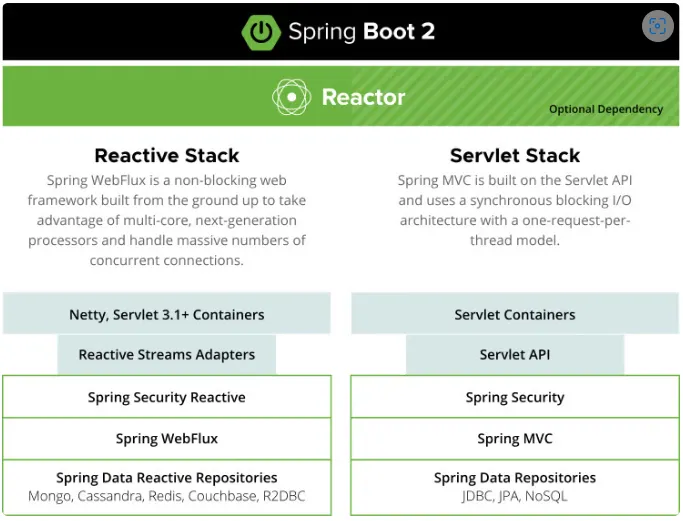

# Spring Batch

## 필요성

* 단발성으로 대용량의 데이터를 처리하는 배치 애플리케이션을 위해 제공되는 프레임워크
* 메모리, IO, CPU 등의 자원에 대한 고민을 최소화하고, 중간에 장애가 발생하더라도 쉽게 복구할 수 있게 도와준다.
* **Quartz는 스케줄러의 역할**이지, Batch 와 같이 **대용량 데이터 배치 처리에 대한 기능을 지원하지 않는다**. 정해진 스케줄마다 Quartz가 Spring Batch를 실행하도록 할 수 있다.

## 컴포넌트

* Job
  * **하나의 배치 작업 단위**를 의미한다.
  * 배치 프로세스 구동 시 원하는 Job만 지정해 실행할 수 있다.
* Step
  * 하나의 Job을 통해 여러 Step들을 실행시킬 수 있다.
  * 조건 분기(특정 조건을 만족할 때 특정 Step을 수행),  Flow 기반 구성을 통한 병렬 실행 등이 가능하다.
  * [https://docs.spring.io/spring-batch/reference/step/controlling-flow.html](https://docs.spring.io/spring-batch/reference/step/controlling-flow.html)
* Tasklet
  * **Step안에서 단일로 수행될 커스텀한 기능**들을 선언할 수 있다.
* Reader / Writer
  *

<figure><figcaption></figcaption></figure>

## 메타데이터 테이블

* 다음 사항들을 디스크에 저장해두기 위한 테이블 구성이 필요하다.
  * 이전에 실행한 Job 목록
  * 최근 실패한 Batch Parameter, 성공한 Job 목록
  * 다시 실행한다면 어디서 부터 시작하면 될지
  * 어떤 Job에 어떤 Step들이 있었고, Step들 중 성공한 Step과 실패한 Step들은 어떤것들이 있는지
* Job Instance
  *
* Job Execution

## 스코프

* `@JobScope`, `@StepScope` 를 통해 Job, Step 객체가 실제로 사용되는 실행 시점에 생성되도록 지연시킬 수 있다.
* `@JobScope`는 Step 선언문에서 사용 가능하고, `@StepScope`는 Tasklet이나 ItemReader, ItemWriter, ItemProcessor에서 사용할 수 있다.
* 내부, 외부에서 파라미터를 받아 여러 Batch 컴포넌트에서 사용 가능한 `Job Parameters`를 사용하려면, 1. Bean을 정의하는 부분에 스코프를 선언하고 2. 인자에 `@Value("#{jobParameters[파라미터명]}")` 을 등록해주어야 한다.
* JobParameter는&#x20;

