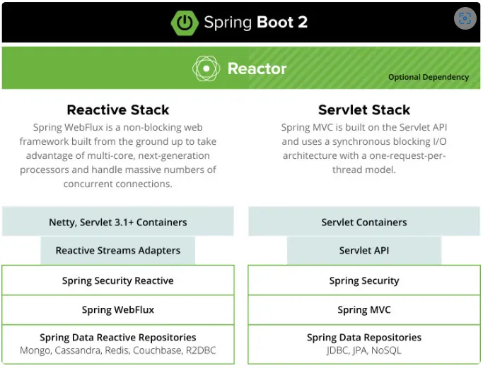

# Spring WebFlux

* Non-Blocking I/O 방식
  * 이벤트 루프 방식을 사용하기 때문에, 적은 수의 스레드로 많은 요청을 처리할 수 있다.
  * 서버에서 복잡한 연산을 처리하는 CPU bound 작업이 많거나, 클라이언트 요청부터 응답을 반환하기까지의 과정 중에 Blocking 되는 작업이 존재한다면 성능이 저하될 수 있다. 성능 저하를 방지하기 위해서는 해당 작업들을 별도 스케줄러에서 수행되도록 해야 한다.
* Netty, Jetty, Undertow 등의 서버 엔진에서 지원하는 Reactive Streams Adapter를 통해 리액티브 스트림즈를 지원한다.
* Spring Security의 경우 표준 서블릿 필터가 아닌 WebFilter를 사용해 구현된다.
* 데이터 액세스 계층까지 Non-Blocking을 지원할 수 있는 라이브러리를 사용해야 한다.

<figure><figcaption></figcaption></figure>
