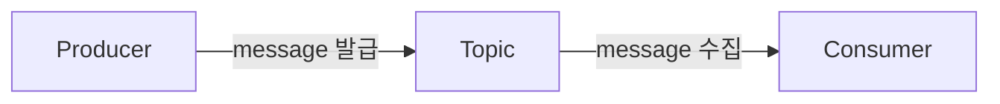
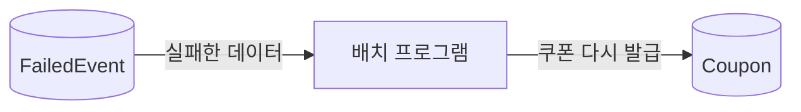

# ⭐️. 실습으로 배우는 선착순 이벤트 시스템

## 쿠폰 발급을 위한 코드 작성

* 선착순으로 n명에게 쿠폰을 지급하는 요구사항을 개발해보며 문제를 개선하고 최적화한다.
* 쿠폰 발급 로직에 필요한 클래스들은 다음과 같이 간단하게 Domain, Repository, Service가 있다.

#### Coupon Domain

* 쿠폰을 발급받은 유저의 ID와 쿠폰의 고유한 기본키를 저장한다.

```java
@Entity
@Getter
@NoArgsConstructor
@RequiredArgsConstructor
public class Coupon {

   @Id
   @GeneratedValue(strategy = GenerationType.IDENTITY)
   private Long id;

   private Long userId;

   public Coupon(Long userId) {
      this.userId = userId;
   }
}
```

#### Coupon Repository

* 단순 CRUD를 제공해주는 JPA Repository 이다.

```java
public interface CouponRepository extends JpaRepository<Coupon, Long> {}
```

#### CouponService

* userId를 입력받아 쿠폰을 발급해주는 기능을 제공한다.
* 쿠폰의 수량은 100개만 준비되어 있기 때문에, 발급된 쿠폰 개수가 100개를 넘었다면 더이상 쿠폰을 발급할 수 없다.

```java
@RequiredArgsConstructor
@Service
public class CouponService {

   private final CouponRepository couponRepository;
   
   public void apply(Long userId) {
     long count = couponRepository.count();
   
     if (count > 100) {
        return;
     }
   
     couponRepository.save(new Coupon(userId));
   }
}
```

## 동시성 문제

* 아래 코드를 통해 1000개의 요청을 아래와 같이 스레드풀을 사용해 동시에 발생시키면, 100개의 쿠폰만 정상적으로 발급되는 것이 아니라, 100개 이상의 쿠폰이 발급되는 문제가 발생한다.

```java
@Test
public void 여러명응모() throws InterruptedException {
   int threadCount = 1000;
   ExecutorService executorService = Executors.newFixedThreadPool(32);
   CountDownLatch countDownLatch = new CountDownLatch(threadCount);
   
   for (int i = 0; i < threadCount; i++) {
     long userId = i;
     executorService.submit(() -> {
        try {
           applyService.apply(userId);
        } finally {
           countDownLatch.countDown();
        }
     });
   }
   
   countDownLatch.await();
   
   long count = couponRepository.count();
   
   assertThat(count).isEqualTo(100); // fail!
}
```

* 그 이유는 여러 스레드에서 count 쿼리를 보내 쿠폰의 현재 총 개수를 조회할 때, 락을 걸지 않기 때문에 race condition이 발생하기 때문이다.
* 아래 표와 같이 여러 스레드가 특정 시점의 count를 읽고, 각각 쿠폰을 추가하게 되는 경우가 발생한다.

<table><thead><tr><th width="252">Thread 1</th><th width="170">Coupon Count</th><th>Thread 2</th></tr></thead><tbody><tr><td>select count(*) from coupon</td><td>99</td><td></td></tr><tr><td></td><td>99</td><td>select count(*) from coupon</td></tr><tr><td>insert into coupon …</td><td>100</td><td></td></tr><tr><td></td><td>101</td><td>insert into coupon …</td></tr></tbody></table>

* 이 문제를 해결하기 위해 Coupon Count를 Redis에서 관리하도록 한다.

## Redis로 해결하기

### RedisTemplate

* Spring 환경에서는 RedisTemplate을 사용해 Redis의 다양한 기능을 메서드로 간단하게 사용할 수 있다.
* Redis를 사용하기 위해 다음과 같이 gradle 의존성을 추가한다.
* RedisTemplate는 key와 value에 어떤 타입이 들어갈 지 지정할 수 있는데, key와 value를 모두 String 타입으로 지정할 경우 기본적으로 빈이 등록되어 있다.
* 이번 실습에서는 key와 value 모두 String 타입으로 지정할 것이기 때문에, RedisTemplate 빈을 따로 생성해 등록해주지 않아도 된다.

### 쿠폰 수량 관리

* Redis는 key에 저장된 value를 increment하는 메서드를 제공한다.
* 쿠폰 발급 시 count value를 increment하도록 하여 쿠폰 수량을 관리할 수 있다.
* 이렇게 할 경우 여러 스레드, 나아가 서버가 분산되어 있다 하더라도 Redis에서 count 값에 접근 가능하다.

```java
@Repository
@RequiredArgsConstructor
public class CouponCountRepository {

   private final RedisTemplate<String, String> redisTemplate; // 빈 주입

   public Long increment() {
      return redisTemplate.opsForValue().increment("coupon count");
   }
}
```

* 쿠폰을 생성할 때 count 값을 1 증가 시키도록 하면, 쿠폰 저장에 실패하지 않는 이상 문제는 발생하지 않는다.

```java
@RequiredArgsConstructor
@Service
public class CouponService {
  private final CouponCountRepository couponCountRepository;
   
  public void apply(Long userId) {
    Long count = couponCountRepository.increment(); // redis로부터 값 증가
    if (count > 100) {
      return;
    }
    
    couponRepository.save(new Coupon(userId));
  }
}
```

### 유저 당 쿠폰 1개로 제한하기

* 한 유저는 하나의 쿠폰만 가질 수 있다는 요구사항도 Redis로 해결해보자.
* redis의 set 자료구조를 사용해, set에 유저를 추가할 수 있는지 확인한 후 쿠폰을 발급하면 된다.
* 먼저 set에 유저를 추가하는 Repository를 생성한다.

```java
@Repository
@RequiredArgsConstructor
public class CouponUserRepository {

   private final RedisTemplate<String, String> redisTemplate;

   public Long add(Long userId){
      return redisTemplate.opsForSet().add("applied_user", userId.toString());
   }
}
```

* Service에서는 set에 유저가 추가되는지 여부를 확인한 후, 쿠폰을 발급하는 로직을 처리한다.

```java
@RequiredArgsConstructor
@Service
public class CouponService {

  private final CouponCountRepository couponCountRepository;
  
  public void apply(Long userId) {
    Long appliedUser = appliedUserRepository.add(userId);
    
    if (appliedUser != 1) {
    return;
    }
    
    Long count = couponCountRepository.increment(); // redis로부터 값 증가
    
    if (count > 100) {
      return;
    }
    
    couponRepository.save(new Coupon(userId));
  }
}
```

### 발생 가능한 문제

* Redis의 장애 발생 시 쿠폰 발급 개수에 접근 자체가 불가능해져 시스템이 마비될 수 있다. 따라서 high availability를 고려하는 것이 중요하다.
* 데이터베이스 부하가 과도하게 들어갈 경우 다른 서비스의 요청에 영향이 갈 수 있다. 따라서 이를 조절하기 위해 Kafka를 사용할 수 있다.

## Kafka로 데이터베이스 부하 조절하기

### 카프카 간단 소개

* 분산 이벤트 스트리밍 플랫폼으로, 소스에서 목적지까지 이벤트를 실시간으로 스트리밍할 수 있다.
* Producer와 Consumer로 구성되어 아래와 같이 메시지를 발급하고 가져올 수 있다.



* 선착순 이벤트에 카프카를 적용하면 다음과 같이 동작할 것이다.
* 이렇게 카프카를 사용하는 이유는 토픽 메시지를 병렬적으로 가져와 처리하는 방식이 아니라 **순차적으로 처리하는 방식이기 때문에 과도하게 DB 부하가 가지 않기 때문**이다.
* Kafka를 사용하려면 Zookeeper도 필요하기 때문에 docker-compose를 사용해 띄워야 간편하다.

### Producer 사용하기

* 쿠폰 발급 검증 및 발급 요청 메시지를 보내는 Producer를 구현해보자.
* 먼저 Producer의 설정 클래스를 작성한다.

```java
@Configuration
public class KafkaProducerConfig {
   @Bean
   public ProducerFactory<String, Long> producerFactory(){
      Map<String, Object> config = new HashMap<>();
   
      config.put(ProducerConfig.BOOTSTRAP_SERVERS_CONFIG, "localhost:9092");
      config.put(ProducerConfig.KEY_SERIALIZER_CLASS_CONFIG, StringSerializer.class);
      config.put(ProducerConfig.VALUE_SERIALIZER_CLASS_CONFIG, LongSerializer.class);
      
      return new DefaultKafkaProducerFactory<>(config);
   }
   
   @Bean
   public KafkaTemplate<String, Long> kafkaTemplate(){
      return new KafkaTemplate<>(producerFactory());
   }
}
```

* KafkaTemplate을 사용해 메시지를 토픽에 보내는 메서드를 작성한다.

```java
@Component
@RequiredArgsConstructor
public class CouponCreateProducer {
  private static final String KAFKA_TOPIC = "coupon_create";
  private final KafkaTemplate<String, Long> kafkaTemplate;
  
  public void create(Long userId) {
    kafkaTemplate.send(KAFKA_TOPIC, userId);
  }
}
```

* Service에서 쿠폰 발급 로직을 제거하고, 쿠폰 발급 요청 메시지를 토픽으로 보내도록 한다.

```java
@RequiredArgsConstructor
@Service
public class CouponService {
  private final CouponCreateProducer couponCreateProducer;
  
  public void apply(Long userId) {
    Long count = couponCountRepository.increment(); // redis로부터 값 증가
    
    if (count > 100) {
      return;
    }
    
    couponCreateProducer.create(userId); // 토픽에 메시지 전송
  }
}
```

### Consumer 사용하기

* producer가 만든 메시지를 수신하여 쿠폰 발급 처리를 하는 Consumer를 구현해보자.
* 프로젝트에 아예 새로운 모듈을 추가하여 멀티 모듈 형태로 사용하도록 한다.
* 먼저 다음과 같이 consumer config를 설정한다.

```java
@Configuration
public class KafkaConsumerConfig {
  @Bean
  public ConsumerFactory<String, Long> consumerFactory() {
    Map<String, Object> config = new HashMap<>();
    config.put(ConsumerConfig.BOOTSTRAP_SERVERS_CONFIG, "localhost:9092");
    config.put(ConsumerConfig.GROUP_ID_CONFIG, "group_1");
    config.put(ConsumerConfig.KEY_DESERIALIZER_CLASS_CONFIG, StringDeserializer.class);
    config.put(ConsumerConfig.VALUE_DESERIALIZER_CLASS_CONFIG, LongDeserializer.class);
    
    return new DefaultKafkaConsumerFactory<>(config);
  }

  @Bean
  ConcurrentKafkaListenerContainerFactory<String, Long> kafkaListenerContainerFactory(){
    ConcurrentKafkaListenerContainerFactory<String, Long> factory = new ConcurrentKafkaListenerContainerFactory<>();
    factory.setConsumerFactory(consumerFactory());
  
    return factory;
  }
}
```

* Consumer에서 Kafka의 Message를 받을 수 있도록 어노테이션을 추가해준다.

```java
@Component
@RequiredArgsConstructor
public class CouponCreateConsumer {
   
   private final CouponRepository couponRepository;
   
   @KafkaListener(topics = "coupon_create", groupId = "group_1")
   public void listener(Long userId){
      couponRepository.save(new Coupon(userId));
   }
}
```

## 쿠폰 발급 시 에러가 발생한다면?

* DB에 FailedEvent 테이블을 생성해 쿠폰 발급 시 에러가 발생하여 쿠폰을 지급받지 못한 user의 정보를 담아둔다.
* 추후에 FailedEvent 데이터를 배치 프로그램이 확인하여 쿠폰 발급을 다시 진행하도록 한다.



* 아래는 쿠폰 발급에 실패하였을 때 FailedEvent를 저장하는 코드이다.

```java
@Component
@RequiredArgsConstructor
public class CouponCreateConsumer {
  private final CouponRepository couponRepository;
  private final FailedEventRepository failedEventRepository;

  @KafkaListener(topics = "coupon_create", groupId = "group_1")
  public void listener(Long userId){
    try {
      couponRepository.save(new Coupon(userId));
    } catch (Exception e) {
      logger.error("failed to create coupon::" + userId); // 실패 로그
      failedEventRepository.save(new FailedEvent(userId)); // FailedEvent를 저장
    }
  }
}
```
